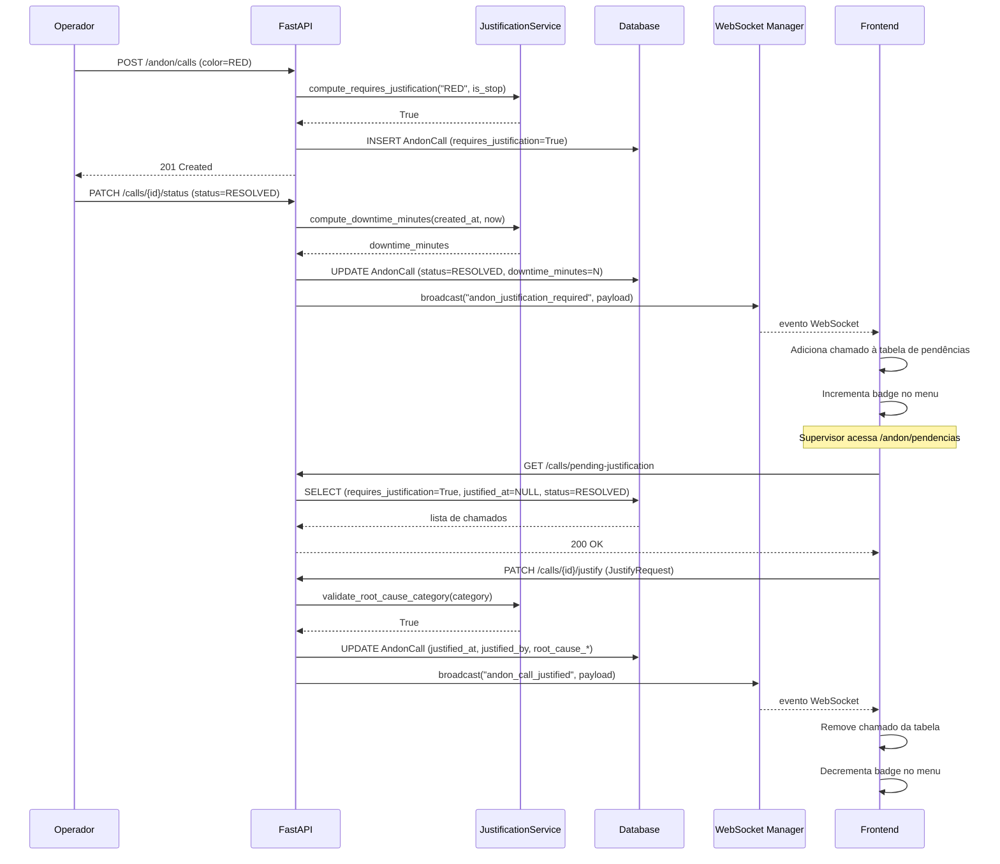

# Design Document — Andon Justification Cycle (Fase 1)

## Overview

O **Ciclo de Justificativa de Paradas** estende o módulo Andon do ID Visual AX com rastreabilidade completa de paradas de produção. Quando um chamado Andon é resolvido e exige justificativa (RED ou YELLOW com `is_stop=True`), o sistema calcula automaticamente o tempo de parada (`downtime_minutes`), enfileira o chamado para justificativa e notifica os supervisores via WebSocket. Um painel dedicado (`/andon/pendencias`) exibe as pendências em tempo real, e um badge no menu lateral mantém o supervisor sempre informado.

### Objetivos

- Calcular e persistir `downtime_minutes` automaticamente ao resolver chamados
- Determinar `requires_justification` no momento da criação, com base em `color` e `is_stop`
- Prover endpoints REST para listagem de pendências, submissão de justificativa e estatísticas
- Emitir eventos WebSocket para atualização em tempo real do frontend
- Fornecer UI dedicada com tabela de pendências, filtros e modal de justificativa
- Exibir badge de contagem no menu lateral

### Não está no escopo desta fase

- Relatórios históricos de justificativas
- Aprovação/rejeição de justificativas por outro supervisor
- Integração das justificativas com o Odoo

---

## Architecture

O design segue a arquitetura em camadas já estabelecida no projeto:

```
┌─────────────────────────────────────────────────────────────────┐
│  Frontend (React + TypeScript)                                  │
│  ┌──────────────────┐  ┌──────────────────┐  ┌──────────────┐  │
│  │ AndonPendencias  │  │ JustificationModal│  │ Layout Badge │  │
│  │ Page.tsx         │  │ .tsx             │  │ (Layout.tsx) │  │
│  └────────┬─────────┘  └────────┬─────────┘  └──────┬───────┘  │
│           │  REST + WebSocket   │  REST              │  REST    │
└───────────┼────────────────────┼────────────────────┼──────────┘
            │                    │                    │
┌───────────▼────────────────────▼────────────────────▼──────────┐
│  Backend (FastAPI async)                                        │
│  ┌──────────────────────────────────────────────────────────┐  │
│  │  endpoints/andon.py  (router: /api/v1/andon)             │  │
│  │  GET  /calls/pending-justification                       │  │
│  │  PATCH /calls/{id}/justify                               │  │
│  │  GET  /calls/justification-stats                         │  │
│  │  PATCH /calls/{id}/status  (modificado)                  │  │
│  └──────────────────┬───────────────────────────────────────┘  │
│                     │                                           │
│  ┌──────────────────▼───────────────────────────────────────┐  │
│  │  services/justification_service.py                       │  │
│  │  compute_requires_justification()                        │  │
│  │  compute_downtime_minutes()                              │  │
│  │  validate_root_cause_category()                          │  │
│  └──────────────────┬───────────────────────────────────────┘  │
│                     │                                           │
│  ┌──────────────────▼───────────────────────────────────────┐  │
│  │  models/andon.py  (AndonCall — campos adicionados)       │  │
│  └──────────────────┬───────────────────────────────────────┘  │
│                     │                                           │
│  ┌──────────────────▼───────────────────────────────────────┐  │
│  │  services/websocket_manager.py  (ws_manager.broadcast)   │  │
│  └──────────────────────────────────────────────────────────┘  │
└─────────────────────────────────────────────────────────────────┘
            │
┌───────────▼──────────────────────────────────────────────────┐
│  Database (PostgreSQL / SQLite)                               │
│  tabela: andon_call  (+7 colunas via Alembic migration)      │
└──────────────────────────────────────────────────────────────┘
```

### Fluxo de dados principal



---

## Components and Interfaces

### Backend

#### `justification_service.py`

```python
ROOT_CAUSE_CATEGORIES = frozenset([
    "Máquina", "Material", "Mão de obra", "Método", "Meio ambiente"
])

def compute_requires_justification(color: str, is_stop: bool) -> bool:
    """
    Regra de negócio: RED sempre requer justificativa.
    YELLOW requer justificativa apenas se is_stop=True.
    """

def compute_downtime_minutes(created_at: datetime, resolved_at: datetime) -> int:
    """
    Calcula downtime em minutos inteiros (floor).
    Garante resultado >= 0 mesmo se resolved_at < created_at (clock skew).
    """

def validate_root_cause_category(category: str) -> bool:
    """Valida que a categoria pertence ao conjunto ROOT_CAUSE_CATEGORIES."""
```

#### Schemas Pydantic (`endpoints/andon.py`)

```python
class JustifyRequest(BaseModel):
    model_config = ConfigDict(extra="forbid")
    root_cause_category: str
    root_cause_detail: str
    action_taken: str
    justified_by: str

class JustificationStats(BaseModel):
    total_pending: int
    by_color: dict[str, int]
    oldest_pending_minutes: Optional[int]
```

#### Novos endpoints

| Método | Path | Descrição |
|--------|------|-----------|
| `GET` | `/api/v1/andon/calls/pending-justification` | Lista chamados pendentes com filtros opcionais |
| `PATCH` | `/api/v1/andon/calls/{call_id}/justify` | Submete justificativa para um chamado |
| `GET` | `/api/v1/andon/calls/justification-stats` | Retorna estatísticas de pendências |

**Query params de `GET /pending-justification`:**

| Param | Tipo | Obrigatório |
|-------|------|-------------|
| `workcenter_id` | `int` | Não |
| `color` | `str` | Não |
| `from_date` | `datetime` | Não |
| `to_date` | `datetime` | Não |

#### Eventos WebSocket

| Evento | Payload | Emitido quando |
|--------|---------|----------------|
| `andon_justification_required` | `{call_id, workcenter_name, color, reason, downtime_minutes}` | Chamado resolvido com `requires_justification=True` |
| `andon_call_justified` | `{call_id, workcenter_name, justified_by}` | Justificativa salva com sucesso |

### Frontend

#### `AndonPendenciasPage.tsx`

- Busca inicial via `GET /api/v1/andon/calls/pending-justification`
- Escuta eventos WebSocket `andon_justification_required` (adiciona linha) e `andon_call_justified` (remove linha)
- Filtros controlados: `workcenter_id`, `color`, `from_date`, `to_date`
- Ao clicar em "Justificar", abre `JustificationModal` com o chamado selecionado

#### `JustificationModal.tsx`

- Props: `call: AndonCall | null`, `currentUser: string`, `onClose: () => void`, `onSuccess: (callId: number) => void`
- Estado local: `rootCauseCategory`, `rootCauseDetail`, `actionTaken`
- `justified_by` preenchido automaticamente com `currentUser`
- Botão "Salvar" desabilitado enquanto qualquer campo obrigatório estiver vazio
- Chama `PATCH /api/v1/andon/calls/{call_id}/justify`
- Toast de sucesso (Sonner) ao receber HTTP 200; toast de erro sem fechar o modal em caso de falha

#### Modificação em `Layout.tsx`

- Novo estado `pendingJustificationCount: number`
- `useEffect` na montagem: chama `GET /api/v1/andon/calls/justification-stats`
- Listener WebSocket: incrementa em `andon_justification_required`, decrementa em `andon_call_justified`
- Badge exibido ao lado do item "Pendências" no grupo Andon quando `pendingJustificationCount > 0`

---

## Data Models

### Alterações em `AndonCall` (`backend/app/models/andon.py`)

```python
class AndonCall(SQLModel, table=True):
    # ... campos existentes ...

    # Campos de parada (adicionados)
    downtime_minutes: Optional[int] = Field(default=None)
    requires_justification: bool = Field(default=False)

    # Campos de justificativa (adicionados)
    justified_at: Optional[datetime] = Field(default=None)
    justified_by: Optional[str] = Field(default=None)
    root_cause_category: Optional[str] = Field(default=None)
    root_cause_detail: Optional[str] = Field(default=None)
    action_taken: Optional[str] = Field(default=None)
```

### Migração Alembic

Novo arquivo em `backend/alembic/versions/` com `down_revision` apontando para `f45dafaf98ee` (última migration existente).

```python
def upgrade() -> None:
    op.add_column('andon_call', sa.Column('downtime_minutes', sa.Integer(), nullable=True))
    op.add_column('andon_call', sa.Column('requires_justification', sa.Boolean(), nullable=False, server_default='false'))
    op.add_column('andon_call', sa.Column('justified_at', sa.DateTime(), nullable=True))
    op.add_column('andon_call', sa.Column('justified_by', sa.String(), nullable=True))
    op.add_column('andon_call', sa.Column('root_cause_category', sa.String(), nullable=True))
    op.add_column('andon_call', sa.Column('root_cause_detail', sa.String(), nullable=True))
    op.add_column('andon_call', sa.Column('action_taken', sa.String(), nullable=True))

def downgrade() -> None:
    op.drop_column('andon_call', 'action_taken')
    op.drop_column('andon_call', 'root_cause_detail')
    op.drop_column('andon_call', 'root_cause_category')
    op.drop_column('andon_call', 'justified_by')
    op.drop_column('andon_call', 'justified_at')
    op.drop_column('andon_call', 'requires_justification')
    op.drop_column('andon_call', 'downtime_minutes')
```

### Tipos TypeScript (`frontend/src/app/types.ts`)

```typescript
export interface AndonCall {
  id: number;
  color: 'YELLOW' | 'RED';
  category: string;
  reason: string;
  description?: string;
  workcenter_id: number;
  workcenter_name: string;
  mo_id?: number;
  status: 'OPEN' | 'IN_PROGRESS' | 'RESOLVED';
  created_at: string;
  updated_at: string;
  triggered_by: string;
  assigned_team?: string;
  resolved_note?: string;
  is_stop: boolean;
  odoo_picking_id?: number;
  odoo_activity_id?: number;
  // Campos de justificativa
  downtime_minutes?: number;
  requires_justification: boolean;
  justified_at?: string;
  justified_by?: string;
  root_cause_category?: string;
  root_cause_detail?: string;
  action_taken?: string;
}

export interface JustificationStats {
  total_pending: number;
  by_color: { RED: number; YELLOW: number };
  oldest_pending_minutes: number | null;
}

export type RootCauseCategory =
  | 'Máquina'
  | 'Material'
  | 'Mão de obra'
  | 'Método'
  | 'Meio ambiente';

export const ROOT_CAUSE_CATEGORIES: RootCauseCategory[] = [
  'Máquina', 'Material', 'Mão de obra', 'Método', 'Meio ambiente',
];
```

---

## Correctness Properties

*Uma propriedade é uma característica ou comportamento que deve ser verdadeiro em todas as execuções válidas de um sistema — essencialmente, uma declaração formal sobre o que o sistema deve fazer. Propriedades servem como ponte entre especificações legíveis por humanos e garantias de correção verificáveis por máquina.*

### Property 1: `compute_requires_justification` é determinístico e correto

*Para qualquer* combinação de `color` e `is_stop`, `compute_requires_justification(color, is_stop)` deve retornar `True` se e somente se `color == "RED"` ou (`color == "YELLOW"` e `is_stop == True`), e `False` em todos os outros casos.

**Validates: Requirements 1.4, 1.5, 1.6, 10.1**

---

### Property 2: `requires_justification` é imutável após a criação

*Para qualquer* `AndonCall` criado com um valor de `requires_justification`, após qualquer sequência de operações válidas sobre o chamado (atualização de status, submissão de justificativa), o valor de `requires_justification` deve permanecer idêntico ao valor definido no momento da criação.

**Validates: Requirements 1.7**

---

### Property 3: `compute_downtime_minutes` é correto e não-negativo

*Para qualquer* par de timestamps `(created_at, resolved_at)` onde `resolved_at >= created_at`, `compute_downtime_minutes(created_at, resolved_at)` deve retornar exatamente `floor((resolved_at - created_at).total_seconds() / 60)` e o resultado deve ser sempre `>= 0`.

**Validates: Requirements 1.8, 3.1**

---

### Property 4: `GET /pending-justification` retorna exatamente o conjunto correto com filtros

*Para qualquer* conjunto de `AndonCall` no banco de dados e qualquer combinação de filtros (`workcenter_id`, `color`, `from_date`, `to_date`), o endpoint deve retornar exatamente os chamados que satisfazem simultaneamente: `requires_justification=True`, `justified_at=None`, `status="RESOLVED"`, e todos os filtros fornecidos. Os resultados devem estar ordenados por `created_at` ascendente.

**Validates: Requirements 4.1, 4.2, 4.3, 4.4, 4.5**

---

### Property 5: `PATCH /justify` persiste todos os campos corretamente

*Para qualquer* `JustifyRequest` válido aplicado a um `AndonCall` elegível, após a operação, o chamado no banco de dados deve ter `root_cause_category`, `root_cause_detail`, `action_taken` e `justified_by` iguais aos valores do request, e `justified_at` deve ser um timestamp UTC não-nulo.

**Validates: Requirements 5.2**

---

### Property 6: `validate_root_cause_category` aceita apenas o conjunto válido

*Para qualquer* string `s`, `validate_root_cause_category(s)` deve retornar `True` se e somente se `s` pertence ao conjunto `{"Máquina", "Material", "Mão de obra", "Método", "Meio ambiente"}`, e `False` para qualquer outra string.

**Validates: Requirements 5.8**

---

### Property 7: `GET /justification-stats` calcula corretamente todas as métricas

*Para qualquer* conjunto de `AndonCall` no banco de dados, o endpoint deve retornar `total_pending` igual ao número de chamados com `requires_justification=True`, `justified_at=None` e `status="RESOLVED"`; `by_color.RED` e `by_color.YELLOW` como os subconjuntos corretos por cor; e `oldest_pending_minutes` como a diferença em minutos inteiros entre o `updated_at` do chamado pendente mais antigo e o timestamp UTC atual.

**Validates: Requirements 6.2, 6.3, 6.4, 6.5**

---

### Property 8: Transição de estado de `justified_at`

*Para qualquer* `AndonCall` com `requires_justification=True` e `status="RESOLVED"`, `justified_at` deve ser `None` antes de `PATCH /justify` e não-`None` após `PATCH /justify` bem-sucedido. A operação não deve ser idempotente — uma segunda chamada ao `PATCH /justify` deve retornar HTTP 409.

**Validates: Requirements 5.7, 10.5**

---

### Property 9: Botão "Salvar" habilitado somente com todos os campos preenchidos

*Para qualquer* estado do formulário `JustificationModal`, o botão "Salvar" deve estar habilitado se e somente se `root_cause_category`, `root_cause_detail` e `action_taken` são todos não-vazios (após trim). Para qualquer combinação onde pelo menos um campo está vazio ou contém apenas espaços em branco, o botão deve estar desabilitado.

**Validates: Requirements 9.4, 9.5**

---

## Error Handling

### Backend

| Situação | HTTP | Mensagem |
|----------|------|----------|
| `call_id` não encontrado | 404 | `"Chamado #{call_id} não encontrado"` |
| `requires_justification=False` em `/justify` | 422 | `"Chamado não requer justificativa"` |
| `status != RESOLVED` em `/justify` | 422 | `"Chamado precisa estar com status RESOLVED antes de ser justificado"` |
| `justified_at` já preenchido | 409 | `"Chamado já foi justificado"` |
| `root_cause_category` inválida | 422 | `"Categoria de causa raiz inválida. Valores aceitos: Máquina, Material, Mão de obra, Método, Meio ambiente"` |
| Erro interno inesperado | 500 | `"Erro interno no servidor [ref: {request_id}]"` (stack trace apenas no log) |

### Frontend

- Erros de rede ou HTTP 5xx: toast de erro genérico via Sonner, sem expor detalhes internos
- HTTP 409 (já justificado): toast informativo "Este chamado já foi justificado"
- HTTP 422: toast com a mensagem de detalhe retornada pela API
- WebSocket desconectado: reconexão automática com backoff exponencial (padrão já existente no projeto)

---

## Testing Strategy

### Abordagem dual

A estratégia combina testes unitários/de exemplo para comportamentos específicos com testes baseados em propriedades para verificar invariantes universais.

### Biblioteca de Property-Based Testing

**Backend**: [`hypothesis`](https://hypothesis.readthedocs.io/) — biblioteca Python madura para PBT, com suporte a estratégias compostas e integração com `pytest`.

Configuração mínima por teste de propriedade: **100 iterações** (`@settings(max_examples=100)`).

Tag de referência por teste:
```python
# Feature: andon-justification-cycle, Property N: <texto da propriedade>
```

### Testes unitários (exemplos e casos de borda)

- Criação de `AndonCall` com campos padrão corretos
- HTTP 404 para `call_id` inexistente em `/status` e `/justify`
- HTTP 422 para `requires_justification=False` em `/justify`
- HTTP 422 para `status != RESOLVED` em `/justify`
- HTTP 409 para chamado já justificado
- Lista vazia com HTTP 200 quando não há pendências
- Resposta de stats com zeros quando não há pendências
- Renderização de colunas da tabela `AndonPendenciasPage`
- Renderização de opções do dropdown no `JustificationModal`
- Comportamento do badge quando `total_pending=0`

### Testes de propriedade (Hypothesis)

```python
# Feature: andon-justification-cycle, Property 1: compute_requires_justification é determinístico e correto
@given(
    color=st.sampled_from(["RED", "YELLOW"]),
    is_stop=st.booleans()
)
@settings(max_examples=100)
def test_compute_requires_justification(color, is_stop):
    result = compute_requires_justification(color, is_stop)
    expected = (color == "RED") or (color == "YELLOW" and is_stop)
    assert result == expected

# Feature: andon-justification-cycle, Property 3: compute_downtime_minutes é correto e não-negativo
@given(
    created_at=st.datetimes(),
    delta_minutes=st.integers(min_value=0, max_value=10000)
)
@settings(max_examples=100)
def test_compute_downtime_minutes(created_at, delta_minutes):
    resolved_at = created_at + timedelta(minutes=delta_minutes)
    result = compute_downtime_minutes(created_at, resolved_at)
    assert result == delta_minutes
    assert result >= 0

# Feature: andon-justification-cycle, Property 6: validate_root_cause_category aceita apenas o conjunto válido
@given(category=st.text())
@settings(max_examples=100)
def test_validate_root_cause_category(category):
    valid = {"Máquina", "Material", "Mão de obra", "Método", "Meio ambiente"}
    assert validate_root_cause_category(category) == (category in valid)
```

### Testes de integração

- Resolver chamado com `requires_justification=True` → verificar emissão de `andon_justification_required`
- Resolver chamado com `requires_justification=False` → verificar ausência de `andon_justification_required`
- Justificar chamado → verificar emissão de `andon_call_justified`
- Fluxo end-to-end: criar → resolver → justificar → verificar estado final no banco

### Testes de UI (React Testing Library)

- `AndonPendenciasPage`: renderização de colunas, aplicação de filtros, resposta a eventos WebSocket
- `JustificationModal`: estado do botão Salvar conforme preenchimento dos campos
- `Layout`: exibição e ocultação do badge conforme `total_pending`

---

## Plano de Commits Atômicos (Fase 1)

1. `feat(andon): adiciona campos de justificativa ao modelo AndonCall`
2. `feat(andon): cria migration Alembic para campos de justificativa em andon_call`
3. `feat(andon): implementa justification_service com regras de negocio`
4. `feat(andon): atualiza endpoint PATCH /calls/{id}/status com downtime e WebSocket`
5. `feat(andon): implementa endpoint GET /calls/pending-justification`
6. `feat(andon): implementa endpoint PATCH /calls/{id}/justify`
7. `feat(andon): implementa endpoint GET /calls/justification-stats`
8. `feat(andon): atualiza create_andon_call para definir requires_justification`
9. `feat(frontend): cria tela AndonPendenciasPage com tabela e filtros`
10. `feat(frontend): cria JustificationModal com validacao e submit`
11. `feat(frontend): adiciona badge de pendencias no menu lateral`
