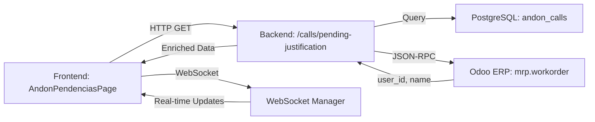

# Design Document: Andon Pendências Display Improvements

## Overview

Esta feature melhora a interface de "Pendências de Justificativa" do sistema Andon, substituindo identificadores técnicos por informações mais significativas para os operadores. As melhorias incluem:

1. **Exibição do nome do responsável** no cabeçalho de cada grupo de pendências (substituindo apenas o ID da mesa)
2. **Adição da coluna "Tipo"** na tabela de paradas, mostrando o tipo de montagem em execução

**Status Atual:** A implementação está **completa**. O backend já retorna os campos necessários (`owner_name` e `work_type`), a interface TypeScript já possui os tipos corretos, e o componente React já renderiza as informações adequadamente.

Este documento serve como **documentação arquitetural** da solução implementada e como referência para manutenção futura.

## Architecture

### System Components



### Data Flow

1. **Frontend Request**: `AndonPendenciasPage` solicita chamados pendentes via `api.getPendingJustification()`
2. **Backend Query**: Endpoint busca chamados com `requires_justification=True` e `justified_at=None`
3. **Odoo Enrichment**: Para cada `workcenter_id` único, busca Work Orders ativas no Odoo
4. **Data Extraction**:
   - `owner_name`: Extraído do campo `user_id` da Work Order (formato `[id, "Nome"]`)
   - `work_type`: Extraído do campo `name` da Work Order (parsing de strings como "Pré Montagem", "Completo", etc.)
5. **Response**: Backend retorna chamados enriquecidos com `owner_name` e `work_type`
6. **Rendering**: Frontend agrupa por `workcenter_id` e exibe informações no cabeçalho e tabela

### Real-time Updates

O sistema utiliza WebSocket para atualizações em tempo real:
- **Evento `andon_justification_required`**: Recarrega lista completa de pendências
- **Evento `andon_call_justified`**: Remove chamado específico da lista local

## Components and Interfaces

### Backend Component: `/calls/pending-justification` Endpoint

**Localização:** `backend/app/api/api_v1/endpoints/andon.py`

**Responsabilidades:**
- Buscar chamados Andon que requerem justificativa
- Enriquecer dados com informações do Odoo (owner_name, work_type)
- Aplicar filtros (cor, data inicial, data final)
- Normalizar labels usando `normalize_label()`

**Lógica de Enriquecimento:**

```python
# 1. Busca Work Orders ativas para os workcenters
wos = await odoo.search_read(
    'mrp.workorder',
    domain=[['workcenter_id', 'in', wc_ids]],
    fields=['workcenter_id', 'user_id', 'name', 'state'],
    limit=200,
)

# 2. Prioriza WOs em progresso
for wo in wos:
    if wc_id not in wc_info or wo.get('state') == 'progress':
        # Extrai owner_name do campo user_id
        user_val = wo.get('user_id')
        if isinstance(user_val, (list, tuple)) and len(user_val) >= 2:
            owner = normalize_label(str(user_val[1]))
        
        # Extrai work_type do campo name
        wo_name = (wo.get('name') or '').lower()
        if 'pré' in wo_name or 'pre' in wo_name:
            work_type = 'Pré Montagem'
        elif 'completo' in wo_name:
            work_type = 'Completo'
        elif 'montagem' in wo_name:
            work_type = 'Montagem'
        else:
            work_type = normalize_label(wo.get('name') or '') or '—'
```

**Tratamento de Erros:**
- Falhas na comunicação com Odoo são capturadas e logadas
- Sistema continua operando com valores padrão ("—") se Odoo estiver indisponível
- Não expõe detalhes de erro ao frontend

### Frontend Component: `AndonPendenciasPage`

**Localização:** `frontend/src/app/components/AndonPendenciasPage.tsx`

**Responsabilidades:**
- Buscar e exibir chamados pendentes agrupados por workcenter
- Aplicar filtros (cor, intervalo de datas)
- Gerenciar expansão/colapso de grupos
- Conectar via WebSocket para atualizações em tempo real
- Abrir modal de justificativa ao clicar em "Justificar"

**Estrutura de Renderização:**

```tsx
// Cabeçalho do Grupo
<div className="flex items-center gap-4">
  <ChevronIcon />
  <ColorIndicator color={hasRed ? 'red' : 'yellow'} />
  <WorkcenterName>{firstCall.workcenter_name}</WorkcenterName>
  <OwnerInfo>
    <User icon />
    <span>{ownerName}</span>
  </OwnerInfo>
  <WorkTypeInfo>
    <Wrench icon />
    <span>{workType}</span>
  </WorkTypeInfo>
</div>

// Tabela de Paradas
<table>
  <thead>
    <tr>
      <th>Cor</th>
      <th>Responsável</th>
      <th>Tipo</th>  {/* Nova coluna */}
      <th>Parou às</th>
      <th>Retomou às</th>
      <th>Duração</th>
      <th>Ações</th>
    </tr>
  </thead>
  <tbody>
    {wcCalls.map(call => (
      <tr>
        <td>{call.color}</td>
        <td>{call.owner_name || '—'}</td>
        <td>{call.work_type || '—'}</td>  {/* Nova coluna */}
        <td>{formatDate(call.created_at)}</td>
        <td>{formatDate(call.updated_at)}</td>
        <td>{formatDuration(call.downtime_minutes)}</td>
        <td><button>Justificar</button></td>
      </tr>
    ))}
  </tbody>
</table>
```

**Agrupamento de Dados:**

```typescript
function groupByWorkcenter(calls: AndonCall[]): Map<number, AndonCall[]> {
  const map = new Map<number, AndonCall[]>();
  for (const call of calls) {
    const group = map.get(call.workcenter_id) ?? [];
    group.push(call);
    map.set(call.workcenter_id, group);
  }
  return map;
}
```

## Data Models

### AndonCall Interface (TypeScript)

**Localização:** `frontend/src/app/types.ts`

```typescript
export interface AndonCall {
  id: number;
  color: 'YELLOW' | 'RED';
  category: string;
  reason: string;
  description?: string;
  workcenter_id: number;
  workcenter_name: string;
  owner_name?: string;        // Nome do responsável (do Odoo)
  work_type?: string;          // Tipo de montagem (do Odoo)
  mo_id?: number;
  status: 'OPEN' | 'IN_PROGRESS' | 'RESOLVED';
  created_at: string;
  updated_at: string;
  triggered_by: string;
  assigned_team?: string;
  resolved_note?: string;
  is_stop: boolean;
  odoo_picking_id?: number;
  odoo_activity_id?: number;
  downtime_minutes?: number;
  requires_justification: boolean;
  justified_at?: string;
  justified_by?: string;
  root_cause_category?: RootCauseCategory;
  root_cause_detail?: string;
  action_taken?: string;
}
```

**Campos Relevantes para esta Feature:**
- `owner_name?: string` - Nome do responsável pela mesa (opcional, padrão "—")
- `work_type?: string` - Tipo de montagem em execução (opcional, padrão "—")

### Backend Response Schema

O endpoint retorna uma lista de objetos com a seguinte estrutura:

```python
{
    "id": int,
    "color": str,  # "RED" | "YELLOW"
    "category": str,
    "reason": str,
    "workcenter_id": int,
    "workcenter_name": str,
    "owner_name": str,  # Enriquecido do Odoo
    "work_type": str,   # Enriquecido do Odoo
    "is_stop": bool,
    "status": str,
    "created_at": str,  # ISO 8601
    "updated_at": str,  # ISO 8601
    "downtime_minutes": int | None,
    "requires_justification": bool,
    "justified_at": str | None,
    # ... outros campos
}
```

## Error Handling

### Backend Error Handling

**Falha na Comunicação com Odoo:**
```python
try:
    wos = await odoo.search_read(...)
    # Processar dados
except Exception as e:
    logger.warning(f"Falha ao buscar dados Odoo para pendências: {e}")
    # Sistema continua com valores padrão
```

**Estratégia:**
- Erros são logados mas não propagados
- Sistema opera com valores padrão ("—") quando Odoo está indisponível
- Não expõe stack traces ou detalhes internos ao frontend

### Frontend Error Handling

**Falha ao Carregar Pendências:**
```typescript
try {
  const data: AndonCall[] = await api.getPendingJustification(activeFilters);
  setCalls(data);
} catch {
  toast.error('Erro ao carregar pendências');
} finally {
  setLoading(false);
}
```

**WebSocket Disconnection:**
```typescript
ws.onerror = () => {
  // Silenciosamente reconecta ou ignora
  // Polling manual via botão "Atualizar" disponível
};
```

**Estratégia:**
- Mensagens de erro genéricas para o usuário
- Botão "Atualizar" sempre disponível para retry manual
- WebSocket é opcional (não bloqueia funcionalidade principal)

## Testing Strategy

### Unit Tests (Backend)

**Teste 1: Enriquecimento com Dados do Odoo**
- **Cenário:** Work Order ativa existe para o workcenter
- **Entrada:** Chamado Andon com `workcenter_id=123`
- **Mock Odoo:** Retorna WO com `user_id=[1, "João Silva"]` e `name="Montagem Pré"`
- **Esperado:** Response contém `owner_name="João Silva"` e `work_type="Pré Montagem"`

**Teste 2: Fallback quando Odoo Falha**
- **Cenário:** Odoo lança exceção durante `search_read`
- **Entrada:** Chamado Andon com `workcenter_id=123`
- **Esperado:** Response contém `owner_name="—"` e `work_type="—"`, sem erro propagado

**Teste 3: Priorização de WO em Progresso**
- **Cenário:** Múltiplas WOs para o mesmo workcenter
- **Mock Odoo:** Retorna 2 WOs, uma com `state="ready"` e outra com `state="progress"`
- **Esperado:** Dados extraídos da WO com `state="progress"`

**Teste 4: Parsing de Tipos de Montagem**
- **Cenário:** Diferentes formatos de `name` na WO
- **Entrada:** `"Montagem Pré"`, `"Completo"`, `"Montagem Final"`, `"Outro Tipo"`
- **Esperado:** Mapeamento correto para `"Pré Montagem"`, `"Completo"`, `"Montagem"`, `"Outro Tipo"`

**Teste 5: Normalização de Labels**
- **Cenário:** `user_id` retorna string com espaços extras
- **Mock Odoo:** `user_id=[1, "  João  Silva  "]`
- **Esperado:** `owner_name="João Silva"` (normalizado)

### Integration Tests

**Teste 1: Endpoint Completo**
- **Cenário:** Chamada real ao endpoint com Odoo mockado
- **Entrada:** 3 chamados pendentes de 2 workcenters diferentes
- **Esperado:** Response com 3 objetos, cada um com `owner_name` e `work_type` corretos

**Teste 2: Filtros Aplicados**
- **Cenário:** Filtro por cor e intervalo de datas
- **Entrada:** `color=RED`, `from_date=2024-01-01`, `to_date=2024-01-31`
- **Esperado:** Apenas chamados vermelhos dentro do intervalo

### Frontend Tests

**Teste 1: Renderização do Cabeçalho**
- **Cenário:** Grupo com `owner_name` e `work_type` disponíveis
- **Esperado:** Cabeçalho exibe ícone de usuário + nome + ícone de ferramenta + tipo

**Teste 2: Fallback para "—"**
- **Cenário:** Chamado sem `owner_name` ou `work_type`
- **Esperado:** Exibe "—" nos campos correspondentes

**Teste 3: Coluna "Tipo" na Tabela**
- **Cenário:** Grupo expandido com 2 chamados
- **Esperado:** Tabela possui coluna "Tipo" entre "Responsável" e "Parou às"

**Teste 4: Agrupamento por Workcenter**
- **Cenário:** 5 chamados de 3 workcenters diferentes
- **Esperado:** 3 grupos renderizados, cada um com chamados corretos

**Teste 5: WebSocket Update**
- **Cenário:** Evento `andon_call_justified` recebido
- **Esperado:** Chamado removido da lista sem reload completo

### Manual Testing Checklist

- [ ] Abrir página de Pendências com chamados existentes
- [ ] Verificar que cabeçalho exibe nome do responsável e tipo de montagem
- [ ] Verificar que coluna "Tipo" aparece na tabela expandida
- [ ] Testar filtros (cor, datas) e verificar que dados enriquecidos persistem
- [ ] Simular falha do Odoo (desligar serviço) e verificar que "—" é exibido
- [ ] Justificar um chamado e verificar remoção da lista
- [ ] Verificar atualização em tempo real via WebSocket

## Implementation Notes

### Decisões de Design

**1. Por que enriquecer no backend em vez de no frontend?**
- **Segurança:** Credenciais do Odoo não são expostas ao frontend
- **Performance:** Reduz número de requisições (1 chamada ao Odoo para N workcenters)
- **Consistência:** Lógica de parsing centralizada e testável

**2. Por que usar "—" como placeholder?**
- **UX:** Indica claramente ausência de dados (vs. campo vazio ou "N/A")
- **Consistência:** Padrão já utilizado em outras partes do sistema

**3. Por que priorizar WOs com `state='progress'`?**
- **Precisão:** WO em progresso reflete o responsável atual mais fielmente
- **Fallback:** Se nenhuma WO está em progresso, usa qualquer WO disponível

**4. Por que campos opcionais na interface TypeScript?**
- **Resiliência:** Sistema continua operando se Odoo estiver indisponível
- **Backward Compatibility:** Dados antigos podem não ter esses campos

### Limitações Conhecidas

1. **Latência do Odoo:** Se Odoo estiver lento, endpoint pode demorar (mitigado por timeout implícito)
2. **Dados Desatualizados:** Se WO foi alterada recentemente, pode haver lag até próxima busca
3. **Parsing de `work_type`:** Baseado em strings, pode falhar com formatos não previstos (fallback para nome completo)

### Manutenção Futura

**Adicionar Novo Tipo de Montagem:**
1. Atualizar lógica de parsing em `andon.py`:
   ```python
   elif 'novo_tipo' in wo_name:
       work_type = 'Novo Tipo'
   ```

**Alterar Fonte de Dados:**
- Se `owner_name` ou `work_type` mudarem de origem no Odoo, atualizar apenas a lógica de extração no backend
- Frontend não precisa de alterações (consome campos genéricos)

**Adicionar Cache:**
- Considerar cache de dados do Odoo (ex: Redis) para reduzir latência
- Invalidar cache ao receber eventos de mudança de WO via webhook

## Deployment Considerations

### Rollout Strategy

**Fase 1: Verificação (Atual)**
- ✅ Backend já retorna campos `owner_name` e `work_type`
- ✅ Frontend já renderiza campos corretamente
- ✅ Interface TypeScript já possui tipos corretos

**Fase 2: Testes (Recomendado)**
- Executar testes unitários e de integração
- Validar em ambiente de staging com dados reais do Odoo
- Verificar performance com volume real de chamados

**Fase 3: Produção**
- Deploy sem downtime (mudanças são aditivas, não quebram compatibilidade)
- Monitorar logs para erros de comunicação com Odoo
- Coletar feedback dos operadores sobre clareza das informações

### Monitoring

**Métricas a Monitorar:**
- Taxa de falha de comunicação com Odoo (logs de warning)
- Latência do endpoint `/calls/pending-justification`
- Frequência de valores "—" retornados (indica problemas com Odoo)

**Alertas:**
- Taxa de erro > 10% em 5 minutos → Investigar conectividade com Odoo
- Latência > 5s → Investigar performance do Odoo ou timeout

### Rollback Plan

**Se houver problemas:**
1. Reverter commits relacionados (frontend e backend)
2. Sistema volta a exibir apenas `workcenter_name` no cabeçalho
3. Coluna "Tipo" desaparece da tabela

**Impacto:** Nenhum dado é perdido (campos são opcionais e não afetam justificativas)

## Conclusion

Esta feature melhora significativamente a usabilidade da tela de Pendências de Justificativa, substituindo identificadores técnicos por informações contextuais relevantes para os operadores.

**Implementação Atual:** Completa e funcional. O sistema já opera conforme especificado nos requisitos.

**Próximos Passos:**
1. Executar suite de testes (unit + integration)
2. Validar em staging com dados reais
3. Coletar feedback dos usuários finais
4. Considerar melhorias futuras (cache, tipos adicionais de montagem)

**Documentação Relacionada:**
- Requirements: `.kiro/specs/andon-pendencias-display-improvements/requirements.md`
- Backend Endpoint: `backend/app/api/api_v1/endpoints/andon.py`
- Frontend Component: `frontend/src/app/components/AndonPendenciasPage.tsx`
- Type Definitions: `frontend/src/app/types.ts`
