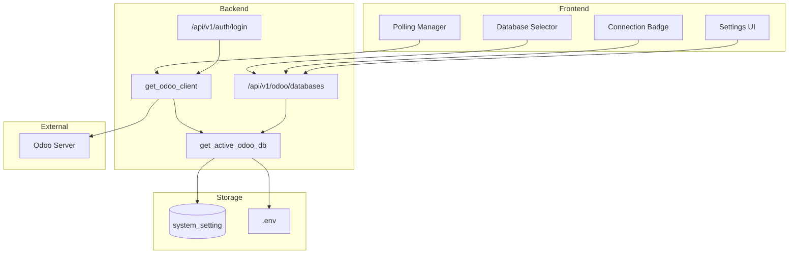
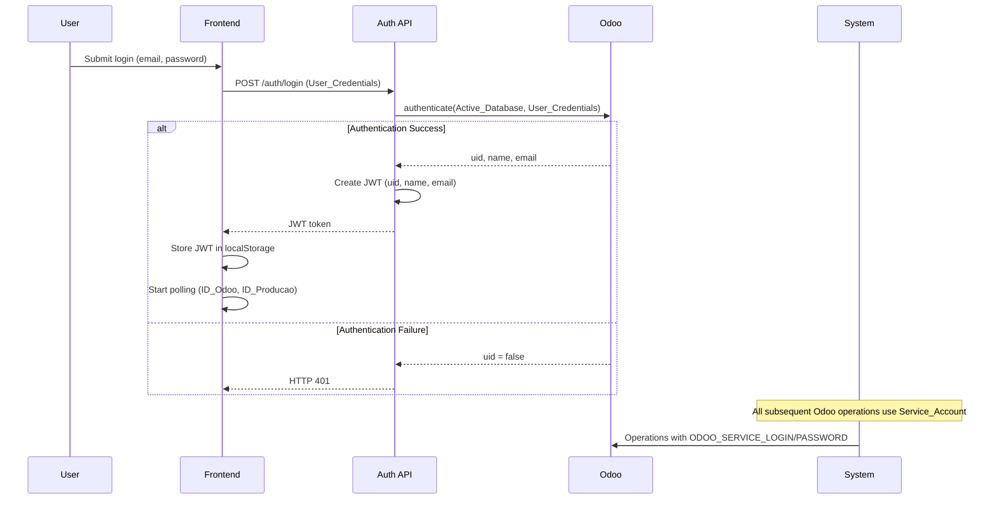
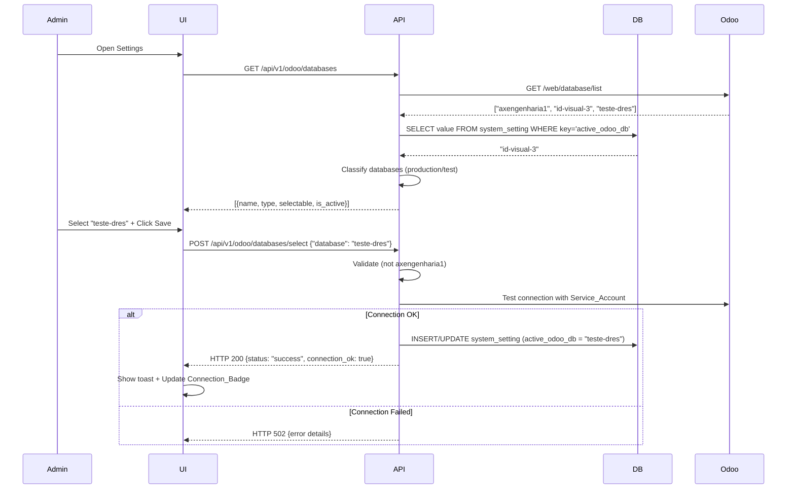

# Design Document: Dynamic Odoo Database Selection

## Overview

Este documento especifica o design técnico para implementação de três features integradas no sistema ID Visual AX:

1. **Seleção Dinâmica de Banco de Dados Odoo**: Permite que administradores selecionem dinamicamente qual banco de dados Odoo será utilizado pelo sistema, com proteção especial para o banco de produção (`axengenharia1`).

2. **Refatoração da Lógica de Autenticação**: Separa claramente o papel de conta de serviço (Service_Account) do papel de validação de usuário (User_Credentials), eliminando ambiguidade no uso das credenciais Odoo.

3. **Polling Automático de Identificações Visuais**: Implementa busca automática em background de ID_Odoo (10 minutos) e ID_Producao (30 segundos) usando Service_Account e Active_Database.

### Motivação

Atualmente, o sistema opera com um único banco de dados Odoo configurado estaticamente via `.env`. Durante desenvolvimento e testes, é necessário editar manualmente o arquivo `.env` para alternar entre bancos, o que é propenso a erros e não permite isolamento por usuário. Além disso, a lógica de autenticação atual mistura credenciais de usuário com credenciais de serviço, criando confusão sobre qual conta está sendo usada para operações no Odoo.

### Objetivos

- Permitir seleção dinâmica de banco de dados Odoo via interface gráfica
- Proteger o banco de produção (`axengenharia1`) contra seleção acidental durante testes
- Separar claramente Service_Account (operações do sistema) de User_Credentials (validação de login)
- Implementar polling automático de identificações visuais com lifecycle gerenciado
- Manter retrocompatibilidade com código existente
- Garantir segurança (zero vazamento de credenciais em logs ou respostas HTTP)

## Architecture

### High-Level Architecture




### Fallback Chain Architecture

O sistema implementa uma cadeia de fallback robusta para determinar o banco de dados ativo:

```
1. system_setting.active_odoo_db (prioridade máxima)
   ↓ (se não existir)
2. "id-visual-3" (padrão hardcoded)
   ↓ (se DB não disponível)
3. settings.ODOO_DB do .env (fallback de emergência)
```

Esta arquitetura garante que o sistema sempre tenha um banco de dados válido, mesmo em cenários de falha.

### Authentication Flow



### Database Selection Flow



## Components and Interfaces

### Backend Components

#### 1. Database Management Endpoints

**GET /api/v1/odoo/databases**

Retorna lista de bancos de dados disponíveis no servidor Odoo configurado.

```python
# backend/app/api/api_v1/endpoints/odoo.py

@router.get("/databases", response_model=List[DatabaseInfo])
async def list_odoo_databases(
    session: AsyncSession = Depends(get_session),
    current_user: User = Depends(get_current_user)
) -> List[DatabaseInfo]:
    """
    Lista todos os bancos de dados disponíveis no servidor Odoo.
    Classifica cada banco como 'production' ou 'test'.
    Marca o banco ativo atual.
    """
    pass
```

**Response Schema:**
```json
[
  {
    "name": "axengenharia1",
    "type": "production",
    "selectable": false,
    "is_active": false
  },
  {
    "name": "id-visual-3",
    "type": "test",
    "selectable": true,
    "is_active": true
  }
]
```

**POST /api/v1/odoo/databases/select**

Seleciona um banco de dados para uso pelo sistema.

```python
@router.post("/databases/select", response_model=DatabaseSelectResponse)
async def select_odoo_database(
    payload: DatabaseSelectRequest,
    session: AsyncSession = Depends(get_session),
    current_user: User = Depends(get_current_user)
) -> DatabaseSelectResponse:
    """
    Seleciona um banco de dados Odoo.
    Valida que não é o banco de produção.
    Testa conexão antes de persistir.
    """
    pass
```

**Request Schema:**
```json
{
  "database": "id-visual-3"
}
```

**Response Schema:**
```json
{
  "status": "success",
  "database": "id-visual-3",
  "connection_ok": true
}
```


#### 2. Helper Function: get_active_odoo_db()

Função centralizada para obter o banco de dados Odoo ativo.

```python
# backend/app/services/odoo_utils.py

async def get_active_odoo_db(session: AsyncSession) -> str:
    """
    Retorna o banco de dados Odoo ativo com fallback chain:
    1. system_setting.active_odoo_db
    2. "id-visual-3" (padrão)
    3. settings.ODOO_DB (fallback de emergência)
    
    Args:
        session: AsyncSession do SQLModel
        
    Returns:
        str: Nome do banco de dados ativo
    """
    try:
        stmt = select(SystemSetting).where(SystemSetting.key == "active_odoo_db")
        result = await session.execute(stmt)
        setting = result.scalars().first()
        
        if setting and setting.value:
            return setting.value.strip()
        
        # Fallback 1: padrão hardcoded
        return "id-visual-3"
        
    except Exception as e:
        logger.warning(f"Failed to get active_odoo_db from database: {e}")
        # Fallback 2: .env
        return settings.ODOO_DB
```

#### 3. Modified Dependency: get_odoo_client()

Atualização do dependency para usar `get_active_odoo_db()`.

```python
# backend/app/api/deps.py

async def get_odoo_client(
    session: AsyncSession = Depends(get_session),
    current_user: Optional[User] = Depends(get_current_user)
):
    from app.services.odoo_client import OdooClient
    from app.services.odoo_utils import get_active_odoo_db
    
    # Obter banco ativo dinamicamente
    active_db = await get_active_odoo_db(session)
    
    client = OdooClient(
        url=settings.ODOO_URL,
        db=active_db,  # Usa banco ativo ao invés de settings.ODOO_DB
        auth_type=settings.ODOO_AUTH_TYPE,
        login=settings.ODOO_SERVICE_LOGIN,  # Renomeado
        secret=settings.ODOO_SERVICE_PASSWORD  # Renomeado
    )
    try:
        yield client
    finally:
        await client.close()
```

#### 4. Authentication Refactoring

**Antes (Ambíguo):**
```python
# Usava ODOO_LOGIN/ODOO_PASSWORD para tudo
client = OdooClient(
    login=settings.ODOO_LOGIN,  # Ambíguo: usuário ou serviço?
    secret=settings.ODOO_PASSWORD
)
```

**Depois (Claro):**
```python
# Login: valida credenciais do usuário
temp_client = OdooClient(
    login=form_data.username,  # User_Credentials
    secret=form_data.password
)

# Operações: usa conta de serviço
service_client = OdooClient(
    login=settings.ODOO_SERVICE_LOGIN,  # Service_Account
    secret=settings.ODOO_SERVICE_PASSWORD
)
```

**Updated auth.py:**
```python
# backend/app/api/api_v1/endpoints/auth.py

@router.post("/login")
async def login_access_token(
    request: Request,
    form_data: OAuth2PasswordRequestForm = Depends(),
    session: AsyncSession = Depends(deps.get_session)
) -> Any:
    """
    OAuth2 compatible token login.
    1. Valida User_Credentials no Odoo usando Active_Database
    2. Cria sessão local com JWT (uid, name, email)
    3. NUNCA armazena senha do usuário
    """
    from app.services.odoo_client import OdooClient
    from app.services.odoo_utils import get_active_odoo_db
    
    active_db = await get_active_odoo_db(session)
    
    # Cria cliente temporário com credenciais do usuário
    temp_odoo = OdooClient(
        url=settings.ODOO_URL,
        db=active_db,  # Usa banco ativo
        auth_type="jsonrpc_password",
        login=form_data.username,  # User_Credentials
        secret=form_data.password
    )
    
    try:
        session_id = await temp_odoo._jsonrpc_authenticate()
        # Sucesso: cria JWT local
        return {
            "access_token": create_access_token(subject=form_data.username),
            "token_type": "bearer",
        }
    except Exception as e:
        # Trata erros sem expor detalhes internos
        if str(e) == "AUTHENTICATION_FAILED":
            raise HTTPException(status_code=401, detail="Credenciais inválidas.")
        raise HTTPException(status_code=502, detail="Erro de infraestrutura Odoo")
    finally:
        await temp_odoo.close()
```

### Frontend Components

#### 1. Database_Selector Component

Dropdown para seleção de banco de dados na tela de Configurações.

```typescript
// frontend/src/app/components/DatabaseSelector.tsx

interface Database {
  name: string;
  type: 'production' | 'test';
  selectable: boolean;
  is_active: boolean;
}

export function DatabaseSelector() {
  const [databases, setDatabases] = useState<Database[]>([]);
  const [selectedDb, setSelectedDb] = useState<string>('');
  const [loading, setLoading] = useState(false);

  useEffect(() => {
    loadDatabases();
  }, []);

  const loadDatabases = async () => {
    try {
      const data = await api.get('/odoo/databases');
      setDatabases(data);
      const active = data.find((db: Database) => db.is_active);
      if (active) setSelectedDb(active.name);
    } catch (err) {
      toast.error('Erro ao carregar bancos de dados');
    }
  };

  const handleSave = async () => {
    setLoading(true);
    try {
      await api.post('/odoo/databases/select', { database: selectedDb });
      toast.success('Banco de dados atualizado com sucesso!');
      // Trigger Connection_Badge update
      window.dispatchEvent(new Event('database-changed'));
    } catch (err: any) {
      toast.error(err.message);
    } finally {
      setLoading(false);
    }
  };

  return (
    <div className="space-y-4">
      <label className="text-xs font-bold text-slate-400 uppercase">
        Banco de Dados Odoo
      </label>
      <select
        value={selectedDb}
        onChange={(e) => setSelectedDb(e.target.value)}
        className="w-full p-4 rounded-xl border border-slate-100 bg-slate-50"
      >
        {databases.map((db) => (
          <option 
            key={db.name} 
            value={db.name}
            disabled={!db.selectable}
          >
            {db.type === 'production' ? '🟢' : '🟡'} {db.name}
            {db.is_active ? ' (Ativo)' : ''}
          </option>
        ))}
      </select>
      
      {databases.find(db => db.name === selectedDb)?.type === 'production' && (
        <div className="bg-amber-50 border border-amber-100 p-3 rounded-lg text-xs text-amber-800">
          ⚠️ Banco de produção — seleção desabilitada durante período de testes
        </div>
      )}
      
      <button
        onClick={handleSave}
        disabled={loading}
        className="px-6 py-2.5 bg-blue-600 text-white rounded-xl font-bold"
      >
        {loading ? 'Salvando...' : 'Salvar Configuração'}
      </button>
    </div>
  );
}
```


#### 2. Connection_Badge Component

Indicador visual no header mostrando status da conexão Odoo.

```typescript
// frontend/src/app/components/ConnectionBadge.tsx

type ConnectionStatus = 'production' | 'test' | 'disconnected';

export function ConnectionBadge() {
  const [status, setStatus] = useState<ConnectionStatus>('disconnected');
  const [dbName, setDbName] = useState<string>('');

  useEffect(() => {
    checkConnection();
    
    // Listen for database changes
    const handleDbChange = () => checkConnection();
    window.addEventListener('database-changed', handleDbChange);
    
    return () => {
      window.removeEventListener('database-changed', handleDbChange);
    };
  }, []);

  const checkConnection = async () => {
    try {
      const data = await api.get('/odoo/databases');
      const active = data.find((db: any) => db.is_active);
      
      if (active) {
        setDbName(active.name);
        setStatus(active.type);
      } else {
        setStatus('disconnected');
      }
    } catch (err) {
      setStatus('disconnected');
    }
  };

  const getStatusConfig = () => {
    switch (status) {
      case 'production':
        return {
          icon: '🟢',
          text: 'ODOO CONECTADO',
          bgColor: 'bg-emerald-50',
          textColor: 'text-emerald-700',
          borderColor: 'border-emerald-100'
        };
      case 'test':
        return {
          icon: '🟡',
          text: 'ODOO CONECTADO',
          bgColor: 'bg-amber-50',
          textColor: 'text-amber-700',
          borderColor: 'border-amber-100'
        };
      default:
        return {
          icon: '🔴',
          text: 'ODOO DESCONECTADO',
          bgColor: 'bg-red-50',
          textColor: 'text-red-700',
          borderColor: 'border-red-100'
        };
    }
  };

  const config = getStatusConfig();

  return (
    <div className={`flex items-center gap-2 px-3 py-1.5 rounded-lg border ${config.bgColor} ${config.textColor} ${config.borderColor}`}>
      <div className="w-2 h-2 rounded-full animate-pulse" style={{ backgroundColor: config.icon === '🟢' ? '#10b981' : config.icon === '🟡' ? '#f59e0b' : '#ef4444' }} />
      <span className="text-[11px] font-bold uppercase tracking-wider">
        {config.text}
      </span>
      {dbName && status !== 'disconnected' && (
        <span className="text-[10px] opacity-70">({dbName})</span>
      )}
    </div>
  );
}
```

#### 3. Polling Manager

Gerenciador de polling automático de identificações visuais.

```typescript
// frontend/src/services/pollingManager.ts

class PollingManager {
  private idOdooInterval: NodeJS.Timeout | null = null;
  private idProducaoInterval: NodeJS.Timeout | null = null;
  private isActive = false;

  start() {
    if (this.isActive) {
      console.warn('Polling already active');
      return;
    }

    this.isActive = true;

    // ID_Odoo: 10 minutos
    this.idOdooInterval = setInterval(async () => {
      try {
        await api.get('/odoo/mos');
        console.log('[Polling] ID_Odoo refreshed');
      } catch (err) {
        console.error('[Polling] ID_Odoo failed:', err);
      }
    }, 10 * 60 * 1000);

    // ID_Producao: 30 segundos
    this.idProducaoInterval = setInterval(async () => {
      try {
        await api.get('/id-requests/manual');
        console.log('[Polling] ID_Producao refreshed');
      } catch (err) {
        console.error('[Polling] ID_Producao failed:', err);
      }
    }, 30 * 1000);

    console.log('[Polling] Started');
  }

  stop() {
    if (this.idOdooInterval) {
      clearInterval(this.idOdooInterval);
      this.idOdooInterval = null;
    }

    if (this.idProducaoInterval) {
      clearInterval(this.idProducaoInterval);
      this.idProducaoInterval = null;
    }

    this.isActive = false;
    console.log('[Polling] Stopped');
  }

  restart() {
    this.stop();
    this.start();
  }
}

export const pollingManager = new PollingManager();
```

**Integration in App.tsx:**
```typescript
// frontend/src/app/App.tsx

useEffect(() => {
  if (isAuthenticated) {
    pollingManager.start();
    
    // Listen for database changes
    const handleDbChange = () => {
      console.log('[App] Database changed, restarting polling');
      pollingManager.restart();
    };
    window.addEventListener('database-changed', handleDbChange);
    
    return () => {
      pollingManager.stop();
      window.removeEventListener('database-changed', handleDbChange);
    };
  }
}, [isAuthenticated]);
```


## Data Models

### Backend Schemas

#### DatabaseInfo (Response)

```python
# backend/app/schemas/odoo.py

from pydantic import BaseModel
from typing import Literal

class DatabaseInfo(BaseModel):
    name: str
    type: Literal["production", "test"]
    selectable: bool
    is_active: bool

class DatabaseSelectRequest(BaseModel):
    database: str

class DatabaseSelectResponse(BaseModel):
    status: Literal["success", "error"]
    database: str
    connection_ok: bool
```

#### SystemSetting (Existing Model)

```python
# backend/app/models/system_setting.py

from sqlmodel import Field, SQLModel
from datetime import datetime
from typing import Optional

class SystemSetting(SQLModel, table=True):
    __tablename__ = "system_setting"
    
    key: str = Field(primary_key=True, index=True)
    value: str
    description: Optional[str] = None
    updated_at: datetime = Field(default_factory=datetime.utcnow)
```

**Chave utilizada:**
- `active_odoo_db`: Nome do banco de dados Odoo ativo (ex: "id-visual-3")

### Frontend Types

```typescript
// frontend/src/types/odoo.ts

export interface Database {
  name: string;
  type: 'production' | 'test';
  selectable: boolean;
  is_active: boolean;
}

export interface DatabaseSelectRequest {
  database: string;
}

export interface DatabaseSelectResponse {
  status: 'success' | 'error';
  database: string;
  connection_ok: boolean;
}
```

### Environment Variables

**Antes (Ambíguo):**
```bash
ODOO_LOGIN=seu_email@exemplo.com
ODOO_PASSWORD=sua_senha_ou_apikey
```

**Depois (Claro):**
```bash
# Conta de Serviço (usada pelo sistema para todas as operações)
ODOO_SERVICE_LOGIN=service_account@exemplo.com
ODOO_SERVICE_PASSWORD=service_account_password_or_apikey

# Nota: Credenciais de usuário são fornecidas no login e NUNCA armazenadas
```

**Updated .env.example:**
```bash
# Integração Odoo
ODOO_URL=https://axengenharia1.odoo.com
ODOO_DB=axengenharia1  # Fallback de emergência (não usado se system_setting existe)

# Conta de Serviço (Service Account)
# Esta conta é usada pelo sistema para todas as operações no Odoo
ODOO_SERVICE_LOGIN=service_account@exemplo.com
ODOO_SERVICE_PASSWORD=sua_senha_ou_apikey

# Tipo de autenticação (jsonrpc_password ou json2_apikey)
ODOO_AUTH_TYPE=jsonrpc_password
```

## Critical Algorithms

### 1. Database Classification Algorithm

```python
def classify_database(db_name: str) -> Literal["production", "test"]:
    """
    Classifica um banco de dados como production ou test.
    
    Rules:
    - "axengenharia1" → production
    - Qualquer outro nome → test
    """
    return "production" if db_name == "axengenharia1" else "test"

def is_selectable(db_type: str) -> bool:
    """
    Determina se um banco pode ser selecionado.
    
    Rules:
    - production → False (protegido)
    - test → True
    """
    return db_type == "test"
```

### 2. Database Name Validation

```python
import re

def validate_database_name(name: str) -> bool:
    """
    Valida nome de banco de dados.
    
    Rules:
    - Não pode ser vazio
    - Não pode conter apenas espaços
    - Deve conter apenas: a-z, A-Z, 0-9, hífen, underscore
    """
    if not name or not name.strip():
        return False
    
    pattern = r'^[a-zA-Z0-9_-]+$'
    return bool(re.match(pattern, name.strip()))

def normalize_database_name(name: str) -> str:
    """
    Normaliza nome de banco de dados (trim).
    """
    return name.strip()
```

### 3. Connection Test Algorithm

```python
async def test_odoo_connection(url: str, db: str, login: str, password: str) -> bool:
    """
    Testa conexão com banco de dados Odoo.
    
    Returns:
        True se conexão bem-sucedida, False caso contrário
    """
    client = OdooClient(
        url=url,
        db=db,
        auth_type="jsonrpc_password",
        login=login,
        secret=password
    )
    
    try:
        await client._jsonrpc_authenticate()
        return True
    except Exception as e:
        logger.error(f"Connection test failed for {db}: {e}")
        return False
    finally:
        await client.close()
```

### 4. Polling Lifecycle Management

```typescript
class PollingManager {
  // Garante que apenas uma instância de cada polling está ativa
  private ensureSingleInstance() {
    if (this.idOdooInterval || this.idProducaoInterval) {
      throw new Error('Polling already active. Call stop() first.');
    }
  }

  start() {
    this.ensureSingleInstance();
    // ... start intervals
  }

  // Reinicia polling quando banco de dados muda
  restart() {
    this.stop();
    // Pequeno delay para garantir cleanup
    setTimeout(() => this.start(), 100);
  }
}
```


## Security Considerations

### 1. Credential Protection

**Princípios:**
- ODOO_SERVICE_PASSWORD NUNCA deve aparecer em logs, stack traces ou respostas HTTP
- User_Credentials (senha do usuário) NUNCA devem ser armazenadas no banco de dados ou sessão
- Mensagens de erro devem ser genéricas para não revelar detalhes internos

**Implementation:**
```python
# Sanitização de logs
def sanitize_error_message(error: str) -> str:
    """Remove credenciais de mensagens de erro."""
    sanitized = error.replace(settings.ODOO_SERVICE_PASSWORD or "", "***")
    sanitized = sanitized.replace(settings.ODOO_SERVICE_LOGIN or "", "***")
    return sanitized

# Geração de request_id para rastreabilidade
import uuid

request_id = str(uuid.uuid4())[:8]
logger.error(f"Odoo error [ref:{request_id}]: {sanitize_error_message(str(e))}")
raise HTTPException(
    status_code=502,
    detail=f"Erro de conectividade Odoo [ref: {request_id}]"
)
```

### 2. Production Database Protection

**Regras:**
- Banco `axengenharia1` NUNCA pode ser selecionado via UI durante período de testes
- Validação no backend (não confiar apenas no frontend)
- Mensagem de erro clara e específica

```python
if payload.database == "axengenharia1":
    raise HTTPException(
        status_code=403,
        detail="Banco de produção não pode ser selecionado durante período de testes"
    )
```

### 3. Session Management

**Princípios:**
- JWT contém apenas: `sub` (username), `exp` (expiration)
- Sessão local armazena: `uid`, `name`, `email` (obtidos do Odoo)
- Service_Account permanece autenticada independente de logout do usuário

**Logout Flow:**
```typescript
// Frontend
api.logout = () => {
  localStorage.removeItem('id_visual_token');
  pollingManager.stop();  // Para polling
  window.location.reload();
};

// Backend: NUNCA chama /web/session/destroy para Service_Account
```

### 4. Input Validation

**Database Name Validation:**
```python
# Rejeita nomes inválidos
if not validate_database_name(payload.database):
    raise HTTPException(
        status_code=400,
        detail="Nome de banco inválido. Use apenas letras, números, hífen e underscore."
    )

# Normaliza antes de persistir
normalized_name = normalize_database_name(payload.database)
```

### 5. Startup Validation

```python
# backend/app/main.py

@app.on_event("startup")
async def validate_environment():
    """Valida variáveis de ambiente críticas no startup."""
    required_vars = [
        "ODOO_URL",
        "ODOO_SERVICE_LOGIN",
        "ODOO_SERVICE_PASSWORD"
    ]
    
    missing = [var for var in required_vars if not getattr(settings, var, None)]
    
    if missing:
        raise RuntimeError(
            f"Missing required environment variables: {', '.join(missing)}"
        )
    
    logger.info("✓ Environment validation passed")
```


## Correctness Properties

*A property is a characteristic or behavior that should hold true across all valid executions of a system—essentially, a formal statement about what the system should do. Properties serve as the bridge between human-readable specifications and machine-verifiable correctness guarantees.*

### Property 1: Database Classification Consistency

*For any* database name returned by Odoo, the system should classify it as "production" if and only if the name is exactly "axengenharia1", otherwise as "test".

**Validates: Requirements 1.2**

### Property 2: Production Database Protection

*For any* database classified as "production", the system should set `selectable: false` in the response.

**Validates: Requirements 1.3**

### Property 3: Active Database Inclusion

*For any* valid response from GET /api/v1/odoo/databases, the response should include exactly one database with `is_active: true`.

**Validates: Requirements 1.4**

### Property 4: Response Schema Completeness

*For any* database in the response list, the object should contain all required fields: `name`, `type`, `selectable`, and `is_active`.

**Validates: Requirements 1.6**

### Property 5: Production Database Rejection

*For any* POST request to /api/v1/odoo/databases/select with `database: "axengenharia1"`, the system should return HTTP 403.

**Validates: Requirements 2.1, 2.2**

### Property 6: Database Selection Persistence

*For any* valid test database name, after successful selection via POST /api/v1/odoo/databases/select, querying system_setting with key "active_odoo_db" should return that database name.

**Validates: Requirements 2.3**

### Property 7: Connection Validation Before Persistence

*For any* database selection attempt, the system should test the connection with Service_Account before persisting the value to system_setting.

**Validates: Requirements 2.4**

### Property 8: Active Database Retrieval

*For any* call to `get_active_odoo_db()`, if system_setting contains a value for "active_odoo_db", that value should be returned.

**Validates: Requirements 3.1**

### Property 9: Database Name Normalization Round-Trip

*For any* valid database name, normalizing then storing then retrieving should produce an equivalent value: `retrieve(store(normalize(name))) == normalize(name)`.

**Validates: Requirements 12.3, 12.4**

### Property 10: Invalid Database Name Rejection

*For any* string composed entirely of whitespace or containing invalid characters (not alphanumeric, hyphen, or underscore), the system should reject it with HTTP 400.

**Validates: Requirements 12.1, 12.2**

### Property 11: Service Account Usage for Operations

*For any* Odoo operation after user login, the system should use ODOO_SERVICE_LOGIN and ODOO_SERVICE_PASSWORD, never User_Credentials.

**Validates: Requirements 8.1, 8.4**

### Property 12: Active Database Usage in All Calls

*For any* OdooClient instantiation via `get_odoo_client()`, the database parameter should be the value returned by `get_active_odoo_db()`.

**Validates: Requirements 3.4, 8.2**

### Property 13: User Password Never Stored

*For any* successful login, the user's password should not appear in the database, session storage, or JWT token.

**Validates: Requirements 7.5**

### Property 14: Session Data Minimalism

*For any* user session, the stored data should contain only `uid`, `name`, and `email`, nothing more.

**Validates: Requirements 7.6**

### Property 15: Service Account Session Preservation

*For any* user logout event, the system should never call `/web/session/destroy` for the Service_Account.

**Validates: Requirements 9.2, 9.3**

### Property 16: Credential Sanitization in Logs

*For any* error log entry, ODOO_SERVICE_PASSWORD and ODOO_SERVICE_LOGIN should never appear in plain text.

**Validates: Requirements 10.1, 10.2**

### Property 17: Generic Error Messages

*For any* authentication failure, the HTTP response should contain a generic message without revealing internal details (e.g., "Credenciais inválidas" instead of "User not found in database X").

**Validates: Requirements 10.3**

### Property 18: Request ID Uniqueness

*For any* error response, the system should include a unique `request_id` for traceability.

**Validates: Requirements 10.4**

### Property 19: Polling Instance Uniqueness

*For any* user session, there should be at most one active instance of ID_Odoo polling and at most one active instance of ID_Producao polling.

**Validates: Requirements 13.9**

### Property 20: Polling Uses Service Account

*For any* polling request (ID_Odoo or ID_Producao), the system should use ODOO_SERVICE_LOGIN and ODOO_SERVICE_PASSWORD.

**Validates: Requirements 13.5**

### Property 21: Polling Uses Active Database

*For any* polling request, the system should use the current value of Active_Database.

**Validates: Requirements 13.6**

### Property 22: Polling Silent Failure Handling

*For any* polling failure, the system should log the error but continue polling without interrupting the user session.

**Validates: Requirements 13.8**


## Error Handling

### Backend Error Handling

#### 1. Odoo Server Unavailable

```python
try:
    response = await httpx.get(f"{settings.ODOO_URL}/web/database/list")
except httpx.TimeoutException:
    raise HTTPException(
        status_code=504,
        detail="Odoo server timeout. Please try again."
    )
except httpx.NetworkError:
    raise HTTPException(
        status_code=502,
        detail="Cannot reach Odoo server. Check network connectivity."
    )
```

#### 2. Database Connection Test Failure

```python
connection_ok = await test_odoo_connection(
    url=settings.ODOO_URL,
    db=payload.database,
    login=settings.ODOO_SERVICE_LOGIN,
    secret=settings.ODOO_SERVICE_PASSWORD
)

if not connection_ok:
    raise HTTPException(
        status_code=502,
        detail=f"Failed to connect to database '{payload.database}' with Service Account. Verify credentials."
    )
```

#### 3. System_Setting Table Unavailable

```python
async def get_active_odoo_db(session: AsyncSession) -> str:
    try:
        stmt = select(SystemSetting).where(SystemSetting.key == "active_odoo_db")
        result = await session.execute(stmt)
        setting = result.scalars().first()
        
        if setting:
            return setting.value.strip()
        return "id-visual-3"  # Fallback 1
        
    except Exception as e:
        logger.warning(f"Database unavailable, using .env fallback: {e}")
        return settings.ODOO_DB  # Fallback 2
```

#### 4. Corrupted Database Name in System_Setting

```python
def validate_and_recover(db_name: str) -> str:
    """
    Valida nome de banco. Se inválido, retorna fallback.
    """
    if not validate_database_name(db_name):
        logger.warning(f"Corrupted database name '{db_name}', using fallback")
        return "id-visual-3"
    return normalize_database_name(db_name)
```

### Frontend Error Handling

#### 1. API Call Failures

```typescript
const loadDatabases = async () => {
  try {
    const data = await api.get('/odoo/databases');
    setDatabases(data);
  } catch (err: any) {
    if (err.status === 502) {
      toast.error('Servidor Odoo indisponível. Verifique a conexão.');
    } else if (err.status === 504) {
      toast.error('Timeout ao conectar com Odoo. Tente novamente.');
    } else {
      toast.error('Erro ao carregar bancos de dados: ' + err.message);
    }
  }
};
```

#### 2. Database Selection Failures

```typescript
const handleSave = async () => {
  try {
    await api.post('/odoo/databases/select', { database: selectedDb });
    toast.success('Banco de dados atualizado!');
  } catch (err: any) {
    if (err.status === 403) {
      toast.error('Banco de produção não pode ser selecionado durante testes.');
    } else if (err.status === 502) {
      toast.error('Falha ao conectar com o banco selecionado. Verifique as credenciais.');
    } else {
      toast.error('Erro ao salvar: ' + err.message);
    }
  }
};
```

#### 3. Polling Failures

```typescript
// Polling deve falhar silenciosamente (não interromper UX)
this.idOdooInterval = setInterval(async () => {
  try {
    await api.get('/odoo/mos');
  } catch (err) {
    console.error('[Polling] ID_Odoo failed:', err);
    // Não exibe toast - falha silenciosa
  }
}, 10 * 60 * 1000);
```

### Error Response Format

**Standard Error Response:**
```json
{
  "detail": "Human-readable error message",
  "request_id": "a3f7b2c1",
  "status_code": 502
}
```

**Validation Error Response:**
```json
{
  "detail": "Nome de banco inválido. Use apenas letras, números, hífen e underscore.",
  "status_code": 400
}
```


## Testing Strategy

### Dual Testing Approach

Este projeto utiliza uma abordagem dual de testes:

1. **Unit Tests**: Verificam exemplos específicos, casos de borda e condições de erro
2. **Property-Based Tests**: Verificam propriedades universais através de geração aleatória de inputs

Ambos são complementares e necessários para cobertura abrangente. Unit tests capturam bugs concretos, enquanto property tests verificam corretude geral.

### Property-Based Testing Configuration

**Library Selection:**
- **Backend (Python)**: `hypothesis` - biblioteca madura para property-based testing em Python
- **Frontend (TypeScript)**: `fast-check` - biblioteca equivalente para JavaScript/TypeScript

**Configuration:**
- Mínimo de 100 iterações por teste (devido à randomização)
- Cada teste deve referenciar a propriedade do design document
- Tag format: `# Feature: dynamic-odoo-database-selection, Property {number}: {property_text}`

### Backend Testing

#### Unit Tests

```python
# backend/app/tests/test_database_selection.py

import pytest
from httpx import AsyncClient
from app.main import app

@pytest.mark.asyncio
async def test_list_databases_returns_correct_format():
    """
    Example test: Verifica formato da resposta de GET /api/v1/odoo/databases
    """
    async with AsyncClient(app=app, base_url="http://test") as client:
        response = await client.get("/api/v1/odoo/databases")
        assert response.status_code == 200
        data = response.json()
        assert isinstance(data, list)
        for db in data:
            assert "name" in db
            assert "type" in db
            assert "selectable" in db
            assert "is_active" in db

@pytest.mark.asyncio
async def test_production_database_rejection():
    """
    Example test: Verifica que axengenharia1 retorna 403
    """
    async with AsyncClient(app=app, base_url="http://test") as client:
        response = await client.post(
            "/api/v1/odoo/databases/select",
            json={"database": "axengenharia1"}
        )
        assert response.status_code == 403
        assert "produção" in response.json()["detail"].lower()

@pytest.mark.asyncio
async def test_invalid_database_name_rejection():
    """
    Example test: Verifica que nomes inválidos retornam 400
    """
    async with AsyncClient(app=app, base_url="http://test") as client:
        # Nome vazio
        response = await client.post(
            "/api/v1/odoo/databases/select",
            json={"database": ""}
        )
        assert response.status_code == 400
        
        # Nome com espaços
        response = await client.post(
            "/api/v1/odoo/databases/select",
            json={"database": "   "}
        )
        assert response.status_code == 400
```

#### Property-Based Tests

```python
# backend/app/tests/test_database_properties.py

import pytest
from hypothesis import given, strategies as st
from app.services.odoo_utils import (
    classify_database,
    validate_database_name,
    normalize_database_name
)

# Feature: dynamic-odoo-database-selection, Property 1: Database Classification Consistency
@given(db_name=st.text(min_size=1))
def test_database_classification_property(db_name):
    """
    For any database name, classification should be 'production' iff name == 'axengenharia1'
    """
    result = classify_database(db_name)
    if db_name == "axengenharia1":
        assert result == "production"
    else:
        assert result == "test"

# Feature: dynamic-odoo-database-selection, Property 9: Database Name Normalization Round-Trip
@given(db_name=st.text(alphabet=st.characters(whitelist_categories=('Lu', 'Ll', 'Nd')), min_size=1))
def test_database_name_round_trip(db_name):
    """
    For any valid database name, normalize -> store -> retrieve should be identity
    """
    if validate_database_name(db_name):
        normalized = normalize_database_name(db_name)
        # Simula store/retrieve (trim)
        retrieved = normalized.strip()
        assert retrieved == normalized

# Feature: dynamic-odoo-database-selection, Property 10: Invalid Database Name Rejection
@given(invalid_name=st.one_of(
    st.just(""),
    st.just("   "),
    st.text(alphabet=st.characters(whitelist_categories=('P',)), min_size=1)
))
def test_invalid_database_names_rejected(invalid_name):
    """
    For any string that is empty, whitespace-only, or contains invalid chars,
    validation should return False
    """
    assert validate_database_name(invalid_name) == False

# Feature: dynamic-odoo-database-selection, Property 13: User Password Never Stored
@given(password=st.text(min_size=8))
def test_user_password_never_in_session(password):
    """
    For any user password, it should never appear in session data
    """
    # Mock session creation
    session_data = create_session_data(uid=123, name="Test User", email="test@example.com")
    
    # Password should not be in any field
    session_str = str(session_data)
    assert password not in session_str
```

**Hypothesis Configuration:**
```python
# backend/app/tests/conftest.py

from hypothesis import settings

settings.register_profile("ci", max_examples=100, deadline=None)
settings.register_profile("dev", max_examples=20, deadline=None)
settings.load_profile("ci")
```


### Frontend Testing

#### Unit Tests (Vitest + React Testing Library)

```typescript
// frontend/src/app/components/__tests__/DatabaseSelector.test.tsx

import { describe, it, expect, vi, beforeEach } from 'vitest';
import { render, screen, fireEvent, waitFor } from '@testing-library/react';
import { DatabaseSelector } from '../DatabaseSelector';
import { api } from '../../../services/api';

vi.mock('../../../services/api');

describe('DatabaseSelector', () => {
  beforeEach(() => {
    vi.clearAllMocks();
  });

  it('should display production database with green icon and disabled', async () => {
    // Example test: Verifica UI para banco de produção
    const mockDatabases = [
      { name: 'axengenharia1', type: 'production', selectable: false, is_active: false },
      { name: 'id-visual-3', type: 'test', selectable: true, is_active: true }
    ];

    vi.mocked(api.get).mockResolvedValue(mockDatabases);

    render(<DatabaseSelector />);

    await waitFor(() => {
      const productionOption = screen.getByText(/axengenharia1/);
      expect(productionOption).toBeInTheDocument();
      expect(productionOption.textContent).toContain('🟢');
      expect(productionOption.closest('option')).toBeDisabled();
    });
  });

  it('should display test database with yellow icon and enabled', async () => {
    // Example test: Verifica UI para banco de teste
    const mockDatabases = [
      { name: 'id-visual-3', type: 'test', selectable: true, is_active: true }
    ];

    vi.mocked(api.get).mockResolvedValue(mockDatabases);

    render(<DatabaseSelector />);

    await waitFor(() => {
      const testOption = screen.getByText(/id-visual-3/);
      expect(testOption).toBeInTheDocument();
      expect(testOption.textContent).toContain('🟡');
      expect(testOption.closest('option')).not.toBeDisabled();
    });
  });

  it('should call API when save button is clicked', async () => {
    // Example test: Verifica integração com API
    const mockDatabases = [
      { name: 'id-visual-3', type: 'test', selectable: true, is_active: true }
    ];

    vi.mocked(api.get).mockResolvedValue(mockDatabases);
    vi.mocked(api.post).mockResolvedValue({ status: 'success' });

    render(<DatabaseSelector />);

    await waitFor(() => screen.getByText(/Salvar/));

    const saveButton = screen.getByText(/Salvar/);
    fireEvent.click(saveButton);

    await waitFor(() => {
      expect(api.post).toHaveBeenCalledWith(
        '/odoo/databases/select',
        { database: 'id-visual-3' }
      );
    });
  });
});
```

#### Property-Based Tests (fast-check)

```typescript
// frontend/src/services/__tests__/pollingManager.properties.test.ts

import { describe, it, expect, vi, beforeEach, afterEach } from 'vitest';
import fc from 'fast-check';
import { pollingManager } from '../pollingManager';

describe('PollingManager Properties', () => {
  beforeEach(() => {
    vi.useFakeTimers();
  });

  afterEach(() => {
    pollingManager.stop();
    vi.restoreAllMocks();
  });

  // Feature: dynamic-odoo-database-selection, Property 19: Polling Instance Uniqueness
  it('should ensure only one instance of each polling is active', () => {
    fc.assert(
      fc.property(fc.integer({ min: 1, max: 10 }), (startCount) => {
        // Try to start polling multiple times
        for (let i = 0; i < startCount; i++) {
          if (i === 0) {
            pollingManager.start();
          } else {
            // Subsequent starts should be no-op or throw
            expect(() => pollingManager.start()).not.toThrow();
          }
        }

        // Verify only one instance is active
        const activeIntervals = pollingManager.getActiveIntervalCount();
        expect(activeIntervals).toBe(2); // ID_Odoo + ID_Producao

        pollingManager.stop();
      }),
      { numRuns: 100 }
    );
  });

  // Feature: dynamic-odoo-database-selection, Property 22: Polling Silent Failure Handling
  it('should continue polling even after failures', () => {
    fc.assert(
      fc.property(fc.array(fc.boolean(), { minLength: 5, maxLength: 20 }), (failurePattern) => {
        let callCount = 0;
        const mockApi = vi.fn(() => {
          const shouldFail = failurePattern[callCount % failurePattern.length];
          callCount++;
          if (shouldFail) {
            throw new Error('Simulated failure');
          }
          return Promise.resolve([]);
        });

        vi.mocked(api.get).mockImplementation(mockApi);

        pollingManager.start();

        // Advance time to trigger multiple polls
        for (let i = 0; i < failurePattern.length; i++) {
          vi.advanceTimersByTime(30 * 1000); // ID_Producao interval
        }

        // Polling should have been called despite failures
        expect(mockApi).toHaveBeenCalled();
        expect(mockApi.mock.calls.length).toBeGreaterThan(0);

        pollingManager.stop();
      }),
      { numRuns: 100 }
    );
  });
});
```

**fast-check Configuration:**
```typescript
// frontend/vitest.config.ts

export default defineConfig({
  test: {
    globals: true,
    environment: 'jsdom',
    setupFiles: './src/tests/setup.ts',
    coverage: {
      provider: 'v8',
      reporter: ['text', 'json', 'html'],
      exclude: ['node_modules/', 'src/tests/']
    }
  }
});
```

### Integration Tests

```python
# backend/app/tests/test_integration_database_selection.py

@pytest.mark.asyncio
async def test_full_database_selection_flow():
    """
    Integration test: Testa fluxo completo de seleção de banco
    """
    async with AsyncClient(app=app, base_url="http://test") as client:
        # 1. List databases
        response = await client.get("/api/v1/odoo/databases")
        assert response.status_code == 200
        databases = response.json()
        
        # 2. Find a test database
        test_db = next((db for db in databases if db["type"] == "test"), None)
        assert test_db is not None
        
        # 3. Select test database
        response = await client.post(
            "/api/v1/odoo/databases/select",
            json={"database": test_db["name"]}
        )
        assert response.status_code == 200
        
        # 4. Verify active database changed
        response = await client.get("/api/v1/odoo/databases")
        databases = response.json()
        active_db = next((db for db in databases if db["is_active"]), None)
        assert active_db["name"] == test_db["name"]
```

### Test Coverage Goals

- **Backend**: Mínimo 80% de cobertura de código
- **Frontend**: Mínimo 70% de cobertura de componentes críticos
- **Property Tests**: 100 iterações por propriedade
- **Integration Tests**: Cobertura de todos os fluxos principais

### Running Tests

```bash
# Backend
cd backend
pytest --cov=app --cov-report=html

# Frontend
cd frontend
npm run test
npm run test:coverage

# Property tests only
pytest -m property
npm run test -- --grep "Properties"
```


## Implementation Roadmap

### Phase 1: Backend Infrastructure (Priority: High)

1. **Renomear variáveis de ambiente**
   - `ODOO_LOGIN` → `ODOO_SERVICE_LOGIN`
   - `ODOO_PASSWORD` → `ODOO_SERVICE_PASSWORD`
   - Atualizar `.env.example`
   - Atualizar `backend/app/core/config.py`
   - Busca global (grep) para garantir zero referências antigas

2. **Implementar helper `get_active_odoo_db()`**
   - Criar `backend/app/services/odoo_utils.py`
   - Implementar fallback chain (system_setting → id-visual-3 → .env)
   - Adicionar testes unitários

3. **Atualizar dependency `get_odoo_client()`**
   - Modificar `backend/app/api/deps.py`
   - Integrar `get_active_odoo_db()`
   - Garantir retrocompatibilidade

4. **Criar endpoints de gerenciamento de banco**
   - `GET /api/v1/odoo/databases`
   - `POST /api/v1/odoo/databases/select`
   - Implementar validações e testes de conexão

5. **Refatorar autenticação**
   - Atualizar `backend/app/api/api_v1/endpoints/auth.py`
   - Separar User_Credentials de Service_Account
   - Implementar sanitização de logs

### Phase 2: Frontend UI (Priority: High)

1. **Criar componente Database_Selector**
   - Implementar dropdown com ícones
   - Adicionar tooltips
   - Integrar com API

2. **Criar componente Connection_Badge**
   - Implementar indicador de status
   - Adicionar lógica de cores (verde/amarelo/vermelho)
   - Integrar no Layout.tsx

3. **Integrar na tela de Configurações**
   - Adicionar seção "Banco de Dados Odoo"
   - Implementar feedback visual (toasts)
   - Adicionar validações de UI

### Phase 3: Polling System (Priority: Medium)

1. **Implementar PollingManager**
   - Criar `frontend/src/services/pollingManager.ts`
   - Implementar lifecycle (start/stop/restart)
   - Garantir instância única

2. **Integrar no App.tsx**
   - Iniciar polling no login
   - Parar polling no logout
   - Reiniciar polling ao mudar banco

3. **Implementar tratamento de erros**
   - Falhas silenciosas
   - Logging no console
   - Não interromper UX

### Phase 4: Testing & Documentation (Priority: Medium)

1. **Implementar testes unitários**
   - Backend: pytest
   - Frontend: vitest

2. **Implementar property-based tests**
   - Backend: hypothesis
   - Frontend: fast-check

3. **Testes de integração**
   - Fluxo completo de seleção
   - Fluxo de autenticação
   - Polling lifecycle

4. **Documentação**
   - Atualizar README.md
   - Criar guia de migração
   - Documentar breaking changes (se houver)

### Phase 5: Deployment & Monitoring (Priority: Low)

1. **Validação de ambiente**
   - Startup checks
   - Validação de credenciais
   - Logs estruturados

2. **Monitoramento**
   - Métricas de polling
   - Logs de seleção de banco
   - Alertas de falha de conexão

3. **Rollout gradual**
   - Deploy em staging
   - Testes com usuários T.I
   - Deploy em produção

## Migration Guide

### Para Desenvolvedores

**Antes:**
```python
# Código antigo
client = OdooClient(
    url=settings.ODOO_URL,
    db=settings.ODOO_DB,
    login=settings.ODOO_LOGIN,
    secret=settings.ODOO_PASSWORD
)
```

**Depois:**
```python
# Código novo (via dependency injection)
async def my_endpoint(
    odoo: OdooClient = Depends(get_odoo_client)
):
    # odoo já está configurado com banco ativo e Service_Account
    data = await odoo.search_read(...)
```

### Para Administradores

1. **Atualizar .env:**
   ```bash
   # Renomear variáveis
   ODOO_SERVICE_LOGIN=seu_email@exemplo.com
   ODOO_SERVICE_PASSWORD=sua_senha_ou_apikey
   ```

2. **Primeira execução:**
   - Sistema usará `id-visual-3` como padrão
   - Acesse Configurações → Integração Odoo
   - Selecione banco desejado
   - Clique em "Salvar Configuração"

3. **Verificar Connection_Badge:**
   - Verde (🟢): Produção
   - Amarelo (🟡): Teste
   - Vermelho (🔴): Desconectado

## Rollback Plan

Caso seja necessário reverter as mudanças:

1. **Reverter variáveis de ambiente:**
   ```bash
   ODOO_LOGIN=seu_email@exemplo.com
   ODOO_PASSWORD=sua_senha_ou_apikey
   ```

2. **Reverter código:**
   ```bash
   git revert <commit-hash>
   ```

3. **Limpar system_setting:**
   ```sql
   DELETE FROM system_setting WHERE key = 'active_odoo_db';
   ```

4. **Reiniciar serviços:**
   ```bash
   docker compose restart api
   ```

## Performance Considerations

### Database Queries

- `get_active_odoo_db()` é chamado em cada requisição via `get_odoo_client()`
- Considerar cache em memória (Redis) se houver problemas de performance
- Query é simples (SELECT com primary key), impacto mínimo

### Polling Impact

- ID_Odoo: 10 minutos → ~6 requisições/hora
- ID_Producao: 30 segundos → ~120 requisições/hora
- Total: ~126 requisições/hora por usuário ativo
- Impacto: Baixo (requisições leves)

### Frontend Bundle Size

- Database_Selector: ~2KB
- Connection_Badge: ~1KB
- PollingManager: ~1KB
- Total: ~4KB adicional (negligível)

## Security Audit Checklist

- [ ] ODOO_SERVICE_PASSWORD nunca aparece em logs
- [ ] ODOO_SERVICE_PASSWORD nunca aparece em respostas HTTP
- [ ] User_Credentials nunca são armazenadas
- [ ] Mensagens de erro são genéricas
- [ ] Request_ID é usado para rastreabilidade
- [ ] Banco de produção não pode ser selecionado via UI
- [ ] Validação de input no backend (não confiar no frontend)
- [ ] JWT contém apenas dados não sensíveis
- [ ] Service_Account session nunca é destruída no logout
- [ ] Startup validation garante credenciais presentes

## Glossary Reference

- **Active_Database**: Banco de dados Odoo atualmente em uso pelo sistema
- **Service_Account**: Conta técnica (ODOO_SERVICE_LOGIN/PASSWORD) usada para operações
- **User_Credentials**: Credenciais fornecidas pelo usuário no login (nunca armazenadas)
- **Production_Database**: `axengenharia1` (protegido contra seleção)
- **Test_Database**: Qualquer banco que não seja `axengenharia1`
- **Fallback Chain**: system_setting → id-visual-3 → .env
- **Polling**: Busca automática em background (ID_Odoo: 10min, ID_Producao: 30s)

## References

- [FastAPI Dependency Injection](https://fastapi.tiangolo.com/tutorial/dependencies/)
- [SQLModel Async Sessions](https://sqlmodel.tiangolo.com/tutorial/async/)
- [Hypothesis Documentation](https://hypothesis.readthedocs.io/)
- [fast-check Documentation](https://fast-check.dev/)
- [Odoo JSON-RPC API](https://www.odoo.com/documentation/16.0/developer/reference/external_api.html)

---

**Document Version:** 1.0  
**Last Updated:** 2024-01-XX  
**Status:** Ready for Implementation
