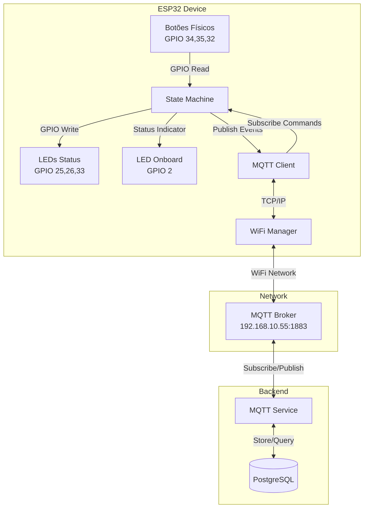
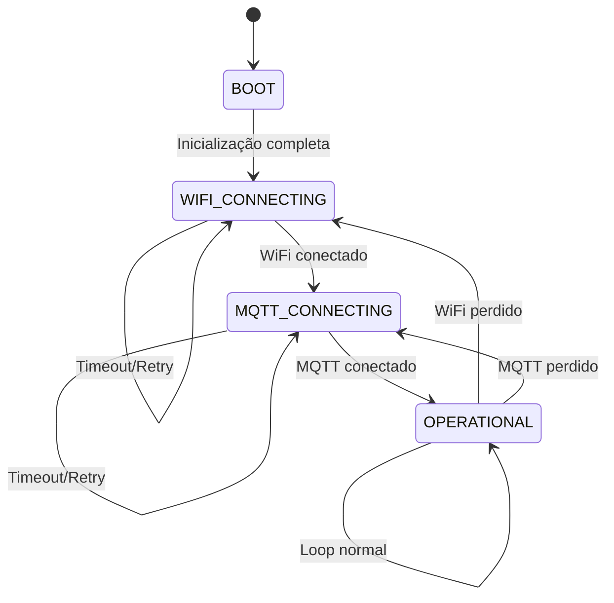

# Design Document: ESP32 Andon Firmware

## Overview

O firmware ESP32 Andon é um sistema embarcado desenvolvido em C++ usando o Arduino Framework via PlatformIO. Ele atua como interface física entre operadores de chão de fábrica e o sistema Andon do ID Visual AX, capturando eventos de botões físicos e controlando LEDs de status através de comunicação MQTT bidirecional.

### Objetivos do Sistema

1. **Captura de Eventos**: Detectar pressionamentos de botões físicos (verde, amarelo, vermelho) com debounce robusto
2. **Comunicação Confiável**: Estabelecer e manter conexão WiFi/MQTT resiliente com reconexão automática
3. **Controle Visual**: Atualizar LEDs de status baseado em comandos MQTT do backend
4. **Descoberta Automática**: Registrar-se automaticamente no backend via mensagem de discovery
5. **Resiliência**: Recuperar-se automaticamente de falhas de rede e firmware através de watchdog timer

### Arquitetura de Alto Nível

O firmware implementa uma arquitetura orientada a eventos baseada em máquina de estados, com loop não-bloqueante usando `millis()` para temporização. A comunicação com o backend FastAPI ocorre exclusivamente via protocolo MQTT através do broker Mosquitto.



### Fluxo de Dados Principal

1. **Inicialização**: BOOT → WIFI_CONNECTING → MQTT_CONNECTING → OPERATIONAL
2. **Evento de Botão**: GPIO Interrupt → Debounce → Publish `andon/button/{mac}/{color}` → Backend processa lógica
3. **Comando de LED**: Backend publica `andon/led/{mac}/command` → Firmware recebe callback → Atualiza GPIOs
4. **Heartbeat**: Timer de 5 minutos → Publish `andon/status/{mac}` → Backend atualiza timestamp

## Architecture

### State Machine Design

O firmware implementa uma máquina de estados finitos (FSM) com 4 estados principais:



#### Estado BOOT
- **Responsabilidades**: Inicialização de hardware e configuração inicial
- **Ações**:
  - Inicializar Serial Monitor (115200 baud)
  - Configurar todos os GPIOs (botões como INPUT, LEDs como OUTPUT)
  - Inicializar Watchdog Timer (30s timeout)
  - Definir estado inicial de LEDs (todos LOW)
  - Obter e formatar MAC address
- **Transição**: Automática para WIFI_CONNECTING após conclusão

#### Estado WIFI_CONNECTING
- **Responsabilidades**: Estabelecer conexão WiFi
- **Ações**:
  - Chamar `WiFi.begin(SSID, PASSWORD)`
  - Piscar LED onboard a cada 500ms (indicador visual)
  - Verificar `WiFi.status()` periodicamente
  - Implementar timeout de 30s por tentativa
  - Aplicar backoff exponencial entre tentativas (5s → 10s → 20s → 40s → 60s max)
- **Transições**:
  - → MQTT_CONNECTING: quando `WiFi.status() == WL_CONNECTED`
  - → WIFI_CONNECTING: retry após timeout ou falha

#### Estado MQTT_CONNECTING
- **Responsabilidades**: Estabelecer conexão MQTT e registrar dispositivo
- **Ações**:
  - Configurar LWT: tópico `andon/status/{mac}`, payload "offline", QoS 1, retain true
  - Chamar `client.connect(clientId, lwt_topic, lwt_qos, lwt_retain, lwt_message)`
  - Piscar LED onboard a cada 1000ms (indicador visual)
  - Ao conectar com sucesso:
    - Publicar "online" em `andon/status/{mac}` (QoS 1, retain)
    - Publicar Discovery Message em `andon/discovery` (QoS 1)
    - Subscrever `andon/led/{mac}/command` (QoS 1)
  - Implementar timeout de 10 tentativas
  - Aplicar backoff exponencial
- **Transições**:
  - → OPERATIONAL: quando `client.connected() == true`
  - → MQTT_CONNECTING: retry após falha
  - → WIFI_CONNECTING: se WiFi for perdido durante tentativas
  - → BOOT (via ESP.restart()): após 10 tentativas falhadas consecutivas

#### Estado OPERATIONAL
- **Responsabilidades**: Operação normal do sistema
- **Ações**:
  - Manter LED onboard aceso continuamente
  - Processar eventos de botões (com debounce)
  - Processar comandos MQTT de LED (via callback)
  - Enviar heartbeat a cada 5 minutos
  - Verificar status WiFi/MQTT a cada loop
  - Resetar watchdog timer a cada iteração
  - Monitorar heap memory a cada 30s
- **Transições**:
  - → WIFI_CONNECTING: se `WiFi.status() != WL_CONNECTED`
  - → MQTT_CONNECTING: se `client.connected() == false`

### Módulos e Responsabilidades

O firmware será organizado em módulos lógicos dentro de `src/main.cpp`:

#### 1. Configuration Module (`include/config.h`)
- Define todas as constantes do sistema
- Credenciais WiFi e MQTT
- Mapeamento de GPIOs
- Timers e thresholds
- Versão do firmware

#### 2. State Management Module
- Enum `SystemState { BOOT, WIFI_CONNECTING, MQTT_CONNECTING, OPERATIONAL }`
- Variável global `currentState`
- Funções de transição de estado

#### 3. GPIO Management Module
- Funções de inicialização de pinos
- Leitura de botões com debounce
- Controle de LEDs (status e onboard)
- Estruturas de dados para debounce

#### 4. WiFi Management Module
- Inicialização e conexão WiFi
- Verificação de status
- Reconexão com backoff
- Logging de eventos WiFi

#### 5. MQTT Management Module
- Inicialização do cliente PubSubClient
- Configuração de LWT
- Publicação de mensagens (discovery, status, logs, button events)
- Callback para comandos de LED
- Reconexão com backoff

#### 6. Timing Module
- Gerenciamento de timers não-bloqueantes usando `millis()`
- Heartbeat timer
- Debounce timers
- LED blink timers
- Heap monitoring timer

#### 7. Diagnostics Module
- Logging via Serial
- Publicação de log messages via MQTT
- Monitoramento de heap
- Detecção de watchdog reset

### Estratégia de Reconexão

O firmware implementa uma estratégia de reconexão resiliente com backoff exponencial:

```
Tentativa 1: aguarda 5s
Tentativa 2: aguarda 10s
Tentativa 3: aguarda 20s
Tentativa 4: aguarda 40s
Tentativa 5+: aguarda 60s (máximo)
```

Para MQTT especificamente:
- Após 10 tentativas consecutivas falhadas, o ESP32 executa `ESP.restart()`
- Isso força uma reinicialização completa, incluindo reconexão WiFi
- Previne estados de "stuck" onde MQTT não consegue conectar mas WiFi está OK

### Watchdog Timer Strategy

O watchdog timer é configurado com timeout de 30 segundos:
- Resetado a cada iteração do loop principal (`esp_task_wdt_reset()`)
- Se o firmware travar ou entrar em loop infinito, o watchdog força reinicialização
- Após reinicialização por watchdog, o firmware detecta via `esp_reset_reason()` e loga o evento

## Components and Interfaces

### Hardware Components

#### Botões Andon (Input)
- **GPIO 34**: Botão Verde (INPUT, sem pull-up - GPIO input-only)
- **GPIO 35**: Botão Amarelo (INPUT, sem pull-up - GPIO input-only)
- **GPIO 32**: Botão Vermelho (INPUT_PULLUP)

**Características**:
- Lógica ativa-baixa (pressionado = LOW, solto = HIGH)
- Debounce de 50ms implementado em software
- GPIOs 34 e 35 são input-only no ESP32, não suportam pull-up interno

#### LEDs de Status (Output)
- **GPIO 25**: LED Vermelho
- **GPIO 26**: LED Amarelo
- **GPIO 33**: LED Verde

**Características**:
- Lógica ativa-alta (HIGH = aceso, LOW = apagado)
- Controlados exclusivamente via comandos MQTT do backend
- Estado inicial: todos LOW (apagados)

#### LED Onboard (Output)
- **GPIO 2**: LED interno do ESP32

**Características**:
- Indicador visual de conectividade
- Padrões de piscada:
  - 500ms: conectando WiFi
  - 1000ms: conectando MQTT
  - Contínuo: operacional

### Software Components

#### WiFi Client
```cpp
#include <WiFi.h>

// Configuração
WiFi.mode(WIFI_STA);
WiFi.begin(WIFI_SSID, WIFI_PASSWORD);

// Verificação de status
WiFiStatus_t status = WiFi.status();
// WL_CONNECTED, WL_NO_SSID_AVAIL, WL_CONNECT_FAILED, etc.

// Obter informações
String ip = WiFi.localIP().toString();
String mac = WiFi.macAddress();
```

#### MQTT Client (PubSubClient)
```cpp
#include <PubSubClient.h>

WiFiClient wifiClient;
PubSubClient mqttClient(wifiClient);

// Configuração
mqttClient.setServer(MQTT_BROKER, MQTT_PORT);
mqttClient.setCallback(mqttCallback);
mqttClient.setBufferSize(MQTT_MAX_PACKET_SIZE); // 512 bytes

// Conexão com LWT
mqttClient.connect(
    clientId,           // "ESP32-Andon-XXXX"
    lwt_topic,          // "andon/status/{mac}"
    lwt_qos,            // 1
    lwt_retain,         // true
    lwt_message         // "offline"
);

// Publicação
mqttClient.publish(topic, payload, retained);

// Subscrição
mqttClient.subscribe(topic, qos);

// Loop (deve ser chamado frequentemente)
mqttClient.loop();
```

#### JSON Serialization (ArduinoJson)
```cpp
#include <ArduinoJson.h>

// Alocação de buffer
StaticJsonDocument<256> doc;

// Serialização
doc["mac_address"] = macAddress;
doc["device_name"] = deviceName;
doc["firmware_version"] = FIRMWARE_VERSION;

char buffer[256];
serializeJson(doc, buffer);

// Desserialização
DeserializationError error = deserializeJson(doc, payload);
if (error) {
    // Tratar erro
}
bool red = doc["red"];
```

#### Watchdog Timer
```cpp
#include <esp_task_wdt.h>

// Inicialização (no setup)
esp_task_wdt_init(30, true); // 30s timeout, panic on timeout
esp_task_wdt_add(NULL);      // Adiciona task atual

// Reset (no loop)
esp_task_wdt_reset();

// Detecção de reset por watchdog
#include <esp_system.h>
esp_reset_reason_t reason = esp_reset_reason();
if (reason == ESP_RST_TASK_WDT) {
    // Watchdog reset detectado
}
```

### MQTT Topic Structure

#### Tópicos Publicados pelo Firmware

| Tópico | QoS | Retain | Payload | Descrição |
|--------|-----|--------|---------|-----------|
| `andon/discovery` | 1 | false | JSON | Mensagem de registro inicial |
| `andon/status/{mac}` | 1 | true | "online"/"offline"/"heartbeat" | Status de conectividade |
| `andon/logs/{mac}` | 1 | false | String | Mensagens de diagnóstico |
| `andon/button/{mac}/green` | 1 | false | "PRESSED" | Evento botão verde |
| `andon/button/{mac}/yellow` | 1 | false | "PRESSED" | Evento botão amarelo |
| `andon/button/{mac}/red` | 1 | false | "PRESSED" | Evento botão vermelho |

#### Tópicos Subscritos pelo Firmware

| Tópico | QoS | Payload | Descrição |
|--------|-----|---------|-----------|
| `andon/led/{mac}/command` | 1 | JSON | Comando para controlar LEDs |

### Interface Definitions

#### Discovery Message (JSON)
```json
{
  "mac_address": "AA:BB:CC:DD:EE:FF",
  "device_name": "ESP32-Andon-EEFF",
  "firmware_version": "1.0.0"
}
```

**Campos**:
- `mac_address`: String - MAC address do ESP32 em formato hexadecimal com separadores ":"
- `device_name`: String - Nome único do dispositivo (prefixo + últimos 4 chars do MAC)
- `firmware_version`: String - Versão semântica do firmware (MAJOR.MINOR.PATCH)

#### LED Command Message (JSON)
```json
{
  "red": true,
  "yellow": false,
  "green": false
}
```

**Campos**:
- `red`: Boolean - Estado do LED vermelho (true = aceso, false = apagado)
- `yellow`: Boolean - Estado do LED amarelo
- `green`: Boolean - Estado do LED verde

**Validação**:
- Todos os três campos devem estar presentes
- Valores devem ser booleanos
- Mensagens malformadas são descartadas com log de erro

## Data Models

### Button State Structure
```cpp
struct ButtonState {
    uint8_t pin;              // GPIO pin number
    bool lastState;           // Último estado lido (HIGH/LOW)
    bool currentState;        // Estado atual após debounce
    unsigned long lastDebounceTime;  // Timestamp da última transição
    bool pressed;             // Flag indicando pressionamento válido
};

ButtonState greenButton = {GPIO_BUTTON_GREEN, HIGH, HIGH, 0, false};
ButtonState yellowButton = {GPIO_BUTTON_YELLOW, HIGH, HIGH, 0, false};
ButtonState redButton = {GPIO_BUTTON_RED, HIGH, HIGH, 0, false};
```

**Campos**:
- `pin`: Número do GPIO associado ao botão
- `lastState`: Estado anterior da leitura digital (usado para detectar transições)
- `currentState`: Estado estável após aplicação do debounce
- `lastDebounceTime`: Timestamp em millis() da última mudança de estado detectada
- `pressed`: Flag que indica se um pressionamento válido foi detectado e ainda não processado

### LED State Structure
```cpp
struct LEDState {
    uint8_t pin;              // GPIO pin number
    bool state;               // Estado atual (HIGH/LOW)
};

LEDState redLED = {GPIO_LED_RED, LOW};
LEDState yellowLED = {GPIO_LED_YELLOW, LOW};
LEDState greenLED = {GPIO_LED_GREEN, LOW};
LEDState onboardLED = {GPIO_ONBOARD_LED, LOW};
```

### Timer Structure
```cpp
struct Timer {
    unsigned long interval;   // Intervalo em millis
    unsigned long lastTrigger; // Último timestamp de disparo
};

Timer heartbeatTimer = {HEARTBEAT_INTERVAL_MS, 0};
Timer heapMonitorTimer = {HEAP_MONITOR_INTERVAL_MS, 0};
Timer ledBlinkTimer = {500, 0}; // Intervalo variável baseado no estado
```

### Reconnection State
```cpp
struct ReconnectionState {
    uint8_t attemptCount;     // Contador de tentativas consecutivas
    unsigned long backoffDelay; // Delay atual de backoff em ms
    unsigned long lastAttempt;  // Timestamp da última tentativa
};

ReconnectionState wifiReconnect = {0, INITIAL_BACKOFF_MS, 0};
ReconnectionState mqttReconnect = {0, INITIAL_BACKOFF_MS, 0};
```

**Lógica de Backoff**:
```cpp
void updateBackoff(ReconnectionState* state) {
    state->attemptCount++;
    state->backoffDelay = min(state->backoffDelay * 2, MAX_BACKOFF_MS);
}

void resetBackoff(ReconnectionState* state) {
    state->attemptCount = 0;
    state->backoffDelay = INITIAL_BACKOFF_MS;
}
```

### System State Variables
```cpp
enum SystemState {
    BOOT,
    WIFI_CONNECTING,
    MQTT_CONNECTING,
    OPERATIONAL
};

SystemState currentState = BOOT;
String macAddress;           // Formato: "AA:BB:CC:DD:EE:FF"
String deviceName;           // Formato: "ESP32-Andon-XXXX"
bool onboardLEDState = false;
```

### Configuration Constants (config.h)
```cpp
// Versão
#define FIRMWARE_VERSION "1.0.0"

// WiFi
#define WIFI_SSID "AX-CORPORATIVO"
#define WIFI_PASSWORD "senha_wifi"
#define WIFI_TIMEOUT_MS 30000

// MQTT
#define MQTT_BROKER "192.168.10.55"
#define MQTT_PORT 1883
#define MQTT_MAX_PACKET_SIZE 512
#define MQTT_TIMEOUT_MS 10000
#define MQTT_MAX_RETRIES 10

// GPIOs - Botões
#define GPIO_BUTTON_GREEN 34
#define GPIO_BUTTON_YELLOW 35
#define GPIO_BUTTON_RED 32

// GPIOs - LEDs
#define GPIO_LED_RED 25
#define GPIO_LED_YELLOW 26
#define GPIO_LED_GREEN 33
#define GPIO_ONBOARD_LED 2

// Timers
#define DEBOUNCE_MS 50
#define HEARTBEAT_INTERVAL_MS 300000  // 5 minutos
#define HEAP_MONITOR_INTERVAL_MS 30000 // 30 segundos
#define WATCHDOG_TIMEOUT_S 30

// Reconexão
#define INITIAL_BACKOFF_MS 5000
#define MAX_BACKOFF_MS 60000

// Thresholds
#define HEAP_WARN_THRESHOLD 10240  // 10KB
```


## Correctness Properties

*A property is a characteristic or behavior that should hold true across all valid executions of a system—essentially, a formal statement about what the system should do. Properties serve as the bridge between human-readable specifications and machine-verifiable correctness guarantees.*

### Property 1: Connection Loss Recovery

*For any* loss of connectivity (WiFi or MQTT) while in the OPERATIONAL state, the system shall transition to the appropriate reconnection state (WIFI_CONNECTING if WiFi is lost, MQTT_CONNECTING if only MQTT is lost) and attempt to restore the connection.

**Validates: Requirements 2.10, 3.7, 4.9**

### Property 2: Device Name Formatting

*For any* MAC address obtained from the ESP32, the device_name field shall be formatted as "ESP32-Andon-" concatenated with the last 4 hexadecimal characters of the MAC address (without colons).

**Validates: Requirements 5.4**

### Property 3: Button Debounce Filtering

*For any* sequence of button state transitions occurring within a 50ms window, only the first transition shall be registered, and subsequent transitions within that window shall be ignored.

**Validates: Requirements 6.3**

### Property 4: Valid Button Press Detection

*For any* button press that maintains the pressed state (LOW) for at least 50ms after the initial transition, the press shall be considered valid and trigger an MQTT publish event.

**Validates: Requirements 6.4**

### Property 5: Button Event Publishing

*For any* valid button press (green, yellow, or red) detected after debounce, the firmware shall publish a message with payload "PRESSED" to the corresponding topic `andon/button/{mac}/{color}` with QoS 1.

**Validates: Requirements 7.1, 7.2, 7.3**

### Property 6: LED State Synchronization

*For any* valid LED command received via MQTT containing boolean fields {red, yellow, green}, the GPIO state of each corresponding LED shall be set to HIGH if the field is true, or LOW if the field is false.

**Validates: Requirements 8.3, 8.4, 8.5, 8.6, 8.7, 8.8**

### Property 7: Invalid JSON Rejection

*For any* MQTT payload received that fails JSON deserialization or does not contain the expected fields, the firmware shall log an error message and discard the payload without modifying system state.

**Validates: Requirements 8.10, 13.5**

### Property 8: Operational State Restriction

*For any* business logic operation (button event processing, LED command processing, heartbeat transmission), the operation shall only be executed when the system is in the OPERATIONAL state.

**Validates: Requirements 7.6, 8.11, 10.5**

### Property 9: Watchdog Reset Frequency

*For any* iteration of the main loop, the watchdog timer shall be reset using `esp_task_wdt_reset()` to prevent unintended system resets.

**Validates: Requirements 9.4**

### Property 10: Heartbeat Periodicity

*For any* continuous period of 5 minutes (300,000 ms) while in the OPERATIONAL state, the firmware shall publish exactly one heartbeat message to `andon/status/{mac}`.

**Validates: Requirements 10.1, 10.4**

### Property 11: Serial Logging Consistency

*For any* log message published via MQTT to `andon/logs/{mac}`, an equivalent message with timestamp (millis()) shall also be sent to the Serial Monitor.

**Validates: Requirements 11.7, 11.8**

### Property 12: Network Error Logging

*For any* network operation failure (WiFi connection, MQTT connection, MQTT publish), the firmware shall log a descriptive error message via Serial and MQTT.

**Validates: Requirements 13.1**

### Property 13: Exponential Backoff Growth

*For any* sequence of consecutive connection failures, the retry interval shall double after each failure (5s → 10s → 20s → 40s) until reaching the maximum backoff limit of 60 seconds.

**Validates: Requirements 13.2, 16.2, 16.3**

### Property 14: Backoff Reset on Success

*For any* successful connection establishment (WiFi or MQTT) after one or more failures, the backoff timer shall be reset to the initial value of 5 seconds.

**Validates: Requirements 16.4**

### Property 15: MQTT Message Size Limit

*For any* MQTT message received by the firmware, if the message size exceeds 512 bytes, it shall be truncated or rejected to prevent buffer overflow.

**Validates: Requirements 13.6**

### Property 16: LED Blink Pattern State Mapping

*For any* state transition, the onboard LED blink pattern shall reflect the current system state: 500ms period for WIFI_CONNECTING, 1000ms period for MQTT_CONNECTING, continuous ON for OPERATIONAL.

**Validates: Requirements 14.4**

### Property 17: Heap Monitoring Periodicity

*For any* continuous period of 30 seconds while the firmware is running, the firmware shall check the available heap memory using `ESP.getFreeHeap()` exactly once.

**Validates: Requirements 17.1**

### Property 18: Heartbeat Heap Reporting

*For any* heartbeat message published, the message or associated log shall include the current free heap memory value in bytes.

**Validates: Requirements 17.3**


## Error Handling

### Network Connectivity Errors

#### WiFi Connection Failures
- **Detection**: `WiFi.status() != WL_CONNECTED`
- **Response**:
  1. Log error via Serial with WiFi status code
  2. Transition to WIFI_CONNECTING state
  3. Apply exponential backoff (5s → 60s max)
  4. Update onboard LED to 500ms blink pattern
- **Recovery**: Automatic reconnection with backoff
- **Escalation**: None (infinite retry with backoff)

#### MQTT Connection Failures
- **Detection**: `client.connected() == false` or `client.connect()` returns error code
- **Response**:
  1. Log error via Serial with MQTT error code
  2. Transition to MQTT_CONNECTING state
  3. Apply exponential backoff (5s → 60s max)
  4. Update onboard LED to 1000ms blink pattern
  5. Increment failure counter
- **Recovery**: Automatic reconnection with backoff
- **Escalation**: After 10 consecutive failures, execute `ESP.restart()` to force full system reset

#### MQTT Publish Failures
- **Detection**: `client.publish()` returns false
- **Response**:
  1. Log error via Serial indicating topic and payload
  2. Do NOT retry immediately (avoid blocking loop)
  3. Message is lost (acceptable for non-critical events like button presses)
- **Recovery**: Next loop iteration will detect MQTT disconnection and trigger reconnection
- **Note**: Critical messages (discovery, status) are sent during connection establishment when connection is known to be stable

### Data Validation Errors

#### Invalid JSON Payload
- **Detection**: `deserializeJson()` returns error code
- **Response**:
  1. Log error via Serial with error description
  2. Publish error log to `andon/logs/{mac}`: "Invalid LED command received"
  3. Discard payload without processing
  4. Do NOT modify LED states
- **Recovery**: Wait for next valid command
- **Prevention**: Backend should validate payloads before publishing

#### Missing JSON Fields
- **Detection**: `doc.containsKey("red")` returns false
- **Response**: Same as Invalid JSON Payload
- **Note**: All three fields (red, yellow, green) must be present

#### JSON Buffer Overflow
- **Detection**: `serializeJson()` returns size > buffer capacity
- **Response**:
  1. Log error via Serial: "JSON buffer overflow"
  2. Publish truncated message if possible, or skip
  3. Continue operation
- **Prevention**: Use adequately sized StaticJsonDocument (256 bytes for discovery, 128 bytes for LED commands)

### Resource Exhaustion Errors

#### Low Heap Memory
- **Detection**: `ESP.getFreeHeap() < HEAP_WARN_THRESHOLD` (10KB)
- **Response**:
  1. Log warning via Serial: "WARNING: low heap {N} bytes"
  2. Publish warning to `andon/logs/{mac}`
  3. Continue operation (no immediate action)
- **Recovery**: Heap should stabilize as buffers are reused
- **Escalation**: If heap continues to drop, watchdog will eventually trigger reset

#### MQTT Buffer Overflow
- **Detection**: Message size > MQTT_MAX_PACKET_SIZE (512 bytes)
- **Response**:
  1. Log error via Serial
  2. Truncate or reject message
- **Prevention**: Configure `client.setBufferSize(512)` at initialization

### Hardware Errors

#### Watchdog Timeout
- **Detection**: `esp_reset_reason() == ESP_RST_TASK_WDT` after boot
- **Response**:
  1. Log via Serial: "Watchdog reset detected"
  2. After MQTT connection, publish to `andon/logs/{mac}`: "Watchdog reset detected"
  3. Continue normal operation
- **Root Cause**: Firmware hung or loop blocked for >30s
- **Prevention**: Ensure all operations are non-blocking, use millis() instead of delay()

#### GPIO Read Errors
- **Detection**: Not explicitly detectable (hardware level)
- **Response**: Debounce algorithm filters transient errors
- **Prevention**: Use external pull-up resistors on input-only GPIOs (34, 35)

### Error Logging Strategy

All errors are logged through two channels:

1. **Serial Monitor** (local debugging):
   ```
   [12345] ERROR: WiFi connection failed, status=6
   [12456] ERROR: MQTT connection failed, rc=-2
   [12567] ERROR: Invalid LED command received
   ```

2. **MQTT Logs** (remote monitoring):
   - Topic: `andon/logs/{mac}`
   - QoS: 1 (at least once delivery)
   - Payload: Human-readable error description
   - Only sent when MQTT connection is available

### Graceful Degradation

The firmware is designed to degrade gracefully under adverse conditions:

- **No WiFi**: Device remains in WIFI_CONNECTING state, retrying indefinitely
- **No MQTT**: Device remains in MQTT_CONNECTING state, retrying with escalation to full restart
- **Low Memory**: Device logs warning but continues operation
- **Invalid Commands**: Device logs error but maintains current state
- **Button Noise**: Debounce algorithm filters spurious signals

The system prioritizes availability over consistency—it will continue attempting to operate even under degraded conditions.


## Testing Strategy

### Overview

O firmware ESP32 Andon será testado usando uma abordagem dual que combina testes unitários para casos específicos e testes baseados em propriedades para validação abrangente. Devido às limitações de hardware embarcado, a estratégia de testes será adaptada para o contexto de firmware.

### Unit Testing Approach

#### Framework: PlatformIO Unit Testing

PlatformIO fornece um framework de testes unitários integrado que permite executar testes tanto no ambiente nativo (desktop) quanto no hardware real (ESP32).

**Configuração** (`platformio.ini`):
```ini
[env:native]
platform = native
test_framework = unity

[env:esp32dev]
platform = espressif32
board = esp32dev
framework = arduino
test_framework = unity
```

#### Test Categories

**1. State Machine Tests**
- Testar transições de estado específicas
- Verificar estado inicial após boot
- Validar comportamento de cada estado

Exemplo:
```cpp
void test_initial_state_is_boot() {
    // Simular reset
    currentState = BOOT;
    TEST_ASSERT_EQUAL(BOOT, currentState);
}

void test_boot_transitions_to_wifi_connecting() {
    currentState = BOOT;
    // Simular conclusão de inicialização
    transitionToWiFiConnecting();
    TEST_ASSERT_EQUAL(WIFI_CONNECTING, currentState);
}
```

**2. Debounce Logic Tests**
- Testar que transições rápidas são filtradas
- Verificar que pressionamentos longos são detectados
- Validar estado de cada botão independentemente

Exemplo:
```cpp
void test_debounce_filters_rapid_transitions() {
    ButtonState btn = {34, HIGH, HIGH, 0, false};
    unsigned long now = 1000;
    
    // Primeira transição
    processButton(&btn, LOW, now);
    TEST_ASSERT_TRUE(btn.lastDebounceTime == now);
    
    // Transição dentro de 50ms - deve ser ignorada
    processButton(&btn, HIGH, now + 20);
    TEST_ASSERT_TRUE(btn.lastDebounceTime == now); // Não atualizado
    
    // Transição após 50ms - deve ser aceita
    processButton(&btn, LOW, now + 60);
    TEST_ASSERT_TRUE(btn.lastDebounceTime == now + 60);
}
```

**3. JSON Serialization/Deserialization Tests**
- Testar criação de discovery message
- Testar parsing de LED commands
- Validar tratamento de JSON inválido

Exemplo:
```cpp
void test_discovery_message_format() {
    String mac = "AA:BB:CC:DD:EE:FF";
    String json = createDiscoveryMessage(mac);
    
    StaticJsonDocument<256> doc;
    deserializeJson(doc, json);
    
    TEST_ASSERT_EQUAL_STRING("AA:BB:CC:DD:EE:FF", doc["mac_address"]);
    TEST_ASSERT_EQUAL_STRING("ESP32-Andon-EEFF", doc["device_name"]);
    TEST_ASSERT_EQUAL_STRING(FIRMWARE_VERSION, doc["firmware_version"]);
}

void test_invalid_json_is_rejected() {
    String invalidJson = "{red: true, yellow}"; // JSON malformado
    bool result = processLEDCommand(invalidJson);
    TEST_ASSERT_FALSE(result);
}
```

**4. Backoff Algorithm Tests**
- Testar crescimento exponencial
- Verificar limite máximo de 60s
- Validar reset após sucesso

Exemplo:
```cpp
void test_backoff_doubles_on_failure() {
    ReconnectionState state = {0, 5000, 0};
    
    updateBackoff(&state);
    TEST_ASSERT_EQUAL(10000, state.backoffDelay);
    
    updateBackoff(&state);
    TEST_ASSERT_EQUAL(20000, state.backoffDelay);
    
    updateBackoff(&state);
    TEST_ASSERT_EQUAL(40000, state.backoffDelay);
}

void test_backoff_caps_at_60_seconds() {
    ReconnectionState state = {0, 40000, 0};
    
    updateBackoff(&state);
    TEST_ASSERT_EQUAL(60000, state.backoffDelay); // Não 80000
    
    updateBackoff(&state);
    TEST_ASSERT_EQUAL(60000, state.backoffDelay); // Permanece em 60000
}
```

**5. Timer Logic Tests**
- Testar detecção de expiração de timers
- Verificar reset de timers
- Validar cálculos de millis()

**6. Edge Cases**
- Heap abaixo de threshold
- Overflow de millis() (após ~49 dias)
- Mensagens MQTT maiores que buffer
- Todos os LEDs comandados simultaneamente

### Property-Based Testing Approach

Devido às limitações de frameworks de property-based testing em ambientes embarcados C++, implementaremos uma abordagem híbrida:

#### Simulação em Ambiente Nativo

Para propriedades complexas, criaremos um simulador do firmware que roda em ambiente nativo (desktop) onde podemos usar frameworks como **RapidCheck** (C++ property-based testing).

**Configuração**:
```ini
[env:native_pbt]
platform = native
lib_deps = 
    rapidcheck
test_framework = unity
```

#### Property Tests

**Property 1: Connection Loss Recovery**
```cpp
// Feature: esp32-andon-firmware, Property 1: For any loss of connectivity while in OPERATIONAL state, system shall transition to appropriate reconnection state
void test_property_connection_loss_recovery() {
    rc::check("connection loss triggers reconnection", []() {
        // Gerar estado inicial aleatório
        SystemState initialState = OPERATIONAL;
        bool wifiConnected = *rc::gen::arbitrary<bool>();
        bool mqttConnected = *rc::gen::arbitrary<bool>();
        
        // Simular perda de conexão
        if (!wifiConnected) {
            handleConnectionLoss(false, true);
            RC_ASSERT(currentState == WIFI_CONNECTING);
        } else if (!mqttConnected) {
            handleConnectionLoss(true, false);
            RC_ASSERT(currentState == MQTT_CONNECTING);
        }
    });
}
```

**Property 2: Device Name Formatting**
```cpp
// Feature: esp32-andon-firmware, Property 2: For any MAC address, device_name shall be formatted correctly
void test_property_device_name_format() {
    rc::check("device name format", []() {
        // Gerar MAC address aleatório
        String mac = generateRandomMAC();
        String deviceName = formatDeviceName(mac);
        
        // Extrair últimos 4 caracteres (sem ':')
        String macSuffix = mac.substring(mac.length() - 5);
        macSuffix.replace(":", "");
        
        RC_ASSERT(deviceName.startsWith("ESP32-Andon-"));
        RC_ASSERT(deviceName.endsWith(macSuffix));
        RC_ASSERT(deviceName.length() == 12 + 4); // "ESP32-Andon-" + 4 chars
    });
}
```

**Property 3: Button Debounce Filtering**
```cpp
// Feature: esp32-andon-firmware, Property 3: For any sequence of transitions within 50ms, only first is registered
void test_property_debounce_filtering() {
    rc::check("debounce filters rapid transitions", []() {
        ButtonState btn = {34, HIGH, HIGH, 0, false};
        unsigned long baseTime = *rc::gen::inRange(0, 1000000);
        
        // Gerar sequência de transições dentro de 50ms
        auto transitions = *rc::gen::container<std::vector<int>>(
            rc::gen::inRange(0, 49)
        );
        
        processButton(&btn, LOW, baseTime);
        unsigned long firstTime = btn.lastDebounceTime;
        
        for (int offset : transitions) {
            processButton(&btn, HIGH, baseTime + offset);
        }
        
        // Timestamp não deve ter mudado
        RC_ASSERT(btn.lastDebounceTime == firstTime);
    });
}
```

**Property 5: Button Event Publishing**
```cpp
// Feature: esp32-andon-firmware, Property 5: For any valid button press, firmware shall publish to correct topic
void test_property_button_event_publishing() {
    rc::check("button press publishes to correct topic", []() {
        // Gerar botão aleatório
        ButtonColor color = *rc::gen::element(GREEN, YELLOW, RED);
        String mac = "AA:BB:CC:DD:EE:FF";
        
        String expectedTopic = "andon/button/" + mac + "/" + colorToString(color);
        String publishedTopic = publishButtonEvent(mac, color);
        
        RC_ASSERT(publishedTopic == expectedTopic);
    });
}
```

**Property 13: Exponential Backoff Growth**
```cpp
// Feature: esp32-andon-firmware, Property 13: For any sequence of failures, retry interval shall double until 60s max
void test_property_exponential_backoff() {
    rc::check("backoff grows exponentially", []() {
        ReconnectionState state = {0, 5000, 0};
        
        // Gerar número aleatório de falhas (1-10)
        int failures = *rc::gen::inRange(1, 11);
        
        for (int i = 0; i < failures; i++) {
            unsigned long prevDelay = state.backoffDelay;
            updateBackoff(&state);
            
            if (prevDelay < 60000) {
                // Deve dobrar se ainda não atingiu o máximo
                RC_ASSERT(state.backoffDelay == min(prevDelay * 2, 60000UL));
            } else {
                // Deve permanecer em 60000
                RC_ASSERT(state.backoffDelay == 60000);
            }
        }
        
        // Nunca deve exceder 60s
        RC_ASSERT(state.backoffDelay <= 60000);
    });
}
```

### Hardware-in-the-Loop (HIL) Testing

Para validação final, testes HIL serão executados no hardware real:

**Setup**:
- ESP32 conectado via USB
- Monitor Serial capturando logs
- Script Python simulando broker MQTT
- Script Python simulando pressionamentos de botão (via GPIO)

**Test Scenarios**:
1. **Boot Sequence**: Verificar sequência completa BOOT → WIFI → MQTT → OPERATIONAL
2. **Button Press**: Simular pressionamento físico e verificar mensagem MQTT
3. **LED Control**: Enviar comando MQTT e verificar estado do GPIO
4. **WiFi Disconnect**: Desconectar WiFi e verificar reconexão
5. **MQTT Disconnect**: Parar broker e verificar reconexão
6. **Long Running**: Executar por 24h e verificar estabilidade (heap, watchdog)

### Test Configuration

**Minimum Iterations for Property Tests**: 100 runs per property

**Test Execution**:
```bash
# Testes unitários em ambiente nativo
pio test -e native

# Testes de propriedades
pio test -e native_pbt

# Testes no hardware real
pio test -e esp32dev --upload-port /dev/ttyUSB0
```

### Coverage Goals

- **State Machine**: 100% de cobertura de transições
- **Debounce Logic**: 100% de cobertura de branches
- **JSON Handling**: 100% de casos de erro
- **Error Handling**: Todos os caminhos de erro testados

### Continuous Integration

Testes unitários e de propriedades serão executados automaticamente em CI/CD:
- Testes nativos em cada commit
- Testes HIL em cada release candidate
- Relatórios de cobertura gerados automaticamente

