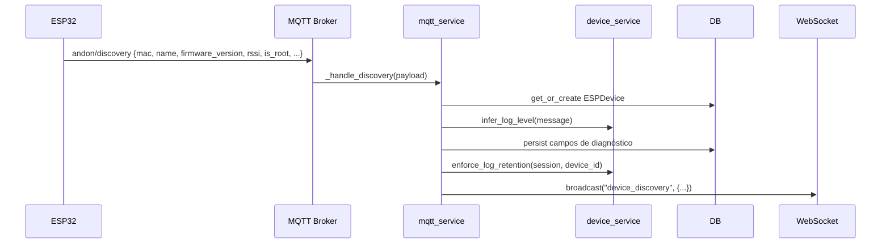
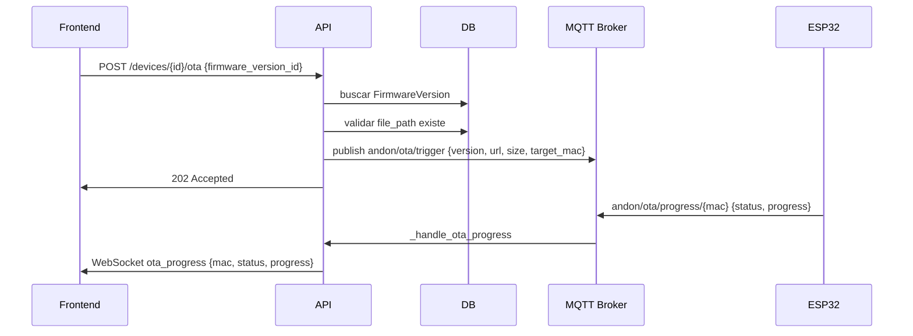

# Design Document — ESP32 Device Management v2

## Overview

Esta feature implementa a **Fase 2 — Gestão de Dispositivos ESP32** do sistema ID Visual AX. O objetivo é expandir o módulo IoT existente com diagnóstico enriquecido por dispositivo, gerenciamento granular de firmware, OTA individual e em lote, alertas automáticos de dispositivos offline e uma tela dedicada `/andon/devices` no frontend com atualizações em tempo real via WebSocket.

A Fase 2 complementa a Fase 1 (`iot-esp32-device-management`) e o spec `esp32-ota-management` (OTA em massa via GitHub). O diferencial desta fase é a **gestão por dispositivo individual**: edição inline, sincronização manual, OTA direcionado, logs filtráveis por severidade e monitoramento de sinal WiFi e topologia Mesh.

### Decisões Arquiteturais

- **Separação de modelos**: O novo modelo `FirmwareVersion` é distinto do `FirmwareRelease` existente (OTA em massa via GitHub). `FirmwareVersion` é gerenciado manualmente via API REST e serve como catálogo de versões disponíveis para OTA individual/lote.
- **Serviço de cálculo isolado**: As funções de cálculo (`compute_rssi_quality`, `compute_firmware_outdated`, `compute_offline_minutes`, `infer_log_level`, `enforce_log_retention`) são implementadas em `device_service.py` como funções puras, facilitando testes unitários e property-based testing.
- **Background task assíncrona**: O alerta de dispositivos offline é implementado como task asyncio nativa (sem Celery), consistente com o padrão do MQTT service já existente.
- **Identificação por UUID nos novos endpoints**: Os endpoints novos (PATCH, DELETE, sync, OTA individual) usam `device_id` (UUID) em vez de `mac_address`, alinhando com o modelo de dados e facilitando referências estáveis.

---

## Architecture

```mermaid
graph TB
    subgraph Frontend
        A[AndonDevicesPage] -->|WebSocket| WS[/api/v1/devices/ws]
        A -->|REST| API[/api/v1/devices]
        A --> DD[DeviceDrawer]
        DD --> OTA[OTADeviceProgressModal]
    end

    subgraph Backend
        API --> DE[devices.py endpoint]
        DE --> DS[device_service.py]
        DE --> DB[(PostgreSQL)]
        DE --> MQTT[mqtt_service.py]
        DE --> WSM[websocket_manager.py]

        BG[device_offline_task.py] -->|asyncio loop| DB
        BG --> WSM

        MQTT -->|_handle_discovery| DS
        MQTT -->|_handle_status| DS
        MQTT -->|_handle_log| DS
    end

    subgraph Models
        ESPDevice[ESPDevice +7 campos]
        ESPDeviceLog[ESPDeviceLog +level]
        FirmwareVersion[FirmwareVersion novo]
    end

    DE --> ESPDevice
    DE --> ESPDeviceLog
    DE --> FirmwareVersion
```

### Fluxo de Dados — Discovery MQTT



### Fluxo de Dados — OTA Individual



---

## Components and Interfaces

### Backend

#### `backend/app/models/esp_device.py` — Alterações

Adição de 7 campos ao modelo `ESPDevice` e campo `level` ao `ESPDeviceLog`.

#### `backend/app/models/firmware_version.py` — Novo

Modelo `FirmwareVersion` para catálogo de binários de firmware gerenciados via API.

#### `backend/app/services/device_service.py` — Novo

Funções puras de cálculo e utilitários de negócio:

```python
def compute_rssi_quality(rssi: int | None) -> str | None
def compute_firmware_outdated(device_version: str | None, latest: str | None) -> bool
def compute_offline_minutes(last_seen_at: datetime | None, status: str) -> int | None
def infer_log_level(message: str) -> str  # retorna "INFO" | "WARN" | "ERROR"
async def enforce_log_retention(session: AsyncSession, device_id: uuid.UUID, max_logs: int = 500) -> None
```

#### `backend/app/services/device_offline_task.py` — Novo

Background task assíncrona para alertas de dispositivos offline:

```python
async def _offline_check_loop() -> None  # loop principal com asyncio.sleep(300)
def start_offline_task() -> None          # cria asyncio.Task
def stop_offline_task() -> None           # cancela a task
```

#### `backend/app/api/api_v1/endpoints/devices.py` — Alterações

Novos schemas e endpoints:

| Método | Path | Descrição |
|--------|------|-----------|
| GET | `/devices` | Lista com response enriquecida |
| PATCH | `/devices/{device_id}` | Edição por UUID |
| GET | `/devices/{device_id}/logs` | Logs com filtro `level` |
| POST | `/devices/{device_id}/sync` | Sync MQTT |
| DELETE | `/devices/{device_id}` | Remoção (só offline) |
| GET | `/devices/firmware/versions` | Lista FirmwareVersion |
| POST | `/devices/firmware/versions` | Upload multipart .bin |
| POST | `/devices/{device_id}/ota` | OTA individual |
| POST | `/devices/ota/batch` | OTA em lote |

#### `backend/app/services/mqtt_service.py` — Alterações

- `_handle_discovery()`: persistir `firmware_version`, `rssi`, `is_root`, `mesh_node_count`, `ip_address`, `uptime_seconds`
- `_handle_status()`: persistir `rssi` se presente no payload
- `_handle_log()`: inferir `level` via `infer_log_level()`, chamar `enforce_log_retention()` após inserção, incluir `level` no broadcast WebSocket

### Frontend

#### `frontend/src/app/components/AndonDevicesPage.tsx` — Novo

Tela principal `/andon/devices`:
- 4 cards de resumo (Total, Online, Offline, Desatualizados)
- Tabela com colunas: Device, Mesa, Status, Sinal, Firmware, Último Contato, Ações
- Conexão WebSocket para eventos em tempo real

#### `frontend/src/app/components/DeviceDrawer.tsx` — Novo

Painel lateral com duas abas:
- **Informações**: campos editáveis + somente leitura + botão OTA
- **Logs**: lista filtrada por nível + badge de erro + atualização em tempo real

#### `frontend/src/app/components/OTADeviceProgressModal.tsx` — Novo

Modal de progresso OTA individual:
- Barra de progresso percentual
- Estados sequenciais mapeados do WebSocket
- Botão "Fechar" habilitado ao concluir/falhar

#### `frontend/src/services/api.ts` — Alterações

Novos métodos:
```typescript
getDevicesEnriched(): Promise<ESPDeviceEnriched[]>
patchDevice(deviceId: string, payload: DevicePatchRequest): Promise<ESPDeviceEnriched>
getDeviceLogsById(deviceId: string, level?: string, limit?: number): Promise<DeviceLog[]>
syncDevice(deviceId: string): Promise<void>
deleteDevice(deviceId: string): Promise<void>
getFirmwareVersions(): Promise<FirmwareVersion[]>
uploadFirmwareVersion(formData: FormData): Promise<FirmwareVersion>
triggerDeviceOTA(deviceId: string, payload: OTATriggerRequest): Promise<void>
triggerBatchOTA(payload: BatchOTARequest): Promise<BatchOTAResponse>
```

#### `frontend/src/app/types.ts` — Alterações

Novos tipos TypeScript:
```typescript
interface ESPDeviceEnriched {
  id: string
  mac_address: string
  device_name: string
  location: string
  workcenter_id: number | null
  workcenter_name: string | null
  status: 'online' | 'offline'
  firmware_version: string | null
  latest_firmware: string | null
  firmware_outdated: boolean
  rssi: number | null
  rssi_quality: 'Ótimo' | 'Bom' | 'Fraco' | 'Crítico' | null
  is_root: boolean
  mesh_node_count: number | null
  ip_address: string | null
  uptime_seconds: number | null
  last_seen_at: string | null
  offline_minutes: number | null
  notes: string | null
  created_at: string
}

interface DeviceLog {
  id: string
  device_id: string
  event_type: string
  message: string
  level: 'INFO' | 'WARN' | 'ERROR'
  created_at: string
}

interface FirmwareVersion {
  id: number
  version: string
  release_notes: string | null
  file_path: string
  file_size_bytes: number
  is_stable: boolean
  created_at: string
  created_by: string
}

interface DevicePatchRequest {
  device_name?: string
  location?: string
  workcenter_id?: number | null
  notes?: string
}

interface OTATriggerRequest {
  firmware_version_id: number
  triggered_by: string
}

interface BatchOTARequest {
  firmware_version_id: number
  triggered_by: string
  device_ids?: string[]
}

interface BatchOTAResponse {
  message: string
  device_count: number
  target_version: string
}
```

---

## Data Models

### ESPDevice (alterado)

```python
class ESPDevice(SQLModel, table=True):
    __tablename__ = "esp_devices"

    id: uuid.UUID = Field(default_factory=uuid.uuid4, primary_key=True)
    mac_address: str = Field(unique=True, index=True, nullable=False)
    device_name: str = Field(default="")
    location: str = Field(default="")
    workcenter_id: Optional[int] = Field(default=None, nullable=True)
    status: DeviceStatus = Field(default=DeviceStatus.offline)
    last_seen_at: Optional[datetime] = Field(default=None)
    created_at: datetime = Field(default_factory=...)

    # Novos campos — Fase 2
    firmware_version: Optional[str] = Field(default=None, nullable=True)
    rssi: Optional[int] = Field(default=None, nullable=True)
    is_root: bool = Field(default=False, nullable=False)
    mesh_node_count: Optional[int] = Field(default=None, nullable=True)
    ip_address: Optional[str] = Field(default=None, nullable=True)
    uptime_seconds: Optional[int] = Field(default=None, nullable=True)
    notes: Optional[str] = Field(default=None, nullable=True)
```

### ESPDeviceLog (alterado)

```python
class ESPDeviceLog(SQLModel, table=True):
    __tablename__ = "esp_device_logs"

    id: uuid.UUID = Field(default_factory=uuid.uuid4, primary_key=True)
    device_id: uuid.UUID = Field(foreign_key="esp_devices.id", index=True)
    event_type: EventType = Field(nullable=False)
    message: str = Field(default="")
    level: str = Field(default="INFO", nullable=False)  # INFO | WARN | ERROR
    created_at: datetime = Field(default_factory=...)
```

### FirmwareVersion (novo)

```python
class FirmwareVersion(SQLModel, table=True):
    __tablename__ = "firmware_versions"

    id: Optional[int] = Field(default=None, primary_key=True)
    version: str = Field(unique=True, index=True, nullable=False)
    release_notes: Optional[str] = Field(default=None, nullable=True)
    file_path: str = Field(nullable=False)
    file_size_bytes: int = Field(nullable=False)
    is_stable: bool = Field(default=False, index=True, nullable=False)
    created_at: datetime = Field(default_factory=lambda: datetime.now(timezone.utc).replace(tzinfo=None))
    created_by: str = Field(nullable=False)
```

### Schemas de Request/Response (Pydantic)

```python
class DeviceEnrichedOut(BaseModel):
    id: uuid.UUID
    mac_address: str
    device_name: str
    location: str
    workcenter_id: Optional[int]
    workcenter_name: Optional[str]
    status: str
    firmware_version: Optional[str]
    latest_firmware: Optional[str]
    firmware_outdated: bool
    rssi: Optional[int]
    rssi_quality: Optional[str]
    is_root: bool
    mesh_node_count: Optional[int]
    ip_address: Optional[str]
    uptime_seconds: Optional[int]
    last_seen_at: Optional[datetime]
    offline_minutes: Optional[int]
    notes: Optional[str]
    created_at: datetime
    model_config = ConfigDict(from_attributes=True)

class DevicePatchRequest(BaseModel):
    model_config = ConfigDict(extra="forbid")
    device_name: Optional[str] = None
    location: Optional[str] = None
    workcenter_id: Optional[int] = None
    notes: Optional[str] = None

class DeviceLogOut(BaseModel):
    id: uuid.UUID
    device_id: uuid.UUID
    event_type: str
    message: str
    level: str
    created_at: datetime
    model_config = ConfigDict(from_attributes=True)

class FirmwareVersionOut(BaseModel):
    id: int
    version: str
    release_notes: Optional[str]
    file_path: str
    file_size_bytes: int
    is_stable: bool
    created_at: datetime
    created_by: str
    model_config = ConfigDict(from_attributes=True)

class OTATriggerRequest(BaseModel):
    model_config = ConfigDict(extra="forbid")
    firmware_version_id: int
    triggered_by: str

class BatchOTARequest(BaseModel):
    model_config = ConfigDict(extra="forbid")
    firmware_version_id: int
    triggered_by: str
    device_ids: Optional[List[uuid.UUID]] = None
```

### Migrações Alembic

**Migration 1** — `feat_adiciona_campos_diagnostico_esp_devices_e_level_esp_device_logs`:
- Adiciona 7 colunas a `esp_devices`: `firmware_version`, `rssi`, `is_root`, `mesh_node_count`, `ip_address`, `uptime_seconds`, `notes`
- Adiciona coluna `level` a `esp_device_logs` com `server_default='INFO'`

**Migration 2** — `feat_cria_tabela_firmware_versions`:
- Cria tabela `firmware_versions` com todos os campos, constraints e índices

### Eventos WebSocket

| Evento | Payload | Emitido quando |
|--------|---------|----------------|
| `device_discovery` | `{mac_address, device_name, status, firmware_version?, rssi?}` | Discovery MQTT processado |
| `device_status` | `{mac_address, status}` | Status MQTT alterado |
| `device_log` | `{mac_address, message, level}` | Log MQTT recebido |
| `device_removed` | `{device_id, mac_address}` | DELETE bem-sucedido |
| `device_offline_alert` | `{device_id, device_name, mac_address, workcenter_id, workcenter_name, offline_minutes}` | Background task detecta device offline > limiar |
| `ota_progress` | `{mac, device_id, status, progress, error}` | Progresso OTA via MQTT |

---

## Correctness Properties

*A property is a characteristic or behavior that should hold true across all valid executions of a system — essentially, a formal statement about what the system should do. Properties serve as the bridge between human-readable specifications and machine-verifiable correctness guarantees.*

Esta feature contém lógica de cálculo pura (classificação de RSSI, inferência de nível de log, retenção de logs, comparação de versões, validação de status para DELETE) que é altamente adequada para property-based testing. A biblioteca escolhida é **Hypothesis** (Python), configurada com `settings(max_examples=100)`.

### Property 1: compute_rssi_quality cobre todos os intervalos sem lacunas

*Para qualquer* valor inteiro de RSSI, `compute_rssi_quality` deve retornar exatamente um dos valores `["Ótimo", "Bom", "Fraco", "Crítico"]`, e o valor retornado deve corresponder ao intervalo correto: RSSI > -60 → "Ótimo"; -60 a -70 → "Bom"; -70 a -80 → "Fraco"; < -80 → "Crítico". Para RSSI nulo, deve retornar `None`.

**Validates: Requirements 4.5**

### Property 2: infer_log_level classifica corretamente por palavras-chave

*Para qualquer* string de mensagem, `infer_log_level` deve retornar:
- `"ERROR"` se a mensagem contiver (case-insensitive) qualquer uma das palavras: `error`, `erro`, `fail`, `falha`, `critical`
- `"WARN"` se a mensagem contiver (case-insensitive) qualquer uma das palavras: `warn`, `aviso`, `atenção`, `timeout` (e não contiver palavras de ERROR)
- `"INFO"` em todos os outros casos

O resultado deve ser sempre um dos três valores válidos e nunca `None`.

**Validates: Requirements 2.2**

### Property 3: enforce_log_retention garante invariante de no máximo 500 logs por device

*Para qualquer* sequência de inserções de logs em um device, após cada chamada a `enforce_log_retention`, o total de logs daquele device deve ser menor ou igual a 500. A invariante deve ser mantida independentemente do número de inserções anteriores.

**Validates: Requirements 2.3, 2.4**

### Property 4: compute_firmware_outdated é True sse ambas as versões são não nulas e diferentes

*Para qualquer* par `(device_version, latest_version)`, `compute_firmware_outdated` deve retornar `True` se e somente se ambos os valores são não nulos e `device_version != latest_version`. Quando qualquer um dos valores é `None`, deve retornar `False`.

**Validates: Requirements 4.4**

### Property 5: DELETE retorna 409 para devices online e 204 para devices offline

*Para qualquer* ESP32_Device com `status = online`, a chamada `DELETE /api/v1/devices/{device_id}` deve retornar HTTP 409. *Para qualquer* ESP32_Device com `status = offline`, a mesma chamada deve retornar HTTP 204 e o device não deve mais existir no banco de dados.

**Validates: Requirements 8.3, 8.4, 8.5**

---

## Error Handling

### Backend

| Cenário | HTTP Status | Mensagem |
|---------|-------------|----------|
| Device não encontrado (por UUID) | 404 | `"Dispositivo não encontrado."` |
| DELETE de device online | 409 | `"Não é possível remover um dispositivo online. Aguarde o dispositivo ficar offline."` |
| OTA em device offline | 409 | `"Dispositivo offline. OTA requer dispositivo online."` |
| Versão de firmware já cadastrada | 409 | `"Versão {version} já cadastrada."` |
| Arquivo sem extensão .bin | 422 | `"Apenas arquivos .bin são aceitos."` |
| Limit > 500 em logs | 422 | `"Limite máximo é 500."` |
| Campos extras no body (extra="forbid") | 422 | Mensagem padrão Pydantic |
| Falha na publicação MQTT (sync) | 503 | `"Falha ao publicar comando MQTT."` |
| Firmware version_id inexistente | 422 | `"Versão de firmware não encontrada."` |
| Arquivo .bin não encontrado no storage | 422 | `"Arquivo de firmware não encontrado no servidor."` |
| Nenhum device elegível para OTA batch | 200 | `{"message": "Nenhum dispositivo elegível para atualização", "device_count": 0}` |

### Princípios de Tratamento de Erros

- **Zero stack trace para o cliente**: Todos os erros internos são capturados, logados com `request_id` e retornam mensagem genérica.
- **Graceful degradation no Odoo**: Se a consulta de `workcenter_name` falhar, retornar `null` sem propagar o erro.
- **MQTT best-effort**: Falhas de publicação MQTT em operações não críticas (ex: broadcast de binding) são logadas mas não retornam erro ao cliente.
- **Background task resiliente**: O loop de alerta offline captura exceções por iteração e continua executando.

### Frontend

- Todos os erros de API exibem toast de erro via Sonner com a mensagem retornada pela API.
- Erros de WebSocket são logados no console e a conexão é reestabelecida automaticamente.
- O botão 🗑️ Remover exibe diálogo de confirmação antes de chamar DELETE.
- O botão "Disparar OTA" é desabilitado se `firmware_outdated = false`.

---

## Testing Strategy

### Abordagem Dual

A estratégia combina testes unitários (exemplos específicos e casos de borda) com property-based testing (propriedades universais), usando:
- **Pytest** + **Hypothesis** para o backend Python
- **Vitest** para o frontend TypeScript

### Property-Based Tests (Hypothesis)

Cada propriedade do design é implementada como um único teste Hypothesis com `max_examples=100`. Os testes são anotados com o número da propriedade correspondente.

```python
# Tag format: Feature: esp32-device-management-v2, Property {N}: {description}

from hypothesis import given, settings
from hypothesis import strategies as st

@settings(max_examples=100)
@given(rssi=st.integers(min_value=-120, max_value=-30))
def test_rssi_quality_covers_all_intervals(rssi):
    # Feature: esp32-device-management-v2, Property 1: compute_rssi_quality cobre todos os intervalos
    result = compute_rssi_quality(rssi)
    assert result in ["Ótimo", "Bom", "Fraco", "Crítico"]
    if rssi > -60:
        assert result == "Ótimo"
    elif rssi >= -70:
        assert result == "Bom"
    elif rssi >= -80:
        assert result == "Fraco"
    else:
        assert result == "Crítico"
```

### Unit Tests

Focados em:
- Exemplos concretos de cada endpoint (200, 404, 409, 422)
- Efeitos colaterais MQTT (com mock de `aiomqtt`)
- Efeitos colaterais WebSocket (com mock de `ws_manager`)
- Casos de borda: `limit=501`, payload com campos extras, arquivo sem `.bin`

### Integration Tests

- Verificar que migrations Alembic aplicam sem erros
- Verificar que campos novos são persistidos via MQTT discovery
- Verificar que background task emite eventos WebSocket corretos

### Frontend Tests (Vitest)

- Snapshot tests dos componentes `AndonDevicesPage`, `DeviceDrawer`, `OTADeviceProgressModal`
- Testes de interação: abrir drawer, salvar edição, confirmar remoção
- Mock do WebSocket para testar atualizações em tempo real
