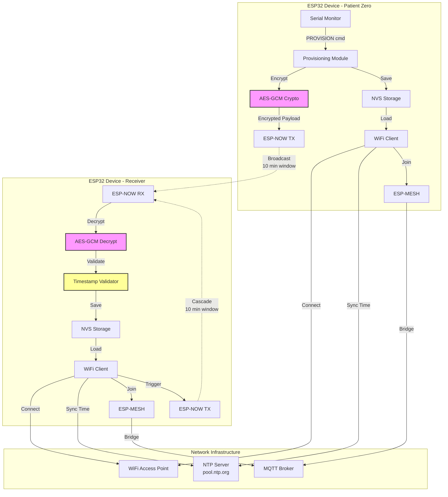
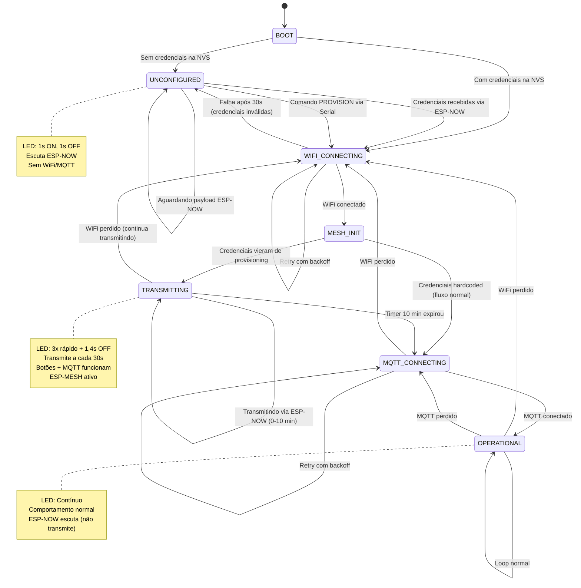
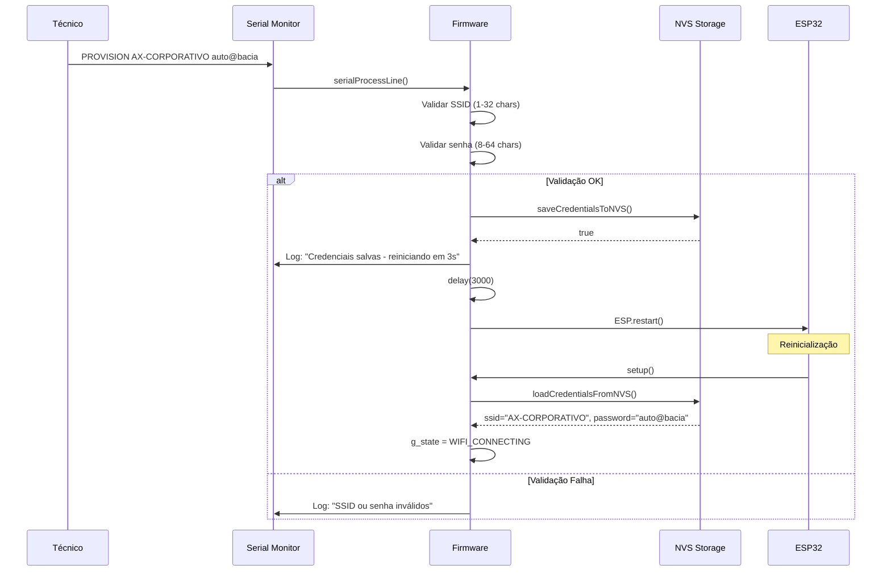
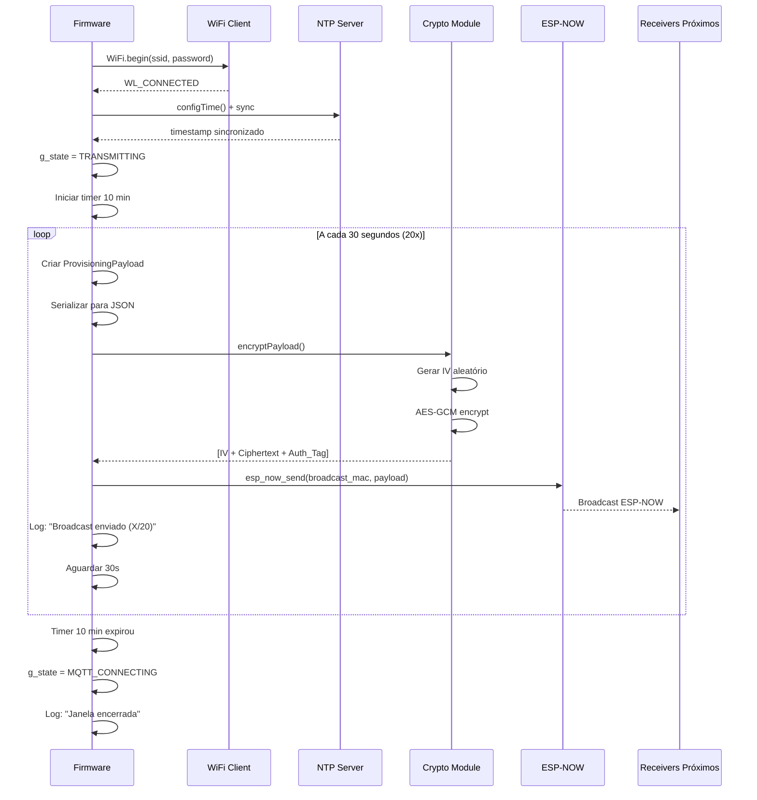
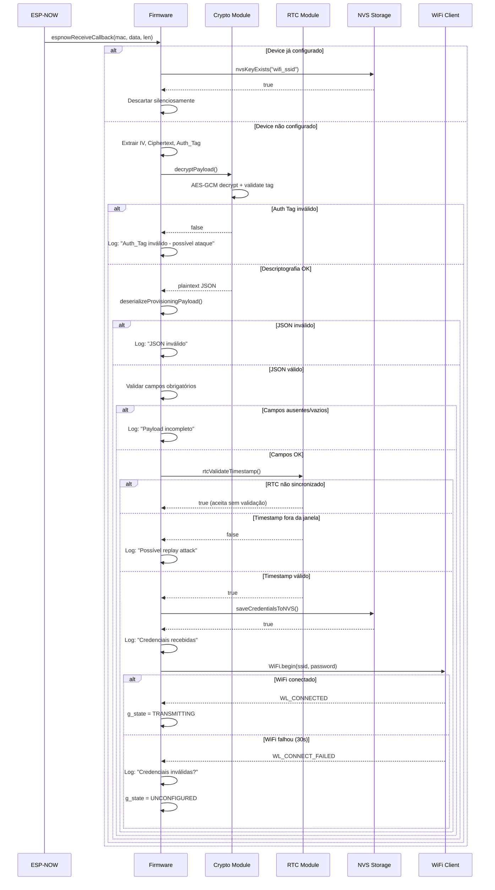
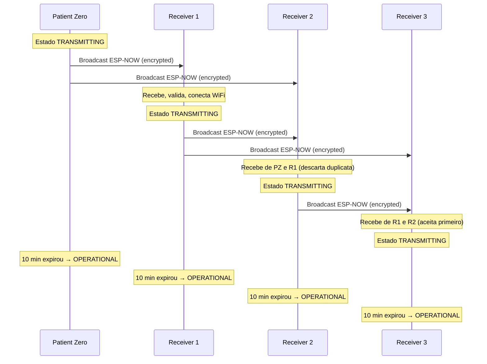

# Design Document: ESP32 Viral Provisioning Seguro com AES-GCM

## Overview

O sistema de Viral Provisioning Seguro é uma extensão do firmware ESP32 Andon que implementa distribuição automática de credenciais WiFi através de propagação em cascata usando o protocolo ESP-NOW com criptografia AES-GCM. Este sistema elimina a necessidade de programar individualmente cada dispositivo com credenciais hardcoded, reduzindo drasticamente o tempo de implantação em ambientes de produção com dezenas ou centenas de dispositivos.

### Objetivos do Sistema

1. **Configuração Inicial Simplificada**: Permitir que um único "Paciente Zero" seja configurado manualmente via Serial Monitor
2. **Propagação Automática**: Distribuir credenciais WiFi automaticamente para dispositivos próximos via ESP-NOW
3. **Segurança Criptográfica**: Proteger credenciais contra sniffing passivo e ataques de modificação usando AES-GCM
4. **Proteção contra Replay**: Validar timestamps para prevenir reutilização de mensagens capturadas
5. **Janela de Ataque Limitada**: Transmitir credenciais por apenas 10 minutos após configuração
6. **Coexistência com ESP-MESH**: Manter compatibilidade total com o sistema ESP-MESH existente
7. **Auditoria Completa**: Registrar todos os eventos de provisionamento para diagnóstico e segurança

### Princípios de Design

- **Security-First**: Toda comunicação de credenciais é criptografada com AES-256-GCM
- **Fail-Safe**: Dispositivos não configurados continuam funcionando com credenciais hardcoded como fallback
- **Non-Blocking**: Todas as operações usam temporização não-bloqueante com `millis()`
- **Resilient**: Sistema continua operacional mesmo se NTP falhar ou ESP-NOW não inicializar
- **Auditable**: Logs detalhados de todas as operações de provisionamento


## Architecture

### Arquitetura de Alto Nível

O sistema de Viral Provisioning adiciona três novos componentes ao firmware ESP32 Andon existente:

1. **Provisioning Module**: Gerencia criptografia, transmissão e recepção de credenciais
2. **ESP-NOW Communication Layer**: Protocolo peer-to-peer para broadcast de payloads criptografados
3. **NVS Storage Module**: Persistência de credenciais WiFi entre reinicializações



### Fluxo de Dados do Provisioning

#### Fase 1: Configuração do Patient Zero
```
1. Técnico conecta ESP32 via USB
2. Abre Serial Monitor (115200 baud)
3. Envia comando: PROVISION AX-CORPORATIVO auto@bacia
4. Firmware valida SSID (1-32 chars) e senha (8-64 chars)
5. Firmware salva credenciais na NVS (namespace: provisioning)
6. Firmware aguarda 3s e reinicia
7. Após reinicialização, firmware carrega credenciais da NVS
8. Firmware conecta ao WiFi
9. Firmware sincroniza RTC via NTP
10. Firmware entra no estado TRANSMITTING
```

#### Fase 2: Transmissão de Credenciais (Patient Zero)
```
1. Firmware cria ProvisioningPayload:
   - ssid: "AX-CORPORATIVO"
   - password: "auto@bacia"
   - timestamp: 1735689600 (Unix timestamp do RTC)
   - device_id: "EEFF" (últimos 4 chars do MAC)

2. Firmware serializa payload para JSON (< 200 bytes)

3. Firmware deriva chave AES-256:
   - Input: "ChaveSecretaAndon2026"
   - SHA-256 hash → 32 bytes

4. Firmware gera IV aleatório (12 bytes) usando esp_random()

5. Firmware criptografa JSON com AES-GCM:
   - Key: 32 bytes (derivada)
   - IV: 12 bytes (aleatório)
   - Plaintext: JSON payload
   - Output: Ciphertext + Auth_Tag (16 bytes)

6. Firmware constrói Encrypted_Payload:
   [IV (12)] + [Ciphertext (variável)] + [Auth_Tag (16)]
   Total: < 256 bytes

7. Firmware transmite via ESP-NOW:
   - Peer: FF:FF:FF:FF:FF:FF (broadcast)
   - Intervalo: 30 segundos
   - Duração: 10 minutos (20 transmissões)

8. LED onboard pisca: 3x rápido (100ms ON/OFF) + 1,4s OFF

9. Após 10 minutos, firmware para transmissão
10. Firmware transita para estado MQTT_CONNECTING
```

#### Fase 3: Recepção e Propagação (Receivers)
```
1. Device não-configurado está no estado UNCONFIGURED
2. LED onboard pisca lentamente (1s ON, 1s OFF)

3. Callback ESP-NOW recebe Encrypted_Payload

4. Firmware verifica se já possui credenciais na NVS:
   - Se SIM: descarta mensagem silenciosamente
   - Se NÃO: continua processamento

5. Firmware extrai componentes do payload:
   - IV: primeiros 12 bytes
   - Auth_Tag: últimos 16 bytes
   - Ciphertext: bytes intermediários

6. Firmware descriptografa com AES-GCM:
   - Key: mesma chave derivada (hardcoded)
   - IV: extraído do payload
   - Valida Auth_Tag automaticamente

7. Se Auth_Tag inválido:
   - Log: "PROVISIONING: Auth_Tag inválido - possível ataque"
   - Descarta mensagem
   - Retorna ao estado UNCONFIGURED

8. Se descriptografia OK:
   - Desserializa JSON
   - Valida campos obrigatórios (ssid, password, timestamp, device_id)

9. Valida timestamp:
   - Se RTC sincronizado: |timestamp_payload - timestamp_atual| < 300s
   - Se RTC não sincronizado: aceita sem validação
   - Se fora da janela: descarta (possível replay attack)

10. Salva credenciais na NVS

11. Tenta conectar ao WiFi (timeout 30s)

12. Se conexão OK:
    - Sincroniza RTC via NTP
    - Transita para estado TRANSMITTING
    - Inicia transmissão por 10 minutos (cascata)
    - Após 10 min, transita para MQTT_CONNECTING

13. Se conexão FALHA:
    - Log: "PROVISIONING: Falha ao conectar - credenciais inválidas?"
    - Retorna ao estado UNCONFIGURED
    - Aguarda novo payload
```


### Máquina de Estados Estendida

O firmware adiciona três novos estados à máquina de estados existente:



#### Descrição dos Estados

**BOOT** (existente)
- Inicialização de hardware
- Configuração de GPIOs
- Inicialização de Watchdog
- Inicialização de ESP-NOW (ANTES de ESP-MESH)
- Verificação de credenciais na NVS
- Transição: → UNCONFIGURED (sem credenciais) ou → WIFI_CONNECTING (com credenciais)

**UNCONFIGURED** (novo)
- Device aguardando credenciais via ESP-NOW
- LED onboard pisca lentamente (1s ON, 1s OFF)
- Callback ESP-NOW ativo escutando broadcasts
- Sem conexão WiFi ou MQTT
- Botões físicos não funcionam (sem backend para enviar eventos)
- Transição: → WIFI_CONNECTING (após receber credenciais válidas)

**WIFI_CONNECTING** (existente, modificado)
- Tentativa de conexão WiFi
- LED onboard pisca a cada 500ms
- Backoff exponencial em caso de falha
- Nova transição: → UNCONFIGURED (se credenciais vieram de provisioning e conexão falha)
- Transição normal: → MESH_INIT (conexão OK)

**MESH_INIT** (existente, renomeado de parte do fluxo)
- Inicialização do ESP-MESH
- Descoberta de nós vizinhos
- Eleição de nó raiz
- Transição: → TRANSMITTING (se credenciais vieram de provisioning) ou → MQTT_CONNECTING (fluxo normal)

**TRANSMITTING** (novo)
- Device transmite credenciais via ESP-NOW por 10 minutos
- LED onboard: 3 piscadas rápidas (100ms ON/OFF) + 1,4s OFF (ciclo de 2s)
- Timer de 10 minutos (600.000 ms) ativo
- Transmissão a cada 30 segundos (20 transmissões totais)
- Operação dual: botões, LEDs e MQTT funcionam normalmente
- ESP-MESH permanece ativo
- Transição: → MQTT_CONNECTING (após 10 minutos)

**MQTT_CONNECTING** (existente)
- Tentativa de conexão MQTT (apenas se for nó raiz)
- LED onboard pisca a cada 1000ms
- Backoff exponencial em caso de falha
- Transição: → OPERATIONAL (conexão OK)

**OPERATIONAL** (existente)
- Operação normal do sistema
- LED onboard aceso continuamente
- Processamento de botões, LEDs, heartbeat
- ESP-NOW permanece inicializado mas NÃO transmite (apenas escuta)
- Transição: → WIFI_CONNECTING (WiFi perdido) ou → MQTT_CONNECTING (MQTT perdido)


## Components and Interfaces

### Módulos de Software

#### 1. Provisioning Module (`provisioning.cpp/h`)

Responsável pela lógica de alto nível do sistema de provisionamento.

**Funções Principais**:
```cpp
// Inicialização
void provisioningInit();

// Configuração manual via Serial
bool provisionManual(const char* ssid, const char* password);

// Reset de credenciais
bool provisionReset();

// Verificação de estado
ProvisioningState getProvisioningState();

// Carregamento de credenciais da NVS
bool loadCredentialsFromNVS(char* ssid, char* password);

// Salvamento de credenciais na NVS
bool saveCredentialsToNVS(const char* ssid, const char* password);
```

#### 2. Crypto Module (`crypto.cpp/h`)

Implementa criptografia AES-GCM usando mbedtls.

**Funções Principais**:
```cpp
// Derivação de chave AES-256 a partir de string
void deriveAESKey(const char* passphrase, uint8_t* key_out);

// Criptografia de payload
bool encryptPayload(
    const uint8_t* plaintext, size_t plaintext_len,
    uint8_t* ciphertext_out, size_t* ciphertext_len,
    uint8_t* iv_out, uint8_t* tag_out
);

// Descriptografia de payload
bool decryptPayload(
    const uint8_t* ciphertext, size_t ciphertext_len,
    const uint8_t* iv, const uint8_t* tag,
    uint8_t* plaintext_out, size_t* plaintext_len
);
```

#### 3. ESP-NOW Communication Module (`espnow_comm.cpp/h`)

Gerencia comunicação ESP-NOW para broadcast e recepção de payloads.

**Funções Principais**:
```cpp
// Inicialização do ESP-NOW
bool espnowInit();

// Registro de peer de broadcast
bool espnowRegisterBroadcastPeer();

// Transmissão de payload criptografado
bool espnowSendEncryptedPayload(const uint8_t* payload, size_t len);

// Callback de recepção (registrado internamente)
void espnowReceiveCallback(const uint8_t* mac, const uint8_t* data, int len);

// Callback de envio (registrado internamente)
void espnowSendCallback(const uint8_t* mac, esp_now_send_status_t status);
```

#### 4. NVS Storage Module (`nvs_storage.cpp/h`)

Abstração para persistência de credenciais na NVS.

**Funções Principais**:
```cpp
// Inicialização da NVS
bool nvsInit();

// Salvamento de string
bool nvsSaveString(const char* key, const char* value);

// Leitura de string
bool nvsLoadString(const char* key, char* value, size_t max_len);

// Verificação de existência de chave
bool nvsKeyExists(const char* key);

// Limpeza de namespace
bool nvsClearNamespace();
```

#### 5. RTC Sync Module (`rtc_sync.cpp/h`)

Sincronização de RTC via NTP.

**Funções Principais**:
```cpp
// Inicialização e sincronização NTP
bool rtcSyncNTP(uint32_t timeout_ms);

// Obtenção de timestamp Unix atual
uint32_t rtcGetTimestamp();

// Verificação de sincronização
bool rtcIsSynced();

// Validação de timestamp (anti-replay)
bool rtcValidateTimestamp(uint32_t payload_timestamp, uint32_t window_seconds);
```

#### 6. Serial Command Parser Module (`serial_parser.cpp/h`)

Parser de comandos Serial para provisionamento.

**Funções Principais**:
```cpp
// Processamento de linha Serial
void serialProcessLine(const char* line);

// Comando PROVISION
bool serialHandleProvision(const char* ssid, const char* password);

// Comando RESET_PROVISION
bool serialHandleResetProvision();
```

### Estruturas de Dados

#### ProvisioningPayload
```cpp
struct ProvisioningPayload {
    char ssid[33];          // SSID WiFi (máximo 32 chars + null terminator)
    char password[65];      // Senha WiFi (máximo 64 chars + null terminator)
    uint32_t timestamp;     // Unix timestamp (segundos desde 1970-01-01)
    char device_id[21];     // ID do transmissor (máximo 20 chars + null terminator)
};
```

#### EncryptedPayload
```cpp
struct EncryptedPayload {
    uint8_t iv[12];                    // Initialization Vector (12 bytes)
    uint8_t ciphertext[200];           // Ciphertext (tamanho variável, máximo 200)
    size_t ciphertext_len;             // Tamanho real do ciphertext
    uint8_t auth_tag[16];              // Authentication Tag (16 bytes)
};

// Tamanho total máximo: 12 + 200 + 16 = 228 bytes (< 256 bytes ESP-NOW limit)
```

#### ProvisioningState
```cpp
enum class ProvisioningState : uint8_t {
    UNCONFIGURED,    // Aguardando credenciais
    TRANSMITTING,    // Transmitindo credenciais (0-10 min)
    OPERATIONAL      // Operação normal (após 10 min ou credenciais hardcoded)
};
```

#### TransmissionTimer
```cpp
struct TransmissionTimer {
    unsigned long start_ms;           // Timestamp de início (millis())
    unsigned long duration_ms;        // Duração total (600.000 ms = 10 min)
    unsigned long interval_ms;        // Intervalo entre transmissões (30.000 ms)
    unsigned long last_transmission;  // Timestamp da última transmissão
    uint8_t transmission_count;       // Contador de transmissões (0-20)
    
    bool isExpired() const {
        return (millis() - start_ms) >= duration_ms;
    }
    
    bool shouldTransmit() const {
        return (millis() - last_transmission) >= interval_ms;
    }
};
```

#### CryptoContext
```cpp
struct CryptoContext {
    uint8_t aes_key[32];              // Chave AES-256 derivada (256 bits)
    bool key_initialized;             // Flag indicando se chave foi derivada
    mbedtls_gcm_context gcm_ctx;      // Contexto mbedtls para AES-GCM
};
```

#### RTCState
```cpp
struct RTCState {
    bool synced;                      // Flag indicando se RTC foi sincronizado via NTP
    uint32_t last_sync_timestamp;     // Timestamp da última sincronização bem-sucedida
    uint32_t sync_attempts;           // Contador de tentativas de sincronização
};
```


## Data Models

### Algoritmos de Criptografia

#### Derivação de Chave AES-256

A chave AES-256 é derivada da string hardcoded "ChaveSecretaAndon2026" usando SHA-256:

```cpp
#include <mbedtls/sha256.h>

void deriveAESKey(const char* passphrase, uint8_t* key_out) {
    mbedtls_sha256_context sha256_ctx;
    mbedtls_sha256_init(&sha256_ctx);
    mbedtls_sha256_starts(&sha256_ctx, 0); // 0 = SHA-256 (não SHA-224)
    
    // Hash da passphrase
    mbedtls_sha256_update(&sha256_ctx, 
                          (const unsigned char*)passphrase, 
                          strlen(passphrase));
    
    // Finaliza e obtém hash de 32 bytes
    mbedtls_sha256_finish(&sha256_ctx, key_out);
    mbedtls_sha256_free(&sha256_ctx);
    
    // key_out agora contém 32 bytes (256 bits) derivados da passphrase
}
```

**Propriedades**:
- Determinística: mesma passphrase sempre gera mesma chave
- Unidirecional: impossível recuperar passphrase a partir da chave
- Tamanho fixo: sempre 32 bytes (256 bits)

#### Geração de IV Aleatório

O Initialization Vector (IV) deve ser único para cada criptografia:

```cpp
#include <esp_random.h>

void generateRandomIV(uint8_t* iv_out) {
    // Gera 12 bytes aleatórios usando gerador de hardware do ESP32
    for (int i = 0; i < 12; i++) {
        iv_out[i] = (uint8_t)(esp_random() & 0xFF);
    }
}
```

**Propriedades**:
- Aleatório: usa gerador de hardware (TRNG)
- Único: probabilidade de colisão é negligenciável (2^-96)
- Tamanho: 12 bytes (96 bits) conforme recomendação NIST para GCM

#### Processo de Criptografia AES-GCM

```cpp
#include <mbedtls/gcm.h>

bool encryptPayload(
    const uint8_t* plaintext, size_t plaintext_len,
    uint8_t* ciphertext_out, size_t* ciphertext_len,
    uint8_t* iv_out, uint8_t* tag_out
) {
    // 1. Gerar IV aleatório
    generateRandomIV(iv_out);
    
    // 2. Inicializar contexto GCM
    mbedtls_gcm_context gcm_ctx;
    mbedtls_gcm_init(&gcm_ctx);
    
    // 3. Configurar chave AES-256
    uint8_t aes_key[32];
    deriveAESKey("ChaveSecretaAndon2026", aes_key);
    
    int ret = mbedtls_gcm_setkey(&gcm_ctx, 
                                  MBEDTLS_CIPHER_ID_AES, 
                                  aes_key, 
                                  256); // 256 bits
    if (ret != 0) {
        mbedtls_gcm_free(&gcm_ctx);
        return false;
    }
    
    // 4. Criptografar com GCM
    ret = mbedtls_gcm_crypt_and_tag(
        &gcm_ctx,
        MBEDTLS_GCM_ENCRYPT,
        plaintext_len,
        iv_out,                    // IV (12 bytes)
        12,                        // Tamanho do IV
        NULL,                      // Additional Data (não usado)
        0,                         // Tamanho do AD
        plaintext,                 // Plaintext
        ciphertext_out,            // Ciphertext output
        16,                        // Tamanho do tag (16 bytes)
        tag_out                    // Authentication Tag output
    );
    
    mbedtls_gcm_free(&gcm_ctx);
    
    if (ret != 0) {
        return false;
    }
    
    *ciphertext_len = plaintext_len;
    return true;
}
```

**Fluxo**:
1. Gera IV aleatório de 12 bytes
2. Deriva chave AES-256 (32 bytes) via SHA-256
3. Inicializa contexto mbedtls GCM
4. Criptografa plaintext → ciphertext
5. Gera Auth Tag de 16 bytes
6. Retorna: IV + Ciphertext + Auth Tag

#### Processo de Descriptografia e Validação

```cpp
bool decryptPayload(
    const uint8_t* ciphertext, size_t ciphertext_len,
    const uint8_t* iv, const uint8_t* tag,
    uint8_t* plaintext_out, size_t* plaintext_len
) {
    // 1. Inicializar contexto GCM
    mbedtls_gcm_context gcm_ctx;
    mbedtls_gcm_init(&gcm_ctx);
    
    // 2. Configurar chave AES-256 (mesma chave hardcoded)
    uint8_t aes_key[32];
    deriveAESKey("ChaveSecretaAndon2026", aes_key);
    
    int ret = mbedtls_gcm_setkey(&gcm_ctx, 
                                  MBEDTLS_CIPHER_ID_AES, 
                                  aes_key, 
                                  256);
    if (ret != 0) {
        mbedtls_gcm_free(&gcm_ctx);
        return false;
    }
    
    // 3. Descriptografar e validar Auth Tag
    ret = mbedtls_gcm_auth_decrypt(
        &gcm_ctx,
        ciphertext_len,
        iv,                        // IV extraído (12 bytes)
        12,                        // Tamanho do IV
        NULL,                      // Additional Data (não usado)
        0,                         // Tamanho do AD
        tag,                       // Authentication Tag (16 bytes)
        16,                        // Tamanho do tag
        ciphertext,                // Ciphertext
        plaintext_out              // Plaintext output
    );
    
    mbedtls_gcm_free(&gcm_ctx);
    
    if (ret != 0) {
        // Auth Tag inválido ou erro de descriptografia
        return false;
    }
    
    *plaintext_len = ciphertext_len;
    return true;
}
```

**Fluxo**:
1. Extrai IV (12 bytes), Ciphertext e Auth Tag (16 bytes) do payload
2. Deriva mesma chave AES-256 (hardcoded)
3. Inicializa contexto mbedtls GCM
4. Descriptografa ciphertext → plaintext
5. Valida Auth Tag automaticamente
6. Se Auth Tag inválido: retorna false (mensagem foi modificada ou chave incorreta)
7. Se OK: retorna plaintext descriptografado

#### Validação de Timestamp (Anti-Replay)

```cpp
bool rtcValidateTimestamp(uint32_t payload_timestamp, uint32_t window_seconds) {
    // 1. Verificar se RTC está sincronizado
    if (!rtcIsSynced()) {
        // RTC não sincronizado - aceita payload sem validação
        logSerial("PROVISIONING: RTC não sincronizado - timestamp não validado");
        return true;
    }
    
    // 2. Obter timestamp atual
    uint32_t current_timestamp = rtcGetTimestamp();
    
    // 3. Calcular diferença absoluta
    uint32_t diff;
    if (current_timestamp > payload_timestamp) {
        diff = current_timestamp - payload_timestamp;
    } else {
        diff = payload_timestamp - current_timestamp;
    }
    
    // 4. Validar janela de ±5 minutos (300 segundos)
    if (diff > window_seconds) {
        logSerial("PROVISIONING: Timestamp fora da janela (±" + 
                  String(window_seconds) + "s) - possível replay attack");
        return false;
    }
    
    return true;
}
```

**Propriedades**:
- Janela de aceitação: ±5 minutos (300 segundos)
- Tolerante a dessincronização de relógio entre devices
- Graceful degradation: se RTC não sincronizado, aceita payload (evita DoS)
- Protege contra replay attacks de mensagens antigas

### Serialização JSON

#### Serialização de ProvisioningPayload

```cpp
#include <ArduinoJson.h>

bool serializeProvisioningPayload(
    const ProvisioningPayload& payload,
    char* json_out, size_t max_len
) {
    StaticJsonDocument<256> doc;
    
    // Adicionar campos
    doc["ssid"] = payload.ssid;
    doc["password"] = payload.password;
    doc["timestamp"] = payload.timestamp;
    doc["device_id"] = payload.device_id;
    
    // Serializar para string
    size_t len = serializeJson(doc, json_out, max_len);
    
    // Validar tamanho (< 200 bytes)
    if (len == 0 || len >= 200) {
        logSerial("PROVISIONING: JSON serializado excede 200 bytes");
        return false;
    }
    
    return true;
}
```

#### Desserialização de ProvisioningPayload

```cpp
bool deserializeProvisioningPayload(
    const char* json_str,
    ProvisioningPayload& payload_out
) {
    StaticJsonDocument<256> doc;
    
    // Desserializar JSON
    DeserializationError error = deserializeJson(doc, json_str);
    if (error) {
        logSerial("PROVISIONING: JSON inválido após descriptografia");
        return false;
    }
    
    // Validar campos obrigatórios
    if (!doc.containsKey("ssid") || !doc.containsKey("password") ||
        !doc.containsKey("timestamp") || !doc.containsKey("device_id")) {
        logSerial("PROVISIONING: Payload incompleto - campos ausentes");
        return false;
    }
    
    // Extrair valores
    const char* ssid = doc["ssid"];
    const char* password = doc["password"];
    uint32_t timestamp = doc["timestamp"];
    const char* device_id = doc["device_id"];
    
    // Validar não-vazios
    if (strlen(ssid) == 0 || strlen(password) == 0 || 
        strlen(device_id) == 0 || timestamp == 0) {
        logSerial("PROVISIONING: Payload incompleto - campos vazios");
        return false;
    }
    
    // Copiar para estrutura
    strncpy(payload_out.ssid, ssid, 32);
    payload_out.ssid[32] = '\0';
    
    strncpy(payload_out.password, password, 64);
    payload_out.password[64] = '\0';
    
    payload_out.timestamp = timestamp;
    
    strncpy(payload_out.device_id, device_id, 20);
    payload_out.device_id[20] = '\0';
    
    return true;
}
```


### Interfaces e APIs

#### ESP-NOW Callbacks

```cpp
// Callback de recepção de mensagens ESP-NOW
void espnowReceiveCallback(const uint8_t* mac_addr, const uint8_t* data, int data_len) {
    // 1. Verificar estado do device
    if (getProvisioningState() != ProvisioningState::UNCONFIGURED) {
        // Device já configurado - descarta mensagem silenciosamente
        return;
    }
    
    // 2. Validar tamanho mínimo (IV + Auth Tag = 28 bytes)
    if (data_len < 28) {
        logSerial("PROVISIONING: Payload muito pequeno");
        return;
    }
    
    // 3. Extrair componentes do Encrypted_Payload
    uint8_t iv[12];
    uint8_t auth_tag[16];
    size_t ciphertext_len = data_len - 28;
    uint8_t ciphertext[256];
    
    memcpy(iv, data, 12);
    memcpy(ciphertext, data + 12, ciphertext_len);
    memcpy(auth_tag, data + 12 + ciphertext_len, 16);
    
    // 4. Descriptografar
    uint8_t plaintext[256];
    size_t plaintext_len;
    
    if (!decryptPayload(ciphertext, ciphertext_len, iv, auth_tag, 
                        plaintext, &plaintext_len)) {
        logMQTT("PROVISIONING: Auth_Tag inválido - possível ataque de MAC=" + 
                macToString(mac_addr));
        return;
    }
    
    // 5. Desserializar JSON
    plaintext[plaintext_len] = '\0'; // Null-terminate
    ProvisioningPayload payload;
    
    if (!deserializeProvisioningPayload((const char*)plaintext, payload)) {
        return; // Erro já logado na função
    }
    
    // 6. Validar timestamp
    if (!rtcValidateTimestamp(payload.timestamp, 300)) {
        logMQTT("PROVISIONING: Timestamp fora da janela - possível replay attack de MAC=" + 
                macToString(mac_addr));
        return;
    }
    
    // 7. Salvar credenciais na NVS
    if (!saveCredentialsToNVS(payload.ssid, payload.password)) {
        logSerial("PROVISIONING: Falha ao salvar credenciais na NVS");
        return;
    }
    
    // 8. Log de sucesso
    logMQTT("PROVISIONING: Credenciais recebidas de device_id=" + 
            String(payload.device_id) + " - conectando ao WiFi");
    
    // 9. Transitar para WIFI_CONNECTING
    g_state = SystemState::WIFI_CONNECTING;
    g_wifiReconnect.reset();
}

// Callback de confirmação de envio ESP-NOW
void espnowSendCallback(const uint8_t* mac_addr, esp_now_send_status_t status) {
    if (status == ESP_NOW_SEND_SUCCESS) {
        logSerial("PROVISIONING: Broadcast enviado com sucesso");
    } else {
        logSerial("PROVISIONING: Falha ao enviar broadcast - tentativa " + 
                  String(g_transmissionTimer.transmission_count) + "/20");
    }
}
```

#### Serial Commands

```cpp
// Processamento de comandos Serial
void serialProcessLine(const char* line) {
    // Remover whitespace
    String cmd = String(line);
    cmd.trim();
    
    // Comando PROVISION
    if (cmd.startsWith("PROVISION ")) {
        // Extrair SSID e senha
        int firstSpace = cmd.indexOf(' ');
        int secondSpace = cmd.indexOf(' ', firstSpace + 1);
        
        if (secondSpace == -1) {
            logSerial("PROVISIONING: Formato inválido. Use: PROVISION <ssid> <password>");
            return;
        }
        
        String ssid = cmd.substring(firstSpace + 1, secondSpace);
        String password = cmd.substring(secondSpace + 1);
        
        // Validar tamanhos
        if (ssid.length() < 1 || ssid.length() > 32) {
            logSerial("PROVISIONING: SSID deve ter entre 1 e 32 caracteres");
            return;
        }
        
        if (password.length() < 8 || password.length() > 64) {
            logSerial("PROVISIONING: Senha deve ter entre 8 e 64 caracteres");
            return;
        }
        
        // Salvar credenciais
        if (saveCredentialsToNVS(ssid.c_str(), password.c_str())) {
            logSerial("PROVISIONING: Credenciais salvas - reiniciando em 3s");
            delay(3000);
            ESP.restart();
        } else {
            logSerial("PROVISIONING: Falha ao salvar credenciais na NVS");
        }
        return;
    }
    
    // Comando RESET_PROVISION
    if (cmd == "RESET_PROVISION") {
        if (nvsClearNamespace()) {
            logSerial("PROVISIONING: Credenciais apagadas da NVS - reiniciando em 3s");
            delay(3000);
            ESP.restart();
        } else {
            logSerial("PROVISIONING: Falha ao apagar credenciais da NVS");
        }
        return;
    }
}
```

#### NVS API

```cpp
#include <Preferences.h>

Preferences g_prefs;

bool nvsInit() {
    // Inicializar NVS (já feito pelo ESP-IDF automaticamente)
    return true;
}

bool nvsSaveString(const char* key, const char* value) {
    if (!g_prefs.begin("provisioning", false)) { // false = read-write
        return false;
    }
    
    size_t written = g_prefs.putString(key, value);
    g_prefs.end();
    
    return (written > 0);
}

bool nvsLoadString(const char* key, char* value, size_t max_len) {
    if (!g_prefs.begin("provisioning", true)) { // true = read-only
        return false;
    }
    
    String str = g_prefs.getString(key, "");
    g_prefs.end();
    
    if (str.length() == 0) {
        return false;
    }
    
    strncpy(value, str.c_str(), max_len - 1);
    value[max_len - 1] = '\0';
    return true;
}

bool nvsKeyExists(const char* key) {
    if (!g_prefs.begin("provisioning", true)) {
        return false;
    }
    
    bool exists = g_prefs.isKey(key);
    g_prefs.end();
    
    return exists;
}

bool nvsClearNamespace() {
    if (!g_prefs.begin("provisioning", false)) {
        return false;
    }
    
    bool success = g_prefs.clear();
    g_prefs.end();
    
    return success;
}
```

#### mbedtls API para AES-GCM

```cpp
#include <mbedtls/gcm.h>
#include <mbedtls/sha256.h>

// Contexto global (inicializado uma vez)
CryptoContext g_crypto;

void cryptoInit() {
    // Derivar chave AES-256
    deriveAESKey("ChaveSecretaAndon2026", g_crypto.aes_key);
    g_crypto.key_initialized = true;
    
    // Inicializar contexto GCM
    mbedtls_gcm_init(&g_crypto.gcm_ctx);
    mbedtls_gcm_setkey(&g_crypto.gcm_ctx, 
                       MBEDTLS_CIPHER_ID_AES, 
                       g_crypto.aes_key, 
                       256);
}

void cryptoCleanup() {
    mbedtls_gcm_free(&g_crypto.gcm_ctx);
    memset(g_crypto.aes_key, 0, 32); // Zerar chave na memória
}
```


## Error Handling

### Falhas de Criptografia/Descriptografia

**Cenário**: Operação de criptografia AES-GCM falha durante transmissão

**Tratamento**:
```cpp
if (!encryptPayload(plaintext, plaintext_len, ciphertext, &ciphertext_len, iv, tag)) {
    logMQTT("PROVISIONING: Erro de criptografia - abortando transmissão");
    // Não transmite payload corrompido
    // Tenta novamente no próximo ciclo de 30s
    return;
}
```

**Cenário**: Operação de descriptografia falha (Auth Tag inválido)

**Tratamento**:
```cpp
if (!decryptPayload(ciphertext, ciphertext_len, iv, tag, plaintext, &plaintext_len)) {
    logMQTT("PROVISIONING: Auth_Tag inválido - possível ataque de MAC=" + macToString(mac_addr));
    // Descarta mensagem silenciosamente
    // Continua escutando novos payloads
    return;
}
```

### Falhas de Transmissão ESP-NOW

**Cenário**: `esp_now_send()` retorna erro

**Tratamento**:
```cpp
esp_err_t result = esp_now_send(broadcast_mac, encrypted_payload, payload_len);
if (result != ESP_OK) {
    logSerial("PROVISIONING: Falha ao enviar broadcast - código=" + String(result) + 
              " tentativa " + String(g_transmissionTimer.transmission_count) + "/20");
    // Não incrementa contador de transmissões
    // Tenta novamente no próximo ciclo de 30s
    return;
}
```

**Cenário**: Callback de envio indica falha

**Tratamento**:
```cpp
void espnowSendCallback(const uint8_t* mac_addr, esp_now_send_status_t status) {
    if (status != ESP_NOW_SEND_SUCCESS) {
        logSerial("PROVISIONING: Confirmação de envio falhou - tentativa " + 
                  String(g_transmissionTimer.transmission_count) + "/20");
        // Log apenas - não afeta fluxo de transmissão
    }
}
```

### Credenciais Inválidas

**Cenário**: Device recebe credenciais via ESP-NOW mas falha ao conectar ao WiFi

**Tratamento**:
```cpp
// No estado WIFI_CONNECTING
if (WiFi.status() != WL_CONNECTED && (millis() - g_wifiReconnect.lastAttemptMs) > 30000) {
    // Timeout de 30s
    if (g_credentialsSource == CredentialSource::PROVISIONING) {
        logMQTT("PROVISIONING: Falha ao conectar - credenciais inválidas?");
        // Retorna ao estado UNCONFIGURED
        g_state = SystemState::UNCONFIGURED;
        // Aguarda novo payload
    } else {
        // Credenciais hardcoded - continua tentando com backoff
        g_wifiReconnect.backoff();
    }
}
```

### Timeout de Sincronização NTP

**Cenário**: Sincronização NTP falha após 10 segundos

**Tratamento**:
```cpp
bool rtcSyncNTP(uint32_t timeout_ms) {
    configTime(-3 * 3600, 0, "pool.ntp.org"); // UTC-3
    
    unsigned long start = millis();
    while ((millis() - start) < timeout_ms) {
        time_t now = time(NULL);
        if (now > 1000000000) { // Timestamp válido
            g_rtcState.synced = true;
            g_rtcState.last_sync_timestamp = now;
            logMQTT("PROVISIONING: RTC sincronizado via NTP - timestamp=" + String(now));
            return true;
        }
        delay(100);
    }
    
    // Timeout - graceful degradation
    logMQTT("PROVISIONING: Falha ao sincronizar NTP - validação de timestamp desabilitada");
    g_rtcState.synced = false;
    // Continua operação normal sem validação de timestamp
    return false;
}
```

### Falha de Inicialização ESP-NOW

**Cenário**: `esp_now_init()` retorna erro

**Tratamento**:
```cpp
bool espnowInit() {
    esp_err_t result = esp_now_init();
    if (result != ESP_OK) {
        logMQTT("PROVISIONING: Falha ao inicializar ESP-NOW - código=" + String(result));
        // Desabilita sistema de provisionamento
        g_provisioningEnabled = false;
        // Firmware continua operando normalmente com credenciais hardcoded
        return false;
    }
    
    // Registrar callbacks
    esp_now_register_recv_cb(espnowReceiveCallback);
    esp_now_register_send_cb(espnowSendCallback);
    
    return true;
}
```

### Perda de Conexão WiFi Durante Transmissão

**Cenário**: Device está no estado TRANSMITTING e perde conexão WiFi

**Tratamento**:
```cpp
// No loop principal, estado TRANSMITTING
if (WiFi.status() != WL_CONNECTED) {
    logSerial("PROVISIONING: WiFi perdido durante transmissão - continuando broadcast");
    // Continua transmitindo via ESP-NOW (não depende de WiFi)
    // ESP-NOW opera na camada MAC, independente de conexão WiFi
    // Após 10 minutos, tenta reconectar ao WiFi
}

// Quando timer expira
if (g_transmissionTimer.isExpired()) {
    logSerial("PROVISIONING: Janela de transmissão encerrada");
    // Transita para WIFI_CONNECTING (se WiFi perdido) ou MQTT_CONNECTING (se WiFi OK)
    if (WiFi.status() == WL_CONNECTED) {
        g_state = SystemState::MQTT_CONNECTING;
    } else {
        g_state = SystemState::WIFI_CONNECTING;
        g_wifiReconnect.reset();
    }
}
```

### Watchdog Timer Durante Operações Criptográficas

**Cenário**: Operações de criptografia/descriptografia podem demorar alguns milissegundos

**Tratamento**:
```cpp
bool encryptPayload(...) {
    // Reset watchdog antes de operação pesada
    esp_task_wdt_reset();
    
    // Operação de criptografia
    int ret = mbedtls_gcm_crypt_and_tag(...);
    
    // Reset watchdog após operação
    esp_task_wdt_reset();
    
    return (ret == 0);
}
```


## Indicadores Visuais (LED Onboard)

### Padrões de LED por Estado

O LED onboard (GPIO 2) indica visualmente o estado do sistema de provisionamento:

#### Estado UNCONFIGURED
```cpp
// Padrão: 1s ON, 1s OFF (piscar lento)
void updateLEDUnconfigured() {
    static unsigned long lastToggle = 0;
    
    if (millis() - lastToggle >= 1000) {
        g_ledOnboard.on = !g_ledOnboard.on;
        digitalWrite(LED_ONBOARD_PIN, g_ledOnboard.on ? HIGH : LOW);
        lastToggle = millis();
    }
}
```

#### Estado TRANSMITTING
```cpp
// Padrão: 3 piscadas rápidas (100ms ON, 100ms OFF) + 1,4s OFF
// Ciclo total: 2 segundos
void updateLEDTransmitting() {
    static unsigned long cycleStart = 0;
    static uint8_t blinkCount = 0;
    
    unsigned long elapsed = millis() - cycleStart;
    
    // Ciclo de 2 segundos
    if (elapsed >= 2000) {
        cycleStart = millis();
        blinkCount = 0;
        elapsed = 0;
    }
    
    // Primeiros 600ms: 3 piscadas (100ms ON + 100ms OFF cada)
    if (elapsed < 600) {
        uint8_t phase = (elapsed / 100) % 2;
        bool shouldBeOn = (phase == 0);
        
        if (g_ledOnboard.on != shouldBeOn) {
            g_ledOnboard.on = shouldBeOn;
            digitalWrite(LED_ONBOARD_PIN, shouldBeOn ? HIGH : LOW);
        }
    } else {
        // Últimos 1400ms: OFF
        if (g_ledOnboard.on) {
            g_ledOnboard.on = false;
            digitalWrite(LED_ONBOARD_PIN, LOW);
        }
    }
}
```

#### Estado OPERATIONAL
```cpp
// Padrão: Aceso continuamente
void updateLEDOperational() {
    if (!g_ledOnboard.on) {
        g_ledOnboard.on = true;
        digitalWrite(LED_ONBOARD_PIN, HIGH);
    }
}
```

#### Estados WiFi/MQTT (existentes, mantidos)
```cpp
// WIFI_CONNECTING: 500ms ON, 500ms OFF
// MQTT_CONNECTING: 1000ms ON, 1000ms OFF
// (Implementação existente mantida)
```

### Implementação Não-Bloqueante

Todos os padrões de LED usam `millis()` para temporização não-bloqueante:

```cpp
void updateOnboardLED() {
    switch (g_state) {
        case SystemState::UNCONFIGURED:
            updateLEDUnconfigured();
            break;
            
        case SystemState::WIFI_CONNECTING:
            // Implementação existente (500ms blink)
            if (timerExpired(g_lastBlink, 500)) {
                setLED(g_ledOnboard, !g_ledOnboard.on);
            }
            break;
            
        case SystemState::TRANSMITTING:
            updateLEDTransmitting();
            break;
            
        case SystemState::MQTT_CONNECTING:
            // Implementação existente (1000ms blink)
            if (timerExpired(g_lastBlink, 1000)) {
                setLED(g_ledOnboard, !g_ledOnboard.on);
            }
            break;
            
        case SystemState::OPERATIONAL:
            updateLEDOperational();
            break;
            
        default:
            break;
    }
}
```

**Propriedades**:
- Nunca usa `delay()` (mantém loop responsivo)
- Usa variáveis estáticas para manter estado entre chamadas
- Atualiza LED apenas quando necessário (evita writes desnecessários)
- Timing preciso usando `millis()`


## Compatibilidade com ESP-MESH

### Ordem de Inicialização

A inicialização correta é crítica para evitar conflitos entre ESP-NOW e ESP-MESH:

```cpp
void setup() {
    Serial.begin(115200);
    
    // 1. Inicializar GPIOs
    initGPIOs();
    
    // 2. Inicializar Watchdog
    initWatchdog();
    
    // 3. Inicializar ESP-NOW ANTES de ESP-MESH
    if (!espnowInit()) {
        logSerial("PROVISIONING: ESP-NOW desabilitado - continuando sem provisionamento");
    }
    
    // 4. Inicializar ESP-MESH
    initMesh();
    
    // 5. Obter MAC address
    obtainMAC();
    
    // 6. Configurar MQTT
    g_mqtt.setServer(MQTT_BROKER, MQTT_PORT);
    g_mqtt.setCallback(mqttCallback);
    
    // 7. Verificar credenciais na NVS
    char nvs_ssid[33];
    char nvs_password[65];
    
    if (loadCredentialsFromNVS(nvs_ssid, nvs_password)) {
        // Credenciais salvas - usar ao invés de hardcoded
        logSerial("PROVISIONING: Credenciais carregadas da NVS");
        g_credentialsSource = CredentialSource::NVS;
        g_state = SystemState::WIFI_CONNECTING;
    } else {
        // Sem credenciais - aguardar provisionamento
        logSerial("PROVISIONING: Sem credenciais na NVS - aguardando provisionamento");
        g_state = SystemState::UNCONFIGURED;
    }
}
```

### Configuração de Canal WiFi

ESP-NOW e ESP-MESH devem operar no mesmo canal:

```cpp
#define MESH_CHANNEL 6  // Canal WiFi fixo (1-13)

bool espnowInit() {
    // Inicializar ESP-NOW
    esp_err_t result = esp_now_init();
    if (result != ESP_OK) {
        return false;
    }
    
    // Configurar canal WiFi para ESP-NOW
    // IMPORTANTE: Deve ser o mesmo canal do ESP-MESH
    WiFi.channel(MESH_CHANNEL);
    
    // Registrar peer de broadcast
    esp_now_peer_info_t peerInfo = {};
    memcpy(peerInfo.peer_addr, broadcast_mac, 6);
    peerInfo.channel = MESH_CHANNEL;  // Mesmo canal
    peerInfo.encrypt = false;         // Criptografia feita em nível de aplicação
    
    result = esp_now_add_peer(&peerInfo);
    if (result != ESP_OK) {
        logSerial("PROVISIONING: Falha ao registrar peer de broadcast");
        return false;
    }
    
    // Registrar callbacks
    esp_now_register_recv_cb(espnowReceiveCallback);
    esp_now_register_send_cb(espnowSendCallback);
    
    logSerial("PROVISIONING: ESP-NOW inicializado no canal " + String(MESH_CHANNEL));
    return true;
}
```

### Coexistência Durante Estado TRANSMITTING

Durante o estado TRANSMITTING, ambos os protocolos operam simultaneamente:

```cpp
void loop() {
    esp_task_wdt_reset();
    
    // 1. Atualizar ESP-MESH (sempre)
    g_mesh.update();
    
    // 2. Atualizar MQTT (se raiz e conectado)
    if (g_isRoot && g_mqtt.connected()) {
        g_mqtt.loop();
    }
    
    // 3. Atualizar LED onboard
    updateOnboardLED();
    
    // 4. Processar estado atual
    switch (g_state) {
        case SystemState::TRANSMITTING:
            // Transmitir via ESP-NOW
            if (g_transmissionTimer.shouldTransmit()) {
                transmitProvisioningPayload();
                g_transmissionTimer.last_transmission = millis();
                g_transmissionTimer.transmission_count++;
            }
            
            // Verificar expiração do timer
            if (g_transmissionTimer.isExpired()) {
                logSerial("PROVISIONING: Janela de transmissão encerrada - entrando em modo operacional");
                g_state = SystemState::MQTT_CONNECTING;
                g_mqttReconnect.reset();
            }
            
            // Processar botões e comandos MQTT normalmente
            handleOperational();
            break;
            
        // Outros estados...
    }
}
```

### Processamento de Callbacks Sem Bloqueio

Callbacks ESP-NOW e ESP-MESH devem ser rápidos e não-bloqueantes:

```cpp
// Callback ESP-NOW (executado em contexto de interrupção)
void espnowReceiveCallback(const uint8_t* mac_addr, const uint8_t* data, int data_len) {
    // Copiar dados para buffer global
    memcpy(g_espnowRxBuffer, data, data_len);
    g_espnowRxLen = data_len;
    memcpy(g_espnowRxMAC, mac_addr, 6);
    g_espnowRxFlag = true;
    
    // Processamento real será feito no loop principal
}

// No loop principal
void loop() {
    // ...
    
    // Processar payload ESP-NOW recebido
    if (g_espnowRxFlag) {
        g_espnowRxFlag = false;
        processReceivedProvisioningPayload(g_espnowRxMAC, g_espnowRxBuffer, g_espnowRxLen);
    }
    
    // ...
}
```

### Transição para Estado OPERATIONAL

Após 10 minutos de transmissão, o device para de transmitir mas mantém ESP-NOW ativo:

```cpp
if (g_transmissionTimer.isExpired()) {
    logSerial("PROVISIONING: Janela de transmissão encerrada");
    
    // Para de transmitir broadcasts
    g_state = SystemState::MQTT_CONNECTING;
    
    // ESP-NOW permanece inicializado e escutando
    // Isso permite que o device receba payloads futuros (caso seja resetado)
    // mas não transmite mais (evita poluição do espectro)
    
    logMQTT("PROVISIONING: ESP-NOW e ESP-MESH coexistindo no canal " + String(MESH_CHANNEL));
}
```


## Correctness Properties

*A property is a characteristic or behavior that should hold true across all valid executions of a system—essentially, a formal statement about what the system should do. Properties serve as the bridge between human-readable specifications and machine-verifiable correctness guarantees.*

### Property Reflection

Após análise dos acceptance criteria, identifiquei as seguintes propriedades testáveis. Realizei uma reflexão para eliminar redundâncias:

**Redundâncias Identificadas**:
- Propriedades 2.4, 3.1, 3.2 (criptografia/descriptografia) são cobertas pela Property 1 (round-trip)
- Propriedades 3.5 (desserialização após descriptografia) é coberta pela Property 1 (round-trip completo)
- Propriedades 13.3, 13.4 (logging de transmissão/recepção) são casos específicos da Property 15 (logging geral)
- Propriedades 5.7, 7.8, 12.4, 12.5 (transições de estado) são cobertas pela Property 11 (state machine transitions)

**Propriedades Consolidadas**:
- Combinei validações de campos JSON (3.7, 3.8, 16.2) em uma única propriedade de validação de payload
- Combinei logging de erros (3.4, 3.6, 13.5, 13.6) em propriedades específicas por tipo de erro
- Combinei operações NVS (9.4, 9.5, 9.6) em propriedades de persistência

### Property 1: Encryption/Decryption Round-Trip

*For any* valid ProvisioningPayload, encrypting then decrypting the payload shall produce an equivalent payload with the same ssid, password, timestamp, and device_id.

**Validates: Requirements 1.2, 2.4, 3.2**

### Property 2: JSON Serialization Round-Trip

*For any* valid ProvisioningPayload, serializing to JSON then deserializing shall produce an equivalent payload structure.

**Validates: Requirements 16.7**

### Property 3: IV Uniqueness

*For any* two consecutive encryption operations, the generated IVs shall be different (collision probability < 2^-96).

**Validates: Requirements 2.3**

### Property 4: Encrypted Payload Structure

*For any* encrypted payload, the structure shall be [IV (12 bytes)] + [Ciphertext] + [Auth_Tag (16 bytes)], and the total size shall not exceed 256 bytes.

**Validates: Requirements 2.6**

### Property 5: Auth Tag Validation Rejects Tampering

*For any* encrypted payload where the ciphertext or auth tag is modified, decryption shall fail and return false.

**Validates: Requirements 3.3, 3.4**

### Property 6: Payload Validation Rejects Incomplete Data

*For any* JSON payload missing required fields (ssid, password, timestamp, device_id) or containing empty values, validation shall fail and the payload shall be discarded.

**Validates: Requirements 3.7, 3.8**

### Property 7: Timestamp Validation Window

*For any* payload with a timestamp outside the ±300 second window from current RTC time (when RTC is synced), validation shall fail and the payload shall be discarded.

**Validates: Requirements 4.4**

### Property 8: Serial Command Validation

*For any* PROVISION command with SSID length outside [1, 32] or password length outside [8, 64], the command shall be rejected with an error log.

**Validates: Requirements 5.2, 5.3**

### Property 9: NVS Persistence Round-Trip

*For any* valid credentials saved to NVS, loading the credentials shall retrieve the same ssid and password values.

**Validates: Requirements 5.4, 9.4, 9.5**

### Property 10: Transmission Periodicity

*For any* device in TRANSMITTING state, broadcasts shall occur every 30 seconds (±100ms tolerance) for a total of 20 transmissions over 10 minutes.

**Validates: Requirements 6.4**

### Property 11: State Machine Transitions

*For any* device starting without NVS credentials, the state machine shall transition: BOOT → UNCONFIGURED → WIFI_CONNECTING (on credential reception) → MESH_INIT → TRANSMITTING → MQTT_CONNECTING → OPERATIONAL.

**Validates: Requirements 7.8, 12.2, 12.4, 12.5, 12.6**

### Property 12: Configured Devices Ignore Provisioning

*For any* device with credentials already saved in NVS, received ESP-NOW provisioning payloads shall be discarded silently without processing.

**Validates: Requirements 7.3**

### Property 13: WiFi Connection Failure Recovery

*For any* device that receives credentials via ESP-NOW but fails to connect to WiFi within 30 seconds, the device shall return to UNCONFIGURED state and await new credentials.

**Validates: Requirements 7.9**

### Property 14: Dual Operation During Transmission

*For any* device in TRANSMITTING state, button events and MQTT commands shall continue to be processed normally while ESP-NOW broadcasts occur.

**Validates: Requirements 6.8**

### Property 15: Error Logging Consistency

*For any* provisioning error (encryption failure, decryption failure, invalid auth tag, timestamp validation failure), a descriptive log message shall be published via Serial and MQTT (if connected).

**Validates: Requirements 3.4, 3.6, 13.1, 13.5, 13.6, 14.1**

### Property 16: ESP-NOW Initialization Order

*For any* firmware boot sequence, ESP-NOW shall be initialized before ESP-MESH to ensure proper channel configuration.

**Validates: Requirements 15.1**

### Property 17: Channel Consistency

*For any* device with both ESP-NOW and ESP-MESH active, both protocols shall operate on the same WiFi channel (channel 6).

**Validates: Requirements 15.2**

### Property 18: Transmission Window Expiration

*For any* device in TRANSMITTING state, after 10 minutes (600,000 ms ±1000ms tolerance), the device shall stop broadcasting and transition to MQTT_CONNECTING state.

**Validates: Requirements 6.6**

### Property 19: NVS Fallback Behavior

*For any* device starting without NVS credentials, the device shall use hardcoded credentials from config.h as fallback if provisioning is disabled or fails.

**Validates: Requirements 9.6**

### Property 20: RTC Graceful Degradation

*For any* device where NTP synchronization fails, timestamp validation shall be skipped and provisioning payloads shall be accepted without timestamp checks.

**Validates: Requirements 4.5, 10.5**

### Property 21: JSON Size Validation

*For any* ProvisioningPayload serialized to JSON, if the resulting string exceeds 200 bytes, serialization shall fail and return an error.

**Validates: Requirements 1.3, 16.3**

### Property 22: Encrypted Payload Size Validation

*For any* encrypted payload, if the total size (IV + Ciphertext + Auth_Tag) exceeds 256 bytes, encryption shall fail and return an error.

**Validates: Requirements 2.7**

### Property 23: Key Derivation Determinism

*For any* two invocations of key derivation with the same passphrase "ChaveSecretaAndon2026", the resulting AES-256 keys shall be identical.

**Validates: Requirements 2.2**

### Property 24: ESP-MESH Coexistence

*For any* device in TRANSMITTING state, ESP-MESH routing and message forwarding shall continue to function normally while ESP-NOW broadcasts occur.

**Validates: Requirements 15.3**

### Property 25: Operational State Broadcast Cessation

*For any* device transitioning from TRANSMITTING to OPERATIONAL state, ESP-NOW broadcasts shall cease but the ESP-NOW stack shall remain initialized and listening.

**Validates: Requirements 15.5**


## Testing Strategy

### Dual Testing Approach

O sistema de Viral Provisioning requer uma estratégia de testes abrangente combinando testes unitários e testes baseados em propriedades (Property-Based Testing).

#### Unit Tests

Testes unitários focam em casos específicos, edge cases e condições de erro:

**Casos Específicos**:
- Comando PROVISION com SSID e senha válidos
- Comando RESET_PROVISION apaga credenciais da NVS
- Payload com timestamp exatamente no limite da janela (±300s)
- Device recebe payload quando já possui credenciais (deve descartar)

**Edge Cases**:
- Payload JSON com exatamente 200 bytes (limite)
- Encrypted payload com exatamente 256 bytes (limite)
- SSID com 1 caractere (mínimo válido)
- SSID com 32 caracteres (máximo válido)
- Senha com 8 caracteres (mínimo válido)
- Senha com 64 caracteres (máximo válido)
- RTC não sincronizado (deve aceitar payload sem validação de timestamp)
- Payload com timestamp = 0 (inválido)

**Condições de Erro**:
- Payload com Auth Tag modificado (deve falhar descriptografia)
- Payload com ciphertext modificado (deve falhar descriptografia)
- JSON malformado após descriptografia
- Campos obrigatórios ausentes no JSON
- Campos obrigatórios vazios no JSON
- Falha de inicialização ESP-NOW
- Falha de transmissão ESP-NOW

**Exemplo de Unit Test**:
```cpp
void test_provision_command_valid() {
    // Arrange
    const char* cmd = "PROVISION TestSSID TestPassword123";
    
    // Act
    bool result = serialHandleProvision("TestSSID", "TestPassword123");
    
    // Assert
    assert(result == true);
    
    // Verify NVS
    char ssid[33], password[65];
    assert(nvsLoadString("wifi_ssid", ssid, 33) == true);
    assert(strcmp(ssid, "TestSSID") == 0);
    assert(nvsLoadString("wifi_password", password, 65) == true);
    assert(strcmp(password, "TestPassword123") == 0);
}

void test_provision_command_ssid_too_long() {
    // Arrange
    char long_ssid[40];
    memset(long_ssid, 'A', 33);
    long_ssid[33] = '\0';
    
    // Act
    bool result = serialHandleProvision(long_ssid, "ValidPassword");
    
    // Assert
    assert(result == false);
}
```

#### Property-Based Tests

Testes baseados em propriedades validam comportamentos universais através de geração aleatória de inputs:

**Biblioteca Recomendada**: 
- Para C++: **RapidCheck** (https://github.com/emil-e/rapidcheck)
- Alternativa: **QuickCheck++** (port do QuickCheck para C++)

**Configuração**:
- Mínimo 100 iterações por teste
- Cada teste deve referenciar a propriedade do design document
- Tag format: `// Feature: esp32-viral-provisioning-aes-gcm, Property X: <property_text>`

**Exemplo de Property Test**:
```cpp
#include <rapidcheck.h>

// Feature: esp32-viral-provisioning-aes-gcm, Property 1: Encryption/Decryption Round-Trip
RC_GTEST_PROP(ProvisioningCrypto, EncryptDecryptRoundTrip, ()) {
    // Generate random payload
    auto ssid = *rc::gen::string<std::string>(
        rc::gen::inRange(1, 33), 
        rc::gen::inRange('a', 'z')
    );
    auto password = *rc::gen::string<std::string>(
        rc::gen::inRange(8, 65), 
        rc::gen::inRange('a', 'z')
    );
    auto timestamp = *rc::gen::inRange<uint32_t>(1000000000, 2000000000);
    auto device_id = *rc::gen::string<std::string>(
        rc::gen::inRange(1, 21), 
        rc::gen::inRange('0', 'F')
    );
    
    // Create payload
    ProvisioningPayload original;
    strncpy(original.ssid, ssid.c_str(), 32);
    original.ssid[32] = '\0';
    strncpy(original.password, password.c_str(), 64);
    original.password[64] = '\0';
    original.timestamp = timestamp;
    strncpy(original.device_id, device_id.c_str(), 20);
    original.device_id[20] = '\0';
    
    // Serialize to JSON
    char json[256];
    RC_ASSERT(serializeProvisioningPayload(original, json, 256));
    
    // Encrypt
    uint8_t ciphertext[256];
    size_t ciphertext_len;
    uint8_t iv[12];
    uint8_t tag[16];
    RC_ASSERT(encryptPayload((uint8_t*)json, strlen(json), 
                             ciphertext, &ciphertext_len, iv, tag));
    
    // Decrypt
    uint8_t plaintext[256];
    size_t plaintext_len;
    RC_ASSERT(decryptPayload(ciphertext, ciphertext_len, iv, tag, 
                             plaintext, &plaintext_len));
    
    // Deserialize
    plaintext[plaintext_len] = '\0';
    ProvisioningPayload recovered;
    RC_ASSERT(deserializeProvisioningPayload((char*)plaintext, recovered));
    
    // Verify round-trip
    RC_ASSERT(strcmp(original.ssid, recovered.ssid) == 0);
    RC_ASSERT(strcmp(original.password, recovered.password) == 0);
    RC_ASSERT(original.timestamp == recovered.timestamp);
    RC_ASSERT(strcmp(original.device_id, recovered.device_id) == 0);
}

// Feature: esp32-viral-provisioning-aes-gcm, Property 3: IV Uniqueness
RC_GTEST_PROP(ProvisioningCrypto, IVUniqueness, ()) {
    // Generate random plaintext
    auto plaintext_str = *rc::gen::string<std::string>(
        rc::gen::inRange(10, 200), 
        rc::gen::arbitrary<char>()
    );
    
    // Encrypt twice
    uint8_t ciphertext1[256], ciphertext2[256];
    size_t len1, len2;
    uint8_t iv1[12], iv2[12];
    uint8_t tag1[16], tag2[16];
    
    RC_ASSERT(encryptPayload((uint8_t*)plaintext_str.c_str(), plaintext_str.length(),
                             ciphertext1, &len1, iv1, tag1));
    RC_ASSERT(encryptPayload((uint8_t*)plaintext_str.c_str(), plaintext_str.length(),
                             ciphertext2, &len2, iv2, tag2));
    
    // IVs must be different
    RC_ASSERT(memcmp(iv1, iv2, 12) != 0);
}

// Feature: esp32-viral-provisioning-aes-gcm, Property 5: Auth Tag Validation Rejects Tampering
RC_GTEST_PROP(ProvisioningCrypto, TamperingDetection, ()) {
    // Generate random payload
    auto plaintext_str = *rc::gen::string<std::string>(
        rc::gen::inRange(10, 200), 
        rc::gen::arbitrary<char>()
    );
    
    // Encrypt
    uint8_t ciphertext[256];
    size_t ciphertext_len;
    uint8_t iv[12];
    uint8_t tag[16];
    RC_ASSERT(encryptPayload((uint8_t*)plaintext_str.c_str(), plaintext_str.length(),
                             ciphertext, &ciphertext_len, iv, tag));
    
    // Tamper with ciphertext (flip one random bit)
    auto tamper_index = *rc::gen::inRange<size_t>(0, ciphertext_len);
    auto tamper_bit = *rc::gen::inRange<uint8_t>(0, 8);
    ciphertext[tamper_index] ^= (1 << tamper_bit);
    
    // Decryption should fail
    uint8_t plaintext[256];
    size_t plaintext_len;
    RC_ASSERT(!decryptPayload(ciphertext, ciphertext_len, iv, tag, 
                              plaintext, &plaintext_len));
}
```

### Test Coverage Goals

**Cobertura Mínima**:
- 90% de cobertura de linhas para módulos críticos (crypto, provisioning, nvs_storage)
- 80% de cobertura de linhas para módulos de suporte (serial_parser, rtc_sync)
- 100% de cobertura de branches para validações de segurança (auth tag, timestamp)

**Módulos Críticos**:
- `crypto.cpp`: Criptografia/descriptografia AES-GCM
- `provisioning.cpp`: Lógica de provisionamento
- `nvs_storage.cpp`: Persistência de credenciais
- `espnow_comm.cpp`: Comunicação ESP-NOW

**Testes de Integração**:
- Fluxo completo: Patient Zero → Receiver → Cascata
- Coexistência ESP-NOW + ESP-MESH
- Reconexão WiFi após receber credenciais
- Transição de estados completa

### Continuous Integration

**Pipeline de CI**:
1. Build do firmware (PlatformIO)
2. Execução de unit tests
3. Execução de property tests (100 iterações cada)
4. Análise de cobertura de código
5. Verificação de memory leaks (Valgrind ou similar)
6. Análise estática (cppcheck, clang-tidy)

**Critérios de Aprovação**:
- Todos os testes passam (0 falhas)
- Cobertura de código >= 85%
- Sem memory leaks detectados
- Sem warnings críticos de análise estática


## Diagramas de Sequência

### Sequência 1: Configuração Manual do Patient Zero



### Sequência 2: Transmissão de Credenciais (Patient Zero)



### Sequência 3: Recepção e Validação de Credenciais



### Sequência 4: Propagação em Cascata



## Considerações de Segurança

### Camadas de Segurança Implementadas

1. **Confidencialidade (AES-256-GCM)**
   - Credenciais WiFi nunca trafegam em plaintext
   - Chave de 256 bits derivada via SHA-256
   - Algoritmo aprovado pelo NIST (FIPS 197)

2. **Integridade e Autenticidade (Auth Tag)**
   - Auth Tag de 16 bytes (128 bits)
   - Detecta qualquer modificação no ciphertext
   - Valida que a mensagem foi criada por quem possui a chave

3. **Proteção contra Replay (Timestamp Validation)**
   - Janela de aceitação de ±5 minutos
   - Mensagens antigas são automaticamente rejeitadas
   - Sincronização via NTP garante precisão

4. **Janela de Ataque Limitada (10 minutos)**
   - Transmissão por apenas 10 minutos reduz exposição
   - Após janela, device para de transmitir
   - Reduz superfície de ataque temporal

5. **Auditoria Completa (Logging)**
   - Todos os eventos de provisionamento são logados
   - Logs incluem MAC address do transmissor
   - Facilita detecção de ataques e troubleshooting

### Riscos Residuais e Mitigações

#### Risco 1: Extração de Firmware
**Descrição**: Atacante com acesso físico pode extrair firmware e obter chave hardcoded.

**Mitigação**:
- Controle de acesso físico ao chão de fábrica
- Chave hardcoded é apenas para provisionamento inicial
- Após provisionamento, credenciais ficam na NVS (pode ser criptografada com Flash Encryption)
- Considerar implementação de Secure Boot e Flash Encryption em versões futuras

**Risco Residual**: Baixo (requer acesso físico prolongado)

#### Risco 2: Ataque de Negação de Serviço (DoS)
**Descrição**: Atacante pode floodar ESP-NOW com payloads inválidos.

**Mitigação**:
- Validação rápida de tamanho mínimo (28 bytes)
- Descriptografia falha rapidamente em Auth Tag inválido
- Callback ESP-NOW é não-bloqueante
- Watchdog timer previne travamento

**Risco Residual**: Médio (pode causar lentidão temporária, mas não trava o sistema)

#### Risco 3: Comprometimento Simultâneo
**Descrição**: Se todos os devices forem comprometidos simultaneamente, atacante pode reconfigurar rede.

**Mitigação**:
- Improvável em ambiente de produção
- Requer acesso físico a todos os devices
- Logs de auditoria detectam atividade anormal
- Credenciais podem ser rotacionadas via comando PROVISION

**Risco Residual**: Muito Baixo (fora do escopo de ameaças realistas)

#### Risco 4: Credenciais Fracas
**Descrição**: Técnico pode configurar senha WiFi fraca no Patient Zero.

**Mitigação**:
- Validação mínima de 8 caracteres
- Documentação recomenda senhas fortes (16+ caracteres, alfanuméricos + símbolos)
- Responsabilidade do administrador de rede

**Risco Residual**: Médio (depende de política de segurança da organização)

### Recomendações de Segurança Adicionais

1. **Flash Encryption** (ESP-IDF feature)
   - Criptografa conteúdo da flash (incluindo NVS)
   - Previne extração de credenciais via leitura direta da flash
   - Requer configuração no menuconfig do ESP-IDF

2. **Secure Boot** (ESP-IDF feature)
   - Valida assinatura digital do firmware antes de executar
   - Previne execução de firmware modificado
   - Requer geração de chaves de assinatura

3. **Rotação de Chave**
   - Considerar rotação periódica da chave hardcoded
   - Implementar versionamento de chave no payload
   - Permite migração gradual para nova chave

4. **Auditoria de Logs**
   - Monitorar logs MQTT para padrões anormais
   - Alertar sobre múltiplas falhas de Auth Tag (possível ataque)
   - Dashboard de provisionamento para visualizar propagação

5. **Política de Acesso Físico**
   - Restringir acesso ao chão de fábrica
   - Documentar todos os devices provisionados
   - Procedimento de revogação para devices comprometidos

